### PLANNED FAIL OVER - FAIL BACK
---
---

#### Failover
---

1. Senaryo oncelikle Istanbul un Diisaster yasadıgı üzerine bir senaryo olacağı için oncelikle İstanbul kaynakları kapatılmalı, Istanbul tarafında Storagelarla alakalı işler yapılmaya başlanmadan once SQL servisi kapatılmalı ve diskler offline a çekilmeli, Burda oluşacak memory -> Disk dumplarının tamamlanması beklenmeli,

2. Bütün pairdisplay komutları mutlaka -fcxe ile çalıştırılmalıdır (eger aksini goruyorsanız ekran goruntulerinde unutulduğu içindir, doğrusu olduğu için değil)

3. Replikasyon kırılmadan once GAD ı keseceğimiz ve verinin tek taraftan gitmesini istediğimiz için oncellikle GAD ın status unu kontol ediyoruz, Instanbul Hit2 de veri kalmadığına herseyin Hit1 le sync olduğunu teyid için GAD ı kontrol ediyoruz,
	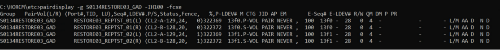

4. Sonrasında HUR tarafında (3DCP) li kısmın da üzerinde bekleyen fark olmamalı, status PAIR olmalı 
	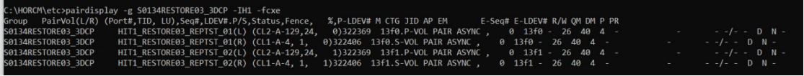

5. Journal kontrol edilmeli Qcnt 0 olmalı 
	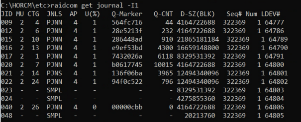

6. Oncelikle simülasyona benzemek için GAD tarafı split edilmeli
	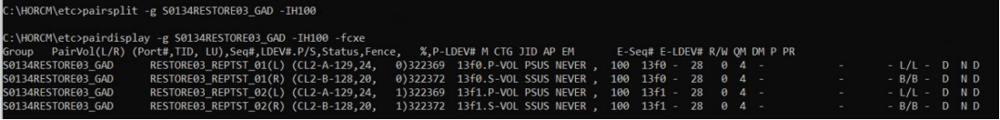

7. Sonrasında HUR parametresiz Split edilir
	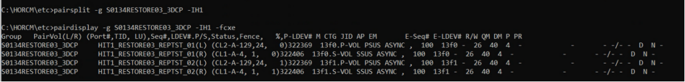

8. DC ve DRC de 3DCP kontrol edilir
	a. DRC
	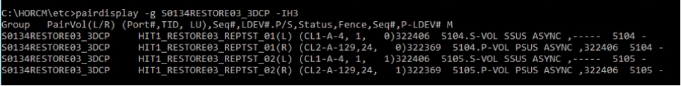
	b. DC
	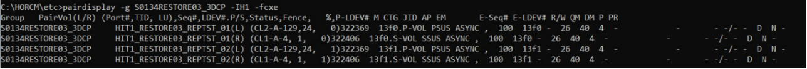

9. -RS ile 3DCP split edilir
	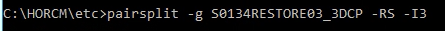

10. -RS le 3DCP split edildikten sonra durum bu olmalıdır (DRC I3 tarafında)
	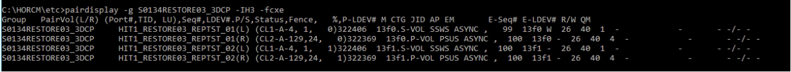

	* Bu anda DC tarafındaki disklerde DRC tarafındaki disklerde read/write Access e acıktır, çalışma başlanırken her iki tarafta offline konumdadır, Şu an da DRC de Windows un RAW olarak gordugu diskler artık read/write ıbıl konumdadır,
	* Şu an en kritik noktadır, Istanbulda diskler Offline durumda ve 3DCPS bu state de ilen DRC deki diskler açılıp SQL database leri attach edilebiliyor mu data gelmiş mi güncel mi gibi kararlar vermek için data işlenebilir, 
	* İstenirse Musteri datasıda alınabilir ancak bu şuanki geri donus senaryosunu iptal eder,
	* Musteri datası alınmadan prod write DRC den kabul edilmeden yapılan kontrollerde istenmeyen bir durumla karşılaşılırsa -RB parametresi ile -RS in rollback i yapılabilir, sonrasında 3DCP pairresync edilerek yapıya hic dokunulmadan İstanbul dan devam eder hale dönebilir,
	* Murat Abi -RB ile pairsync ediyoruz degilmi ?
	* Pairresync -g S0134RESTORE03_3DCP -RB -I3 gibi mi olmalı ornek komutu ? 
	* Normal geçiş senaryosunda ise -RS le açılıp bakıldıktan sonra hersey ok ise sonraki adımlarla devam edilebilir, prod herseyiyle ankara alındı kararının net verilmiş olması gerekir,
	* Write ların nerden kabul edileceği ve nerenin primary olduğu pairdisplay çıktısındaki SSWS in hangi Storage ı gösterdiğinden anlaşılabilir,
	* Aşağıdaki ornek de 369 daki karşılık PSUS , 406 ise SSWS 
	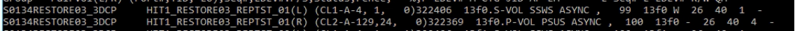

11. Butun kabuller yapıldıktan sonra replikasyon yonude artık ankaradan istanbula olsun denmesi için swap çalıştırılır,
	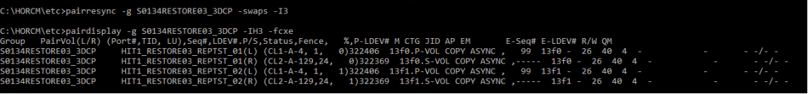

	* COPY lerin PAIR olması ve journalin durumları kontrol edilmelidir,
	* Bu komutla birlite istanbuldaki diskler artık read/write pozisyonundan cıkmıs Windows un RAW gordugu pozisyona geçmiştir,
	* !!!	BU DURUM 1 HAFTA DRC den CALISALIM DENDIGINDE 1 HAFTA BOYUNCA KALACAGIMIZ STATE DIR !!!

#### Failback
---

1. İstanbula geri dönmek istendiği zaman oncelikle Ankara tarafındaki ortamlar kapatılmalı, SQL servisleri offline a çekilmeli, memorylerin diskler dump etmeleri beklenmeli ve diskler offline'a çekilmeli, 3DCP nin Pair olduğundan ve journal in bos olduğundan emin olunana kadar beklenmeli,
	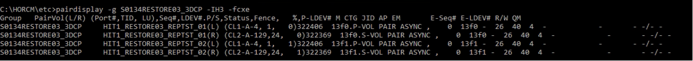

2. Yedinci adımdaki yaptığımız iş aynen tekrar yapılır bu sefer yon farklı olacağı için I1 den çalıştırılır, her komut sonrasında kontroller yine yapılmalıdır, -RS den sonra SSWS in hangi Storage a baktığı kontrol edilmelidir,
	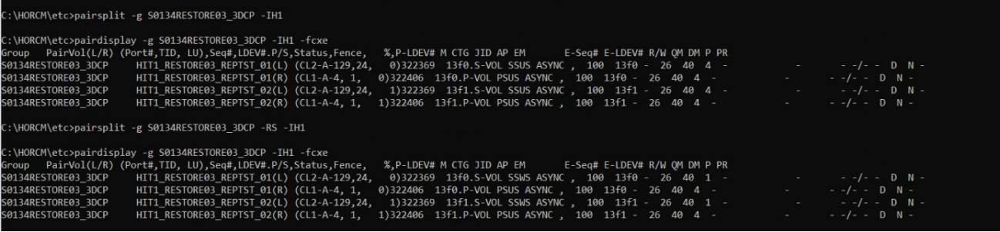

	Bu durum 11. Adımdaki Artık varlığımızı DRC de surduruyoruz un tam olarak geriş donus kontrol noktasıdır, Istanbulda diskler online a çekilerek kontrolleri yapılabilir, Musteri/prod write ı hala alınmamalıdır, bir sorun çıkarsa -RB ile geri dönülebilir, bu state de hem Istanbul hemde ankaradaki diskler read/write edilebilir konumdadır, dikkat edilmelidir, bir sekilden bir sebepten ankara prod write alırsa (otomatik disk online eden bir sistem vs.)tekrar ankaraya geçilip replikasyon tekrar ankaradan istanbula a olacak sekilde sync edilmeli ve 12. Adım ve sonrası tekrar çalıştırılmalı,
	
	Bu noktaya kadar herseyin ok olduğunu düşünüyorsak artık swap ederek istanbuldan ankaraya replikasyonu başlatabilir ve ankaradaki disklerin RAW konumuna geçmesini saglayabilriz.

4. Swaps çalıştırılır.
	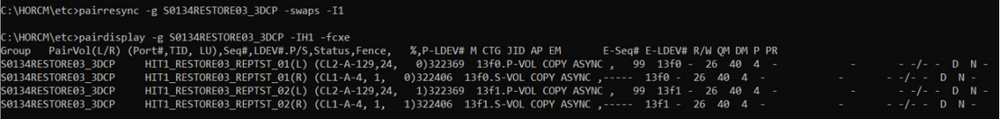

	Murat abi Swaps calısırıldıgı anda olay tamam degilmi ? status un copy olması Ist to Ankara replikasyonla HUR la alakalı bir mevzu ? (oyle olmalıda emin olmak için soruyorum)

5. Son olarak da GAD tekrar Sync edilerek operasyonlar tamamlanmalı
	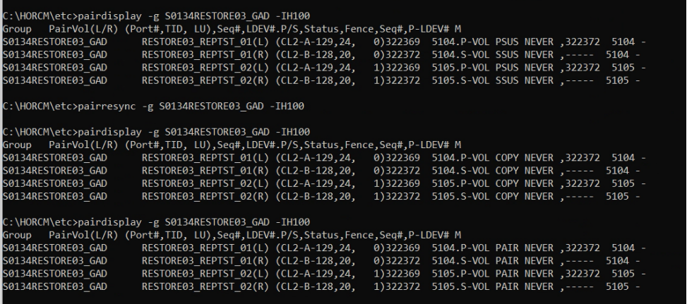
