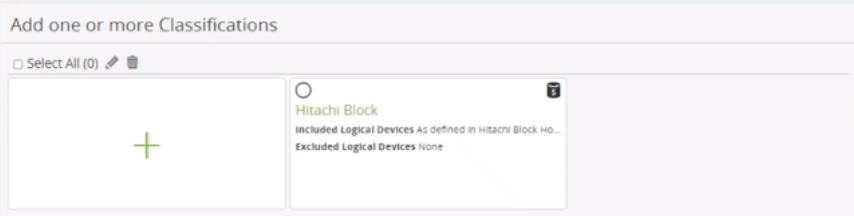
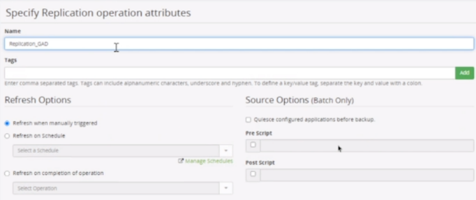
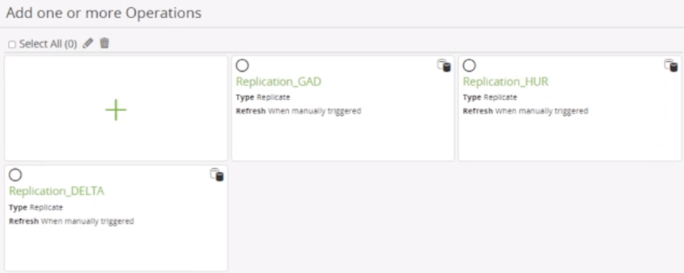

### CREATE BLOCK STORAGE & BLOCK HOST & POLICY
---
---

#### Create Hitachi Block Storage
---

1. **Nodes** → **+** → **Storage** → **Hitachi Block Device** → **Next**
2. Provide **Node Name** → **Confirm** → **Next**
3. Select **Proxy Node** → **Next**
4. Select **Metadata directory** → **Next**
5. Select **Storage Serial Number** → **Provide User/Password** → **Next**
6. Do not enable **CM-REST** for reporting → **Next**
7. Select **All** for **LDEV range** → **Next**
8. Select **Command Device** → **Next**
9. **Finish**
10. **Menu** → **Storage** → Select Storage → **Refresh**

#### Create Hitachi Block Host
---

1. **Nodes** → **+** → **Host** → **Hitachi Block Host** → **Next**
2. Provide Node Name → **Next**
3. Do not select **Resource Group** → **Next**
4. Select **Block Device** (Storage) → **Next**
5. Type included and/or excluded **LDEVs** → **Next**
6. **Finish**

#### Create Policy
---

1. **Policy** → **+** → Provide **Name** → **Next**
2. Do not select **Resource Group** → **Next**
3. Add one or more **classification** → **+** 
4. **Physical** → **Hitachi Block** → **Next**
5. Select **Use Hitachi Block Host Selections** → **Next**
6. **Next**
	

7. Add one or more **operation** → **+** 
8. **Replicate** → **Next**
9. Configure **GAD Replication**
	1. **Name**: Replication_GAD
	2. **Refresh Options**: Refresh when manually triggered
	3. **Quiesce**: Unchecked
	4. **Tags**: GAD
	
	5. **Finish**

10. Add one or more **operation** → **+** 
11. **Replicate** → **Next**
12. Setup **HUR Replication**
	1. **Name**: Replication_HUR
	2. **Refresh Options**: Refresh when manually triggered
	3. **Quiesce**: Unchecked
	4. **Tags**: HUR
	5. **Finish**

13. Add one or more **operation** → **+** 
14. **Replicate** → **Next**
15. Setup **DELTA Replication**
	1. **Name**: Replication_DELTA
	2. **Refresh Options**: Refresh when manually triggered
	3. **Quiesce**: Unchecked
	4. **Tags**: DELTA
	5. **Finish**

