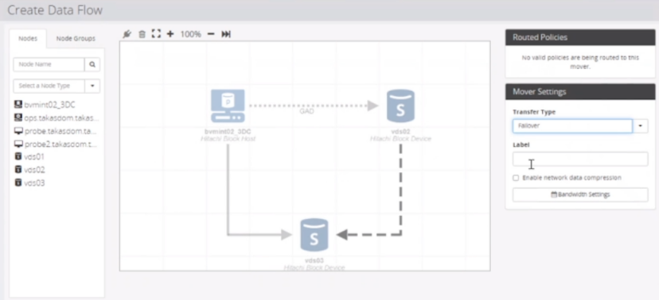
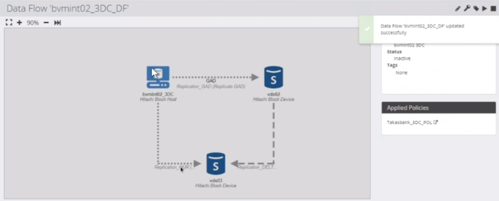

### CREATE & EXECUTE DATA FLOW
---
---

1. **Data Flows** → **+** → Provide **Name** → **Next**
2. Do not select **Resource Group** → **Next**
3. Select **Block Host** → Drag & Drop
4. Select **Secondary** Storage → Drag & Drop → Keep on top **Block Host** for a while → Drag & Drop
5. Select **Third (HUR)** Storage → Drag & Drop → Keep on top **Block Host** for a while → Drag & Drop
6. **Mover Settings**:
	1. Select **Link** between **Block Host** and **Secondary** Storage
		1. **Transfer Type**: Continuous
		2. **Label**: GAD
	2. Select **Link** between **Block Host** and **Third** Storage
		1. **Transfer Type**: Continuous
		2. **Label**: HUR
	3. Select **Link** between **Secondary** and **Third** Storage
		1. **Transfer Type**: Failover
		2. **Label**: DELTA
		   
	

##### Select Policy for Primary Storage
---
7. Click **Block Host** & Select **3DC Policy** from right corner

##### Select Policy for Secondary Storage
---   
8. Click **Secondary** Storage & Select **3DC Policy** from right corner
	1. **Policies** → Select **Replication_GAD (Replicate)** → Click **Configure Operation Properties**
	2. Select **Creation Mode**: **New** or **Adoption** → **Next**
	3. Configure **Replication**
		1. **Replication Type**: Active-Active Remote Clone - Global Active Device
		2. **Mirror Unit**: 0 or 1 (You may check if it is already configured as h0 or h1 for existing setup)
		3. **Copy Pace**: Medium
	4. Configure **Secondary** Storage
		1. **Capacity Saving Mode**: Match Source Volume
		2. **Capacity Saving Process Mode**: Match Source Volume
		3. **Data Reduction Shared Volume**: Enabled if Supported
	5. **Select Remote Path Group** → Automatically Selected
	6. Select **Secondary Volume Host Groups**
		1. **Use Automatically Provisioned Host Group** → not to assign to any Host Group but Protector
		2. Add **Host Group** → to assign to particular Host Group
		3. **Enforce LUN ID**: This option tries to select same LDEV on Secondary and it fails if LDEV is not available. If it is not selected it still tries to get same LDEV but it doesn't fail if LDEV is not available.
	7. **Specify Naming Options**
	8. **Finish**

##### Select Policy for Third Storage - HUR
---   
9. Click **Third** Storage & Select **3DC Policy** from right corner
	1. **Policies** → Select **Replication_HUR (Replicate)** → Click **Configure Operation Properties**
	2. Select **Creation Mode**: **New** or **Adoption** → **Next**
	3. Configure **Replication**
		1. **Replication Type**: Asynchronous Remote Clone - Universal Replicator
		2. **Mirror Unit**: 2 (You may check if it is already configured as h2 for existing setup)
		3. **Copy Pace**: Medium
	4. Configure **Secondary** Storage
		1. **Capacity Saving Mode**: Match Source Volume
		2. **Capacity Saving Process Mode**: Match Source Volume
		3. **Data Reduction Shared Volume**: Enabled if Supported
	5. **Select Remote Path Group** → Automatically Selected
	6. Select **Secondary Volume Host Groups**
		1. **Use Automatically Provisioned Host Group** → not to assign to any Host Group but Protector
		2. Add **Host Group** → to assign to particular Host Group
		3. **Enforce LUN ID**: This option tries to select same LDEV on Secondary and it fails if LDEV is not available. If it is not selected it still tries to get same LDEV but it doesn't fail if LDEV is not available.
	7. **Specify Naming Options**
	8. **Finish**

##### Select Policy for Third Storage - DELTA
---   
10. Click **Third** Storage & Select **3DC Policy** from right corner
	1. **Policies** → Select **Replication_DELTA (Replicate)** → Click **Configure Operation Properties**
	2. Select **Creation Mode**: **New** or **Adoption** → **Next**
	3. Configure **Replication**
		1. **Replication Type**: Asynchronous Remote Failover - Universal Replicator
		2. **Mirror Unit**: 3 (You may check if it is already configured as h3 for existing setup)
		3. **Copy Pace**: Medium
	4. **Select Remote Path Group** → Automatically Selected
	5. **Specify Naming Options**
	6. **Finish**

11. **Activate** Data Flow
12. Check Status