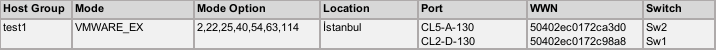
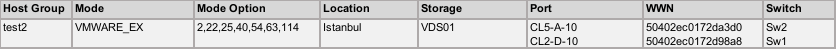
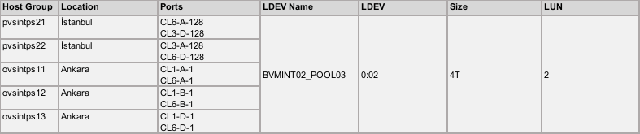

## SCENARIOS
---
---
---


### 1. ADDING NEW HOST GROUP for GAD
---
---


#### 1. DECISION
---



 Decide which storage port will be used
	 Choose redundant path for each storage and san switch
	 Check response time of ports. Try to use the least used ports.
 Remember you can use host groups of storage from 128 to 240 (e.g. from CL1-A-128 to CL1-A-240)
 You may check ports with following command.

	raidcom get host_grp -port <<<PORT>>> -IH0
	raidcom get host_grp -port <<<PORT>>> -IH1

 Remember you may use LDEVs between 00:00 - 01:FF for GAD
 Do not forget to click “scan for host new servers” button on OPS Center’s server interface if you create hostgroups from command line.

Lets assume you decided to use port CL5-A and CL2-D of primary and secondary storages and you noticed that CL5-A-128, CL5-A-129 and CL2-D-128, CL2-D-129 are already used for another host groups.
So you will be using next available host groups which are CL5-A-130 and CL2-D-130.


#### 2. ZONING
---

##### Switch 1
	alicreate "A_test1_P0_Sw1", "50:40:2e:c0:17:2c:98:a8"
	zonecreate "Z_test1_VDS01_Sw1", "A_VDS01_CL2_D_Sw1;A_test1_P0_Sw1"
	zonecreate "Z_test1_VDS02_Sw1", "A_VDS02_CL2_D_Sw1;A_test1_P0_Sw1"
	cfgadd "C_config_Fabric1", "Z_test1_VDS01_Sw1;Z_test1_VDS02_Sw1"
	cfgsave
	cfgenable "C_config_Fabric1" 

##### Switch 2
	alicreate "A_test1_P1_Sw2", "50:40:2e:c0:17:2c:a3:d0"
	zonecreate "Z_test1_VDS01_Sw2", "A_VDS01_CL5_A_Sw2;A_test1_P1_Sw2"
	zonecreate "Z_test1_VDS02_Sw2", "A_VDS02_CL5_A_Sw2;A_test1_P1_Sw2"
	cfgadd "C_config_Fabric2", "Z_test1_VDS01_Sw2;Z_test1_VDS02_Sw2"
	cfgsave
	cfgenable "C_config_Fabric2" 


#### 3. CREATING HOST GROUP
---

##### VDS01
	raidcom add host_grp -port CL5-A-130 -host_grp_name test1 -IH0
	raidcom modify host_grp -port CL5-A-130 -host_mode VMWARE_EX -set_host_mode_opt 2 22 25 40 54 63 68 110 -IH0
	raidcom add hba_wwn -port CL5-A-130 -hba_wwn 50402ec0172ca3d0 -IH0
	raidcom set hba_wwn -port CL5-A-130 -hba_wwn 50402ec0172ca3d0 -wwn_nickname test1_P1 -IH0
	raidcom add host_grp -port CL2-D-130 -host_grp_name test1 -IH0
	raidcom modify host_grp -port CL2-D-130 -host_mode VMWARE_EX -set_host_mode_opt 2 22 25 40 54 63 68 110 -IH0
	raidcom add hba_wwn -port CL2-D-130 -hba_wwn 50402ec0172c98a8 -IH0
	raidcom set hba_wwn -port CL2-D-130 -hba_wwn 50402ec0172c98a8 -wwn_nickname test1_P0 -IH0

##### VDS02
	raidcom add host_grp -port CL5-A-130 -host_grp_name test1 -IH1
	raidcom modify host_grp -port CL5-A-130 -host_mode VMWARE_EX -set_host_mode_opt 2 22 25 40 54 63 68 110 -IH1
	raidcom add hba_wwn -port CL5-A-130 -hba_wwn 50402ec0172ca3d0 -IH1
	raidcom set hba_wwn -port CL5-A-130 -hba_wwn 50402ec0172ca3d0 -wwn_nickname test1_P1 -IH1
	raidcom add host_grp -port CL2-D-130 -host_grp_name test1 -IH1
	raidcom modify host_grp -port CL2-D-130 -host_mode VMWARE_EX -set_host_mode_opt 2 22 25 40 54 63 68 110 -IH1
	raidcom add hba_wwn -port CL2-D-130 -hba_wwn 50402ec0172c98a8 -IH1
	raidcom set hba_wwn -port CL2-D-130 -hba_wwn 50402ec0172c98a8 -wwn_nickname test1_P0 -IH1


### 2. ADDING NEW HOST GROUP for SINGLE STORAGE
---
---


#### 1. DECISION
---



 Decide which storage port will be used
	 Choose redundant path for each storage and san switch
	 Check response time of ports. Try to use the least used ports.
 Remember you can use host groups of storage from 1 to 127 (e.g. from CL1-A-1 to CL1-A-127)
 You may check ports with following command.

	raidcom get host_grp -port <<<PORT>>> -IH0
	raidcom get host_grp -port <<<PORT>>> -IH1

 Remember you may use LDEVs between 10:00 - 1F:FF for non-GAD
 Do not forget to click “scan for host new servers” button on OPS Center’s server interface if you create hostgroups from command line.

Lets assume you decided to use port CL5-A and CL2-D of VDS01 and you noticed that ports are already used for another host groups from CL5-A-1 to CL5-A-9 and from CL2-D-1 to CL2-D-9. So you will be using next available host groups which are CL5-A-10 and CL2-D-10.


#### 2. ZONING
---

##### Switch 1
	alicreate "A_test2_P0_Sw1", "50:40:2e:c0:17:2d:98:a8"
	zonecreate "Z_test2_VDS01_Sw1", "A_VDS01_CL2_D_Sw1;A_test2_P0_Sw1"
	cfgadd "C_config_Fabric1", "Z_test2_VDS01_Sw1"
	cfgsave
	cfgenable "C_config_Fabric1" 

##### Switch 2
	alicreate "A_test2_P1_Sw2", "50:40:2e:c0:17:2d:a3:d0"
	zonecreate "Z_test2_VDS01_Sw2", "A_VDS01_CL5_A_Sw2;A_test2_P1_Sw2"
	cfgadd "C_config_Fabric2", "Z_test2_VDS01_Sw2"
	cfgsave
	cfgenable "C_config_Fabric2" 


#### 3. CREATING HOST GROUP
---

##### VDS01
	raidcom add host_grp -port CL5-A-10 -host_grp_name test2 -IH0
	raidcom modify host_grp -port CL5-A-10 -host_mode VMWARE_EX -set_host_mode_opt 2 22 25 40 54 63 68 110 -IH0
	raidcom add hba_wwn -port CL5-A-10 -hba_wwn 50402ec0172da3d0 -IH0
	raidcom set hba_wwn -port CL5-A-10 -hba_wwn 50402ec0172da3d0 -wwn_nickname test2_P1 -IH0
	raidcom add host_grp -port CL2-D-10 -host_grp_name test2 -IH0
	raidcom modify host_grp -port CL2-D-10 -host_mode VMWARE_EX -set_host_mode_opt 2 22 25 40 54 63 68 110 -IH0
	raidcom add hba_wwn -port CL2-D-10 -hba_wwn 50402ec0172d98a8 -IH0
	raidcom set hba_wwn -port CL2-D-10 -hba_wwn 50402ec0172d98a8 -wwn_nickname test2_P0 -IH0


### 3. ADDING LDEV to EXISTING GROUP in 3DC
---
---


#### 1. DECISION
---



 Remember you may use LDEVs between 00:00 - 01:FF for GAD. You may check available LDEVs with following command:
```bash
for i in $(seq 0 511); do
	echo "LDEV ${i}:  $(raidcom get ldev -ldev_id ${i} -IH0 | grep VOL_Capacity)”
done
```

 Check luns already assigned to the host group and find next available lun id by using following command:

	raidcom get lun -port CL6-A-128 -IH0
	raidcom get lun -port CL6-A-128 -IH1
	
and repeat the command for other ports. Lets assume next available LDEV is 00:02. And next available lun id is 2.


#### 2. CREATE & ASSIGN VOLUMES
---

##### 1. Create Volumes
	raidcom add ldev -pool 0 -ldev_id 0x0002 -capacity 4T -capacity_saving deduplication_compression -IH0
	raidcom add ldev -pool 0 -ldev_id 0x0002 -capacity 4T -capacity_saving deduplication_compression -IH1
	raidcom add ldev -pool 0 -ldev_id 0x0002 -capacity 4T -capacity_saving deduplication_compression -IH2
	raidcom modify ldev -ldev_id 0x0002 -ldev_name BVMINT02_POOL03 -IH0
	raidcom modify ldev -ldev_id 0x0002 -ldev_name BVMINT02_POOL03 -IH1
	raidcom modify ldev -ldev_id 0x0002 -ldev_name BVMINT02_POOL03 -IH2
	raidcom get ldev -ldev_id 0x0002 -fx -IH0
	raidcom get ldev -ldev_id 0x0002 -fx -IH1
	raidcom get ldev -ldev_id 0x0002 -fx -IH2

##### 2. Add LUNs
	raidcom add lun -port CL6-A-128 -lun_id 2 -ldev_id 0x0002 -IH0
	raidcom add lun -port CL3-D-128 -lun_id 2 -ldev_id 0x0002 -IH0
	raidcom add lun -port CL3-A-128 -lun_id 2 -ldev_id 0x0002 -IH0
	raidcom add lun -port CL6-D-128 -lun_id 2 -ldev_id 0x0002 -IH0
	raidcom get lun -port CL6-A-128 -fx -IH0
	raidcom get lun -port CL3-D-128 -fx -IH0
	raidcom get lun -port CL3-A-128 -fx -IH0
	raidcom get lun -port CL6-D-128 -fx -IH0
	
	raidcom add lun -port CL6-A-128 -lun_id 2 -ldev_id 0x0002 -IH1
	raidcom add lun -port CL3-D-128 -lun_id 2 -ldev_id 0x0002 -IH1
	raidcom add lun -port CL3-A-128 -lun_id 2 -ldev_id 0x0002 -IH1
	raidcom add lun -port CL6-D-128 -lun_id 2 -ldev_id 0x0002 -IH1
	raidcom get lun -port CL6-A-128 -fx -IH1
	raidcom get lun -port CL3-D-128 -fx -IH1
	raidcom get lun -port CL3-A-128 -fx -IH1
	raidcom get lun -port CL6-D-128 -fx -IH1
	
	raidcom add lun -port CL1-A-1 -lun_id 2 -ldev_id 0x0002 -IH2
	raidcom add lun -port CL6-A-1 -lun_id 2 -ldev_id 0x0002 -IH2
	raidcom add lun -port CL1-B-1 -lun_id 2 -ldev_id 0x0002 -IH2
	raidcom add lun -port CL6-B-1 -lun_id 2 -ldev_id 0x0002 -IH2
	raidcom add lun -port CL1-D-1 -lun_id 2 -ldev_id 0x0002 -IH2
	raidcom add lun -port CL6-D-1 -lun_id 2 -ldev_id 0x0002 -IH2

Check LUNs

	raidcom get lun -port CL1-A-1 -fx -IH2
	raidcom get lun -port CL1-B-1 -fx -IH2
	raidcom get lun -port CL1-D-1 -fx -IH2
	raidcom get lun -port CL6-A-1 -fx -IH2
	raidcom get lun -port CL6-B-1 -fx -IH2
	raidcom get lun -port CL6-D-1 -fx -IH2


#### 3. RECONFIGURE HORCM FILES for GAD
---

##### 1. Stop Instances
	horcmshutdown 0 1 2

##### 2. Edit Horcm Files

###### /etc/horcm0.conf 
	HORCM_MON
	#ip_address	service	poll(10ms)		timeout(10ms)
	localhost		31000	1000			3000
	
	HORCM_CMD
	# dev_name
	#\\.\IPCMD-172.30.255.28-31001 \\.\IPCMD-172.30.255.29-31001
	/dev/sdc
	
	HORCM_LDEV
	#GRP				DEV					SERIAL	LDEV#	MU#
	bvmint02			BVMINT02_POOL01		745175	00:00		h0
	bvmint02			BVMINT02_POOL02		745175	00:01		h0
	bvmint02			BVMINT02_POOL03		745175	00:02		h0
	bvmint02_HUR		BVMINT02_POOL01_HUR	745175	00:00		h2
	bvmint02_HUR		BVMINT02_POOL02_HUR	745175	00:01		h2
	bvmint02_HUR		BVMINT02_POOL03_HUR	745175	00:02		h2
	
	HORCM_INST
	#GPR				IP ADR	PORT#
	bvmint02			localhost	31001
	bvmint02_HUR		localhost	31002

###### /etc/horcm1.conf 
	HORCM_MON
	#ip_address	service	poll(10ms)		timeout(10ms)
	localhost		31001	1000			3000
	
	HORCM_CMD
	# dev_name
	#\\.\IPCMD-172.30.255.38-31001 \\.\IPCMD-172.30.255.39-31001
	/dev/sdd
	
	HORCM_LDEV
	#GRP				DEV					SERIAL	LDEV#	MU#
	bvmint02			BVMINT02_POOL01		715062	00:00		h0
	bvmint02			BVMINT02_POOL02		715062	00:01		h0
	bvmint02			BVMINT02_POOL03		715062	00:02		h0
	bvmint02_DLT		BVMINT02_POOL01_DLT	715062	00:00		h3
	bvmint02_DLT		BVMINT02_POOL02_DLT	715062	00:01		h3
	bvmint02_DLT		BVMINT02_POOL03_DLT	715062	00:02		h3
	
	HORCM_INST
	#GPR				IP ADR	PORT#
	bvmint02			localhost	31000
	bvmint02_DLT		localhost	31002

###### /etc/horcm2.conf 
	HORCM_MON
	#ip_address	service	poll(10ms)		timeout(10ms)
	localhost		31102	1000			3000
	
	HORCM_CMD
	# dev_name
	\\.\IPCMD-172.30.35.11-31001 \\.\IPCMD-172.30.35.12-31001
	
	HORCM_LDEV
	#GRP				DEV					SERIAL	LDEV#	MU#
	bvmint02_HUR		BVMINT02_POOL01_HUR	715061	00:00		h2
	bvmint02_HUR		BVMINT02_POOL02_HUR	715061	00:01		h2
	bvmint02_HUR		BVMINT02_POOL03_HUR	715061	00:02		h2
	bvmint02_DLT		BVMINT02_POOL01_DLT	715061	00:00		h3
	bvmint02_DLT		BVMINT02_POOL02_DLT	715061	00:01		h3
	bvmint02_DLT		BVMINT02_POOL03_DLT	715061	00:02		h3
	
	HORCM_INST
	#GPR				IP ADR	PORT#
	bvmint02_HUR		localhost	31000
	bvmint02_DLT		localhost	31001

##### 3. Start Instances
	horcmstart 0 1 2


#### 4. CREATE GAD PAIRS
---

 “-jq” switch needs quorum id and it is always 0.
 Use paircreate with -d switch pointing new LDEV name. 
 “-fg never” switch needs CTG id. You need to know consistency group for existing group in order to run paircreate command. Use following command to find it. You will see CTG in first column at the output of the command. Here we used CTG 1.

	pairdisplay -g bvmint02 -v ctg -IH0
	pairdisplay -g bvmint02 -v ctg -IH1

 In the end you need to confirm that pair status of new volume is PAIR. 

	pairdisplay -g bvmint02 -v ctg -IH0
	paircreate -g bvmint02 -d BVMINT02_POOL03 -fg never 1 -vl -jq 0 -IH0
	pairdisplay -g bvmint02 -fxce -IH0


#### 5. CREATE 3DC PAIRS
---

 Use paircreate with -d switch pointing new LDEV name. 
 First, you need to confirm that pair status of GAD pair is PAIR. 
 “-jp switch” is used to define journal id of P-VOL and “-js” switch is used to define the journal id of S-VOL. You need to know P-VOL and S-VOL journal ids. In order to find you may run following command. JID column shows journal ids.

	pairdisplay -g bvmint02_HUR -v jnl -IH0
	pairdisplay -g bvmint02_DLT -v jnl -IH1

##### 1. Create DELTA pair first
	pairdisplay -g bvmint02_DLT -v jnl -IH1
	JID of 715062 is jp and JID of 715061 is js. Here we used 0 for both.
	paircreate -g bvmint02_DLT -d BVMINT02_POOL03 -f async -vl -jp 0 -js 0 -nocsus –IH1

##### 2. Confirm that the UR delta resync pair creation is completed  
In CCI, the pair status of P-VOL is displayed as PSUE, and the mirror status of the journal is displayed as PJNS.

	pairdisplay -g bvmint02_DLT -fxce –IH1

##### 3. Create HUR pair finally
	pairdisplay -g bvmint02_HUR -v jnl -IH0	
	
	JID of 745175 is jp and JID of 715061 is js. Here we used 0 for both.
	paircreate -g bvmint02_HUR -d BVMINT02_POOL03 -f async -vl -jp 0 -js 0 –IH0

##### 4. Check replication status
	pairdisplay -g bvmint02_HUR -fxce –IH0


### 4. CREATING NEW GROUP of LDEVs for 3DC
---
---


#### 1. DECISION
---

 Remember you may use LDEVs between 00:00 - 01:FF for GAD. You may check available LDEVs with following command:
```bash
for i in $(seq 0 511); do
	echo "LDEV ${i}:  $(raidcom get ldev -ldev_id ${i} -IH0 | grep VOL_Capacity)”
done
```
 This scenario assumes that you’ve already created ldevs and assigned luns to the hosts.
 This scenario also assumes that new journal with id 1 will be used for 3DC replication. Remember that journal id can be between 0-255. You may find next available journal id with following command:
	
	raidcom get journal -IH0
	raidcom get journal -IH1
	raidcom get journal -IH2

 This scenario assumes next available ldev is 0x3F11 for journals at all storages.
 Remember that you may create totally 85 consistency group for 3DC. In this scenario CTG id 2 will be used for GAD. CTG id for HUR and DELTA will be automatically choosen as next available id.
	 GAD: 85 (CTG ID 0 through CTG ID 84)
	 UR: 85 (CTG ID 85 through CTG ID 169)
	 UR delta resync: 85 (CTG ID 170 through CTG ID 254)

Lets assume new LDEV is 00:10 and 00:11. Name of these new LDEVs are TESTVOL1 and TESTVOL2 accordingly.


#### 2. CREATE JOURNAL
---

##### 1. Create Journal Volume
	raidcom add ldev -pool 0 -ldev_id 0x3F11 -capacity 2T -IH0
	raidcom add ldev -pool 0 -ldev_id 0x3F11 -capacity 2T -IH1
	raidcom add ldev -pool 0 -ldev_id 0x3F11 -capacity 2T -IH2
	raidcom get ldev -ldev_id 0x3F11 -fx -IH0
	raidcom get ldev -ldev_id 0x3F11 -fx -IH1
	raidcom get ldev -ldev_id 0x3F11 -fx -IH2

##### 2. Add journal with id 1
	raidcom add journal -journal_id 1 -ldev_id 0x3F11 -IH0
	raidcom add journal -journal_id 1 -ldev_id 0x3F11 -IH1
	raidcom add journal -journal_id 1 -ldev_id 0x3F11 -IH2

##### 3. Modify journals for fast transfer
	raidcom modify journal -journal_id 1 -mirror_id 0 -copy_size 3 -IH0
	raidcom modify journal -journal_id 1 -mirror_id 1 -copy_size 3 -IH0
	raidcom modify journal -journal_id 1 -mirror_id 2 -copy_size 3 -IH0
	raidcom modify journal -journal_id 1 -mirror_id 3 -copy_size 3 -IH0
	raidcom modify journal -journal_id 1 -data_overflow_watch 0 -IH0
	
	raidcom modify journal -journal_id 1 -mirror_id 0 -copy_size 3 -IH1
	raidcom modify journal -journal_id 1 -mirror_id 1 -copy_size 3 -IH1
	raidcom modify journal -journal_id 1 -mirror_id 2 -copy_size 3 -IH1
	raidcom modify journal -journal_id 1 -mirror_id 3 -copy_size 3 -IH1
	raidcom modify journal -journal_id 1 -data_overflow_watch 0 -IH1
	
	raidcom modify journal -journal_id 1 -mirror_id 0 -copy_size 3 -IH2
	raidcom modify journal -journal_id 1 -mirror_id 1 -copy_size 3 -IH2
	raidcom modify journal -journal_id 1 -mirror_id 2 -copy_size 3 -IH2
	raidcom modify journal -journal_id 1 -mirror_id 3 -copy_size 3 -IH2
	raidcom modify journal -journal_id 1 -data_overflow_watch 0 -IH2

Confirm LDEV is registered to the journal

	raidcom get journal -IH0
	raidcom get journal -IH1
	raidcom get journal -IH2


#### 3. RECONFIGURE HORCM FILES for GAD
---

##### 1. Stop Instances
	horcmshutdown 0 1 2

##### 2. Edit Horcm Files

###### /etc/horcm0.conf 
	HORCM_MON
	#ip_address	service	poll(10ms)		timeout(10ms)
	localhost		31000	1000			3000
	
	HORCM_CMD
	# dev_name
	#\\.\IPCMD-172.30.255.28-31001 \\.\IPCMD-172.30.255.29-31001
	/dev/sdc
	
	HORCM_LDEV
	#GRP				DEV					SERIAL	LDEV#	MU#
	bvmint02			BVMINT02_POOL01		745175	00:00		h0
	bvmint02			BVMINT02_POOL02		745175	00:01		h0
	bvmint02			BVMINT02_POOL03		745175	00:02		h0
	TESTVOL_GAD		TESTVOL1				745175	00:10		h0
	TESTVOL_GAD		TESTVOL2				745175	00:11		h0
	bvmint02_HUR		BVMINT02_POOL01_HUR	745175	00:00		h2
	bvmint02_HUR		BVMINT02_POOL02_HUR	745175	00:01		h2
	bvmint02_HUR		BVMINT02_POOL03_HUR	745175	00:02		h2
	TESTVOL_HUR		TESTVOL1_HUR			745175	00:10		h2
	TESTVOL_HUR		TESTVOL2_HUR			745175	00:11		h2
	
	HORCM_INST
	#GPR				IP ADR	PORT#
	bvmint02			localhost	31001
	TESTVOL_GAD		localhost	31001
	bvmint02_HUR		localhost	31002
	TESTVOL_HUR		localhost	31002

###### /etc/horcm1.conf 
	HORCM_MON
	#ip_address	service	poll(10ms)		timeout(10ms)
	localhost		31001	1000			3000
	
	HORCM_CMD
	# dev_name
	#\\.\IPCMD-172.30.255.38-31001 \\.\IPCMD-172.30.255.39-31001
	/dev/sdd
	
	HORCM_LDEV
	#GRP				DEV					SERIAL	LDEV#	MU#
	bvmint02			BVMINT02_POOL01		715062	00:00		h0
	bvmint02			BVMINT02_POOL02		715062	00:01		h0
	bvmint02			BVMINT02_POOL03		715062	00:02		h0
	TESTVOL_GAD		TESTVOL1				715062	00:10		h0
	TESTVOL_GAD		TESTVOL2				715062	00:11		h0
	bvmint02_DLT		BVMINT02_POOL01_DLT	715062	00:00		h3
	bvmint02_DLT		BVMINT02_POOL02_DLT	715062	00:01		h3
	bvmint02_DLT		BVMINT02_POOL03_DLT	715062	00:02		h3
	TESTVOL_DLT		TESTVOL1_DLT			715062	00:10		h3
	TESTVOL_DLT		TESTVOL2_DLT			715062	00:11		h3
	
	HORCM_INST
	#GPR				IP ADR	PORT#
	bvmint02			localhost	31000
	TESTVOL_GAD		localhost	31000
	bvmint02_DLT		localhost	31002
	TESTVOL_DLT		localhost	31002

###### /etc/horcm2.conf 
	HORCM_MON
	#ip_address	service	poll(10ms)		timeout(10ms)
	localhost		31102	1000			3000
	
	HORCM_CMD
	# dev_name
	\\.\IPCMD-172.30.35.11-31001 \\.\IPCMD-172.30.35.12-31001
	
	HORCM_LDEV
	#GRP				DEV					SERIAL	LDEV#	MU#
	bvmint02_HUR		BVMINT02_POOL01_HUR	715061	00:00		h2
	bvmint02_HUR		BVMINT02_POOL02_HUR	715061	00:01		h2
	bvmint02_HUR		BVMINT02_POOL03_HUR	715061	00:02		h2
	TESTVOL_HUR		TESTVOL1_HUR			715061	00:10		h2
	TESTVOL_HUR		TESTVOL2_HUR			715061	00:11		h2
	bvmint02_DLT		BVMINT02_POOL01_DLT	715061	00:00		h3
	bvmint02_DLT		BVMINT02_POOL02_DLT	715061	00:01		h3
	bvmint02_DLT		BVMINT02_POOL03_DLT	715061	00:02		h3
	TESTVOL_DLT		TESTVOL1_DLT			715061	00:10		h3
	TESTVOL_DLT		TESTVOL2_DLT			715061	00:11		h3
	
	HORCM_INST
	#GPR				IP ADR	PORT#
	bvmint02_HUR		localhost	31000
	TESTVOL_HUR		localhost	31000
	bvmint02_DLT		localhost	31001
	TESTVOL_DLT		localhost	31001

##### 3. Start Instances
	horcmstart 0 1 2


#### 4. CREATE GAD PAIRS
---

 “-fg never” switch needs new CTG id. 
 “-jq” switch needs quorum id and it is always 0.
 In the end you need to confirm that pair status of new volume is PAIR. 

	paircreate -g TESTVOL_GAD -fg never 2 -vl -jq 0 -IH0
	pairdisplay -g TESTVOL_GAD -fxce -IH0


#### 5. CREATE 3DC PAIRS
---

 First, you need to confirm that pair status of GAD pair is PAIR.
 -jp switch is used to define journal id of P-VOL and -js switch is used to define the journal id of S-VOL. 

##### 1. Create DELTA pair first
	paircreate -g TESTVOL_DLT -f async -vl -jp 1 -js 1 -nocsus –IH1

##### 2. Confirm that the UR delta resync pair creation is completed  
In CCI, the pair status of P-VOL is displayed as PSUE, and the mirror status of the journal is displayed as PJNS.

	pairdisplay -g TESTVOL_DLT -fxce –IH1

##### 3. Create HUR pair finally
	paircreate -g TESTVOL_HUR -f async -vl -jp 1 -js 1 –IH0

##### 4. Check replication status
	pairdisplay -g TESTVOL_HUR -fxce –IH0
