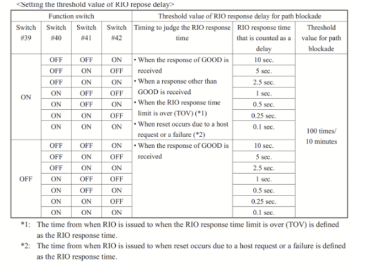

## SYSTEM OPTIONS
---
---

### Remote Replication (GAD, UR)
---

**Remote Replication Function Switch**
**Menu** → **Actions** → **Remote Replications** → **Edit Remote Replica Function Switch**
	**17 18 20 39 40 44**(recover path)  + **41 42** (40 is disabled at Denizbank G1500)
	**39, 40 and 42** is set. This will set a counting of RIO delayed for 500 msec or more.

	Support for RIO path auto-recovery function
	RIO path auto-recovery function is supported.
	When Function Switch 44 is enabled, the recovery processing works under the following conditions:
		1. A logical path blockage by Function Switch 17 occurs while Function Switch 44 is enabled.
		2. After 1, failure detection (LIP or RSCN event) works for a certain number of times (up to 15) in a 30-minute period.

### Advanced System Settings 
---

https://docs.hitachivantara.com/r/en-us/svos/9.8.7/mk-98rd9023/planning-for-universal-replicator/preparing-the-storage-systems-for-ur/advanced-system-settings
**Menu** → **Setting** → **Environmental Setting** → **Edit Advanced System Settings**
	5 or **6** (online disk expansion) **18**(hur) 

##### _Advanced_ _System_ _Setting_ No. 5 (Default OFF)
Switch the control of differential bitmaps of volumes used for TC/UR/GAD pairs whose capacity is 4TB or less (for open volumes) at creation or resynchronization of pairs.
When enabled, for a TC, UR, or GAD pair that uses an open volume (only DP-VOL) with user capacity of 4,194,304 MB or less, the differential data management for the target volume is enabled by the hierarchical difference at the new pair creation or the pair resynchronization (hierarchical difference management).
In addition, for a TC, UR, or GAD pair that uses an open volume (only DP-VOL) with user capacity exceeding 4,194,304 MB, the differential data management for the target volume is enabled by the hierarchical difference at the new pair creation regardless of this _setting_.

##### _Advanced_ _System_ _Setting_ No. 6 (Default OFF)
Switch the control of differential bitmaps of volumes used for TC/UR/GAD pairs whose capacity is 4TB or less (for open volumes) at creation of pairs.
When enabled, for a TC, UR, or GAD pair that uses an open volume (only DP-VOL) with user capacity of 4,194,304 MB or less, the differential data management for the target volume is enabled by the hierarchical difference at the new pair creation (hierarchical difference management).
In addition, for a TC, UR, or GAD pair that uses an open volume (only DP-VOL) with user capacity exceeding 4,194,304 MB, the differential data management for the target volume is enabled by the hierarchical difference at the new pair creation regardless of this _setting_.
|  Setting5 |  Setting6 |  Description |
|---|---|---|
|  Disabled |  Disabled |  **Create operation**: Apply the shared memory (SM) difference management at the new pair creation. **Resync operation**: Change the management method of the existing pair from hierarchical differences to SM differences when the pair is resynchronized and the pair status changes to PAIR after No. 5 and No. 6 settings.  |
|      Disabled     |      Enabled     |                                                                                                                                                                                                                                                                                                                       **Create operation:** Apply the hierarchical difference management at the new pair creation. **Resync operation:** The differential data management method of the existing pair is not changed.           |
|          Enabled         |         Disabled         |                                                                                                                                                                                                                                                                                                                       **Create operation:** Apply the hierarchical difference management at the new pair creation. **Resync operation:** Change the management method of the existing pair from SM differences to hierarchical differences when the pair is resynchronized and the pair status changes to PAIR after No. 5 and No. 6 settings.           |

**Note:**
	* If the user capacity of a volume used in a TC, UR, or GAD pair exceeds 4,194,304 MB for an open volume (only DP-VOL) the differential data management for the target volume is enabled by the hierarchical difference at the new pair creation regardless of the settings of the _advanced_ _system_ settings No. 5 and No. 6.
	* Make the same settings of the _advanced_ _system_ settings No. 5 and No. 6 for both the primary and secondary storage systems.
	* If the _system_ option mode (_SOM_) 1198 or 1199 is applied, the difference management method with _SOM_ 1198 or 1199 takes precedence. For more information, see the _System_ Administrator Guide.

##### Advanced System Setting No. 14 (Default OFF)
After delta resync, the pair status remains COPY during journal data copy.
	* **Enabled**: When a delta resync is performed in a 3DC multi-target configuration with TC and UR, the pair status remains COPY during journal data copy.
	* **Disabled**: When a delta resync is performed in a 3DC multi-target configuration with TC and UR, the pair status changes directly to PAIR.

##### Advanced System Setting No. 15 (Default OFF)
One minute after remote path failure detection, the mirror is split.
	* **Enabled**: When a remote path failure is detected, the mirror is split if the remote path is not restored within one minute after the detection.
	* **Disabled**: When a remote path failure is detected, the mirror is split if the remote path is not restored within the path monitoring time set by the mirror option.
	This _setting_ is enabled only when No. 16 is enabled. When No. 16 is disabled, the mirror is not split even if a remote path failure is detected.

##### Advanced System Setting No. 16 (Default OFF)
After remote path failure detection, the mirror is split.
	* Enabled: After a remote path failure is detected, the mirror is split.
	* Disabled: Even if a remote path failure is detected, the mirror is not split.
	How this _setting_ works with _setting_ No. 15 is described in the following table.
|  Setting15 |  Setting16 |  Description |
|---|---|---|
|  Disabled |  Disabled |  Even if a remote path failure is detected, the mirror is not split.  |
|      Enabled     |      Disabled     |                                                                                                                                                                                                                                                                                                                      Even if a remote path failure is detected, the mirror is not split.           |
|          Disabled         |         Enabled         |                                                                                                                                                                                                                                                                                                                      After remote path failure detection, the mirror is split if the remote path is not restored within the path monitoring time.           |
|             Enabled             |             Enabled             |  After remote path failure detection, the mirror is split if the remote path is not restored within one minute after the detection.                                                                                                                                                                                                                              |

##### Advanced System Setting No. 17 (Default OFF)
The copy pace for mirror option (Medium) becomes one level faster.
When enabled, the pace for copying data during initial copy becomes one level faster when the copy pace for journal option is Medium. This item can be used to make the initial copy operation in Medium speed mode perform faster.

##### Advanced System Setting No. 18 (Default OFF)
The copy pace for mirror option (Medium) becomes two level faster.
When enabled, the pace for copying data during initial copy becomes two levels faster when the copy pace for journal option is Medium. This item can be used to make the initial copy operation in Medium speed mode perform faster.

### Deduplication - SOM 1191
---

	raidcom modify system_opt -system_option_mode system -mode_id 1191 -mode enable -Ixxx

### HMO for HDLM or Long Distance
---

You can use the following host mode option (HMO) to improve response time of host I/O by improving response time between the storage systems for distance direct connections (up to 10 km Long Wave) when the open package is used.After remote path failure detection, the mirror is split if the remote path is not restored within one minute after the detection.

	* HMO **51** (Round Trip Set Up Option)

Host mode options **49, 50, 51, and 65** are enabled only for the 8UFC/16UFC package.

##### 1. Round Trip Set Up Option (51)
---

		If you want to adjust the response time of the host I/O, for example when the distance between MCU and RCU of the TrueCopy pair is long (approximately 100 kilometers) and the Point-to-Point topology is used.
		Use the combination of this host mode option and the host mode option 65.
		Note: Set host mode option 51 for both ports on MCU and RCU.

##### 2. Round Trip extended set up option (65)
---

		If you want to adjust the response time of the host I/O when you use the host mode option 51 and the host connects the TrueCopy pair. For example, when the configuration using the maximum number of processor blades is used.
		Use the combination of this host mode option and the host mode option 51.

### BLOCKED PATH MONITORING
---
---

https://docs.hitachivantara.com/r/en-us/svos/9.6.0/mk-98rd9023/ur-configuration-operations/setting-the-remote-replica-options/setting-the-blocked-path-monitoring-and-blocked-path-sim-monitoring-options
	- When you use Fibre Channel as a remote path, if you specify Auto for Port Speed, specify 10 seconds or more for Blocked Path Monitoring. If you want to specify 9 seconds or less, do not set Auto for Port Speed.
	- If the time specified for Blocked Path Monitoring is not long enough, the network speed might be slowed down or the period for speed negotiation might be exceeded. As a result, paths might be blocked.

You can set the period of time to monitor a blocked path and the time to monitor SIMs that are reported by a blocked path using the Edit Remote Replica Options window.
You can also change these settings later as needed.
	- Blocked Path Monitoring: range = 2 to 45 seconds
	- Blocked Path SIM Monitoring: range = 2 to 100 seconds

##### To perform this task in CCI, use the raidcom modify remote_replica_opt command. (Storage Administrator (Remote Copy) role is required.)
---

	raidcom modify system_opt -system_option_mode system -mode_id <SOM> -mode enable -Ixxx
	raidcom modify system_opt -system_option_mode system -mode_id <SOM> -mode enable -password <One Time Password> -Ixxx
	raidcom get system_opt -key mode -lpr system -Ixxx

1. In the **Storage Systems** tree, select **Replication**.
2. Click **Edit Options > Remote Replication**.
3. In **Copy Type**, select **TC/TCMF**.
	These values are necessary for setting **Blocked Path Monitoring**, and are used for TC, TCz, UR, URz, and GAD operations.
4. In **Blocked Path Monitoring**, enter a value from 2 to 45 (sec.) as the time to monitor a path blockade.
5. In **Blocked Path SIM Monitoring**, enter a value from 2 to 100 (sec.) as the time to monitor SIMs that are reported by a path blockade.
6. Click **Finish**.
7. In the **Confirm** window, check the settings you made, and then enter the task name in **Task Name**.
8. Click **Apply**.
	The task is registered, and the **Tasks** window appears if the **Go to tasks window for status** check box is selected.
9. You can check the progress of the task on the **Tasks & Alerts** tab. Click the task name to view details of the task.

### GAD SOM
---
---

##### SOM 784 (TruCopy, GAD):
This _SOM_ can reduce the time-out (MIH) watch time of RI/O for a TC or GAD pair internally so that update I/Os can continue by using an alternate path without time-out occurrence in the environment where host time-out time is short (15 seconds or less). This _SOM_ is effective at initial pair creation or Resync operation for TC or GAD. (Not effective by just setting this _SOM_ to ON.)

This _SOM_ is applied to TC and GAD. This _SOM_ supports paths between DKCs using Fibre, but not those between DKCs using iSCSI.

**Mode _784_ = ON:** The MIH time of RIO is internally reduced so that, even though a path failure occurs between storage systems in the environment where host MIH time is set to 15 seconds, update I/Os can be processed by using an alternate path promptly, lowering the possibility of host MIH occurrence.

**Mode _784_ = OFF (default)** The operation is processed in accordance with the TC or GAD specification.

	raidcom modify system_opt -system_option_mode system -mode_id 784 -mode enable -Ixxx
	raidcom get system_opt -key mode -lpr system -Ixxx
