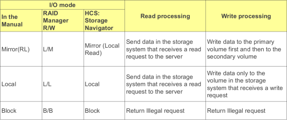
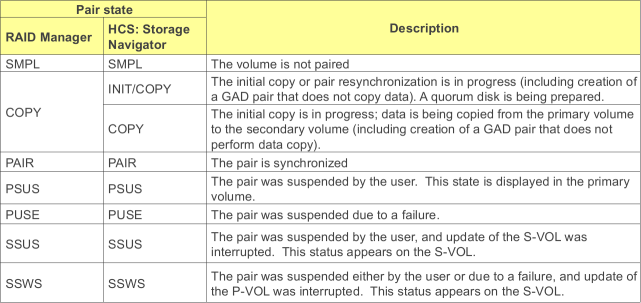
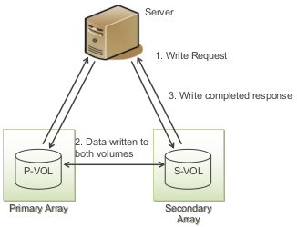
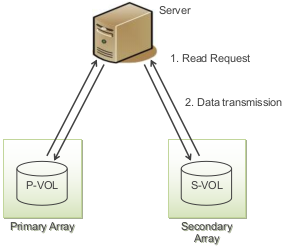
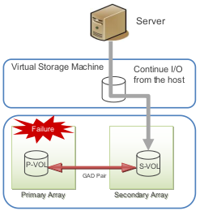

### 3DC RECOVERY 📝
---
---

#### 1. IO MODES
---

#### 2. PAIR STATES
---

#### 3. GAD IO FLOW
---

##### GAD Write I/O
When GAD status is mirrored the I/O mode of the pairs is mirror (RL)
		Write requests are written to both pair volumes and then a write completed response is returned to the host
		

##### GAD Read I/O
When GAD status is mirrored the I/O mode of the pairs is mirror (RL)
		Read requests are read from the volume connected to the server and then sent to the server
		There is no communication between the primary and secondary storage system
		

##### Failure
If a failure occurs preventing host access to a volume in a GAD pair
			Multipathing software will recognize the failure
			If connectivity is available I/O can continue on the other storage system
			

