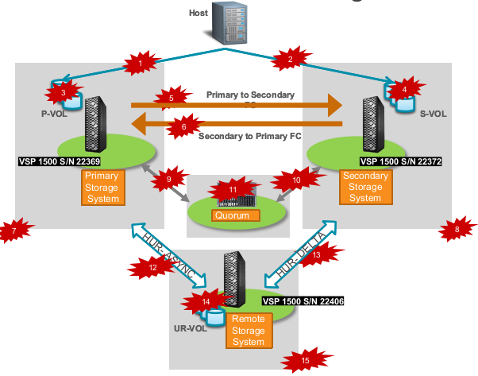
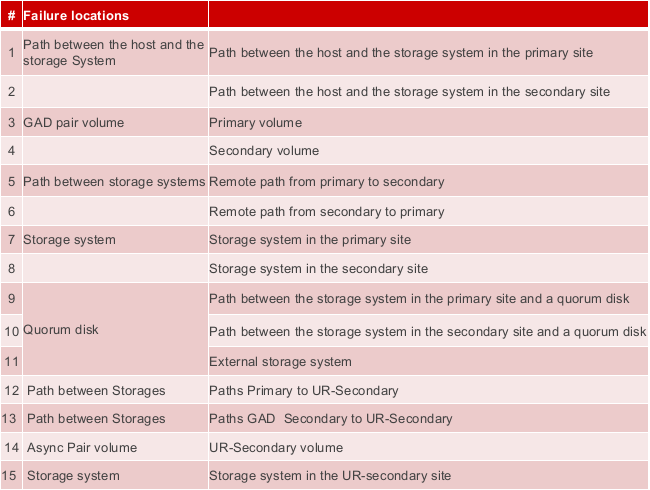

#### Managing 3DC Failover and Failback Scenario (CLI)
---
---

Following config files are used when working with CCI.

##### Local
	1- For Primary Storage GAD horcm100.conf , for Secondary GAD  horcm200.conf
	2- Primary to DRC HUR horcm1.conf
	3- Secondary to DRC Delta  horcm2.conf

##### Remote
	1- For Remote site(Ankara)  Storage HUR and Delta  horcm3.conf

##### HORCM  (Hitachi Online Remote Copy Manager)
	These files must reside in 
		c:\windows on Windows
		/etc on Linux 
	To start these files following commands needed 
		cd c:\horcm\etc
		horcmstart 100 200 1 2 3
		raidcom -login –I100 
		raidcom -login –I200
		raidcom -login –I1
		raidcom -login –I2
		raidcom -login –I3

When anything will be changed in these files they must be shutdown first than commands for start must be applied. To  shutdown 

	cd c:\horcm\etc\bin
	horcmshutdown  100 200 1 2 3

Locations where failures might occur
 
