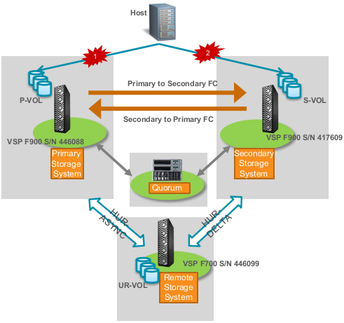

#### Recovering from a failure of a physical path between the host and the storage system
---
---

##### Steps for recovery from the failure
---

1. Restore the path
	* Using alternative path software, identify the path that cannot be accessed from the host.
	* Using SAN management software, identify the failure location.
	* Reconnect the physical path or reconfigure the SAN to recover from the path failure.
	  
2. Using alternative path software, resume I/Os from the host to the recovered path.

No action needed on Storages
