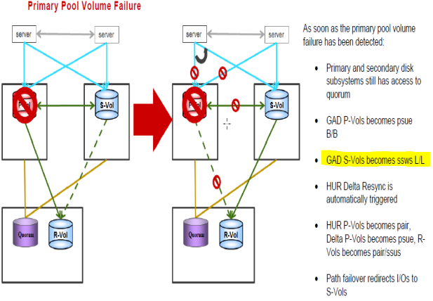

#### Recovering from a failure of GAD P-VOL LDEV (1-2)
---
---




##### Steps for recovery from the failure
---

1. If needed delete the alternative path
	* Using alternative path software, identify the volume that cannot be accessed from the host.
	* Verify whether the volume that cannot be accessed from the host is blocked.
	* For example, you can use the following command:

		```raidcom get ldev -ldev_id 18:00 –I100```

2. Verify that the pool/pool volume is not blocked (BLK in the STS column)

3. Change the direction
	* Lets assume LDEV ID 18:00 device name in horcm100.conf file is  LEASDB_LOG_01
	* Servers continue to work from S-VOL only path to P-VOL lost
	* After recovering P-VOL and status was normal for LDEV
	* This command will change  S-vol to P-vol

		```pairresync -g S0134LEASDBV1_GAD -d LEASDB_LOG_01 -swaps –I200```
 
	* After ldev status pair,o make ldev 18:00 P-vol on primary storage again

		```pairresync -g S0134LEASDBV1_GAD -d LEASDB_LOG_01 -swaps –I100```

	* To check status 
	
		```pairdisplay -g S0134LEASDBV1_GAD -d LEASDB_LOG_01 -fxce –I100```

Status must be pair in a while
