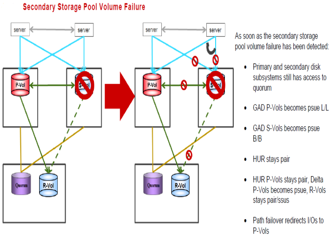

#### Recovering from a failure of GAD S-VOL LDEV
---
---




##### Steps for recovery from the failure
---

1. Servers continue to work from P-VOL only, path to S-VOL lost
	To resync

	```pairresync -g S0134LEASDBV1_GAD -d LEASDB_LOG_01 –I100```

	To check status

	```pairdisplay -g S0134LEASDBV1_GAD -d LEASDB_LOG_01 -fxce –I100```

Status must be pair in a while
