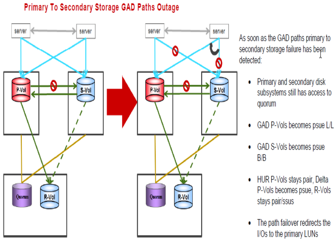

#### Primary to Secondary GAD Paths Outage
---
---




##### Steps for recovery from the failure
---

1. Reconnect the physical path or reconfigure the SAN to recover from the failure of the path between the storage systems.
	* After the physical path between the storage systems is recovered, the remote path is automatically recovered.
	* All groups in horcm100 file need to be resync
	  
		```pairresync -g S0134LEASDBV1_GAD –I100```
		```pairresync -g S0134DMSDBV01_GAD –I100```

	* To check status for one group as a sample

		```pairdisplay -g S0134LEASDBV1_GAD -fxce –I100```

Status must be pair in a while
