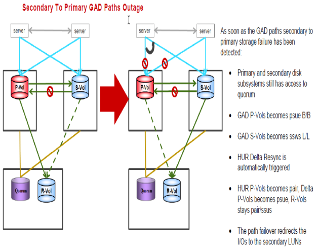

#### Secondary to Primary GAD Paths Outage
---
---




##### Steps for recovery from the failure
---

- Servers continue to work from S-VOL only  path to P-VOL lost
- S-VOL status will be **SSWS**

  
After paths online

1. Split HUR from Primary to Async Remote for all groups in horcm1.conf (If all HUR/GAD Pvols are not in same storage than use correct horcmx.conf and group name)

	```pairsplit -g S0134LEASDBV1_3DCP  -S –I1```

2. Recreate Old HUR as DELTA for all groups in horcm(use correct journal ids 0 here as sample)

	```paircreate -g S0134LEASDBV1_3DCP  -f async -jp 0 -js 0 -nocsus –I1```

3. Resync from GAD Secondary to Primary which changes old P-VOL to S-VOL

	```pairresync -g S0134LEASDBV1_GAD -swaps –I200```

4. After ldevs are in PAIR state,if requested, to make ldevs P-vol on primary storage again

	```pairrsplit -g S0134LEASDBV1_GAD -RS –I100```
	```pairresync -g S0134LEASDBV1_GAD -swaps –I100```
	
Status must be pair in a while
