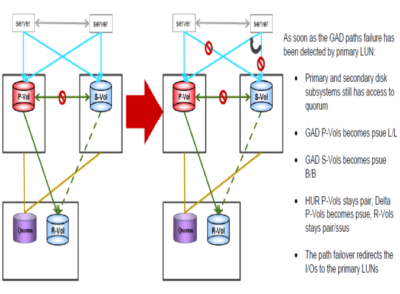
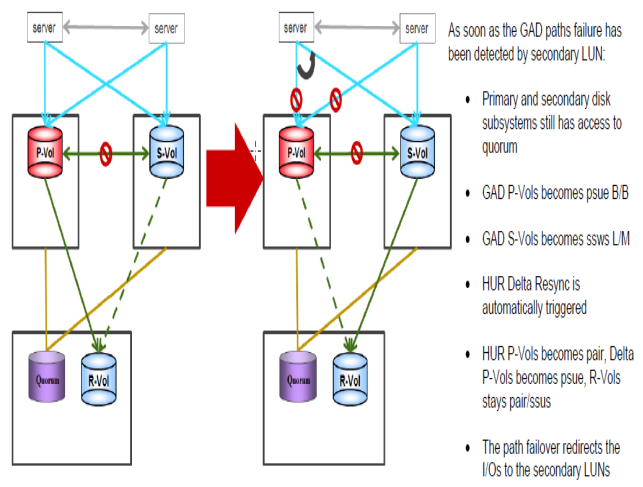

#### All GAD Paths Outage
---
---


This scenario includes GAD Paths outage only , not all SAN outage.


##### Steps for recovery from the failure
---

1. If I/O continues to P-VOL, 
	a. Check status
		```pairdisplay -g S0134LEASDBV1_GAD -fxce –I100```
		Second column from right shows L/L or B/B. If P-VOL shows L/L and S-Vol is B/B, S-VOL status will be PSUE.
		Servers continue to work from P-VOL , only path to S-VOL lost.
	
	b. After paths online
		```pairresync -g S0134LEASDBV1_GAD –I100```

	c. To check status for one group as a sample
		```pairdisplay -g S0134LEASDBV1_GAD  -fxce –I100```

2. If I/O continues to S-VOL, 
	a. Check status
		```pairdisplay -g S0134LEASDBV1_GAD -fxce –I100```
		Second column from right shows L/L or B/B. If P-VOL shows B/B and S-Vol is L/L, Servers continue to work from S-VOL ,only path to P-VOL lost. S-VOL status will be SSWS.
		DELTA will be HUR primary and continue to replicate UR.
		
	b. After paths online, split HUR from Primary to DR storage for all groups in horcm
		```pairsplit -g S0134LEASDBV1_3DCP  -S –I1```
		
	c. Recreate Old HUR as DELTA for all groups in horcm
		```paircreate -g S0134LEASDBV1_3DCP  -f async -jp 0 -js 0 -nocsus –I1```
		
	d. Resync from GAD Secondary to Primary which changes old P-VOL to S-VOL
		```pairresync -g S0134LEASDBV1_GAD -swaps –I200```
		
	e. To make ldevs P-vol on primary storage again
		```pairrsplit -g S0134LEASDBV1_GAD -RS –I100```
		```pairresync -g S0134LEASDBV1_GAD -swaps –I100```
		
	f. To check status for one group as a sample
		```pairdisplay -g S0134LEASDBV1_GAD -fxce –I100```

Status must be pair in a while
