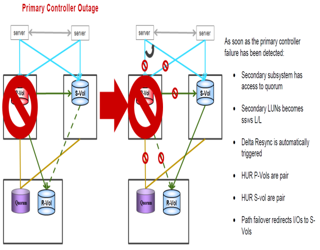

#### Recovering from failure of Primary Storage System
---
---





##### Steps for recovery from the failure
---

* Servers continue to work from Secondary storage
* After Primary storage recovered and status online
* GAD S-VOL status will be SSWS and DELTA will be HUR primary

1. Split HUR from Primary to DR storage
	
	```pairsplit -g S0134LEASDBV1_3DCP  -S –I1```

2. Recreate Old HUR as DELTA (use correct journal IDs)

	```paircreate -g S0134LEASDBV1_3DCP  -f async -jp 0 -js 0 -nocsus –I1```

3. Resync from GAD Secondary to Primary which changes old P-VOL to S-VOL
	
	```pairresync -g S0134LEASDBV1_GAD -swaps –I200```

After ldevs are in PAIR state,

4. To make ldevs P-vol on primary storage again

	```pairrsplit -g S0134LEASDBV1_GAD -RS –I100```
	```pairresync -g S0134LEASDBV1_GAD -swaps –I100```
	
Status must be pair in a while
