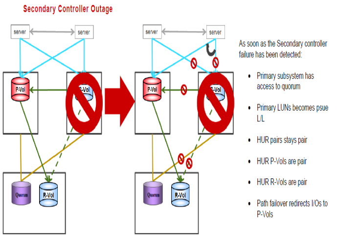

#### Recovering from failure of Secondary Storage System
---
---





##### Steps for recovery from the failure
---

* Servers continue to work from Primary storage
* After Secondary storage recovered and status online only resync from Primary

1. Resync pairs
	
	```pairresync -g S0134LEASDBV1_GAD –I100```

2. To check status for one group as a sample
	
	```pairdisplay -g S0134LEASDBV1_GAD  -fxce –I100```
	
Status must be pair in a while
