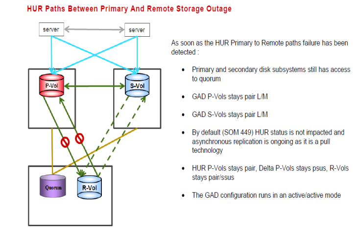

#### Path failure from Primary to Async Remote
---
---





##### Steps for recovery from the failure
---

1. Recover failed paths (SAN,GBIC, cable, switch.....)
2. No other action needed.Storage will bring paths online after failure fix
3. If HUR pairs suspended than resync
	
	```pairresync -g S0134LEASDBV1_3DCP  -I1```
