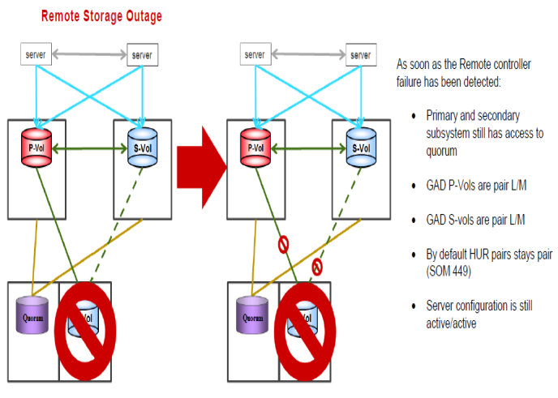

#### Recovering from a failure of HUR Remote storage
---
---





##### Steps for recovery from the failure
---

After Remote Storage Online again

1. No other action needed.Storage will bring paths online after failure fix
2. If needed (HUR shows suspended with PSUE status than resync HUR
	
	```pairresync -g S0134LEASDBV1_3DCP   -I1```
