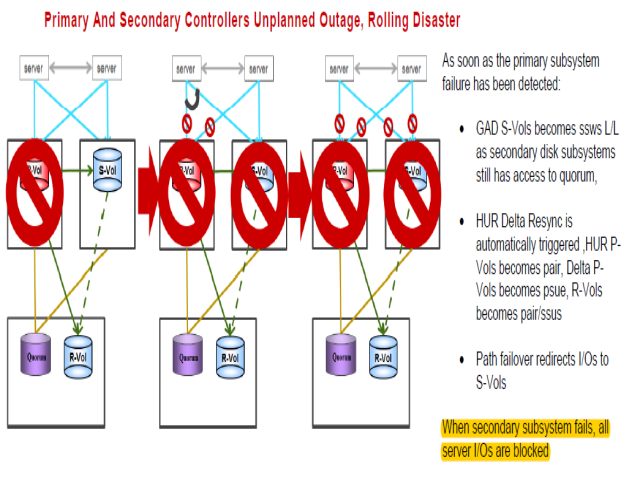

#### Recovering from failure of first GAD Primary After then Secondary Rolling Disaster
---
---





##### Steps for recovery from the failure
---

1. To start working from HUR remote storage
	```pairsplit -g S0134LEASDBV1_3DCS -RS –I3```

After Primary and secondary  Storage Online again, the path between servers and primary/secondary GAD should be offline as they would see old data 

2. Run
	```pairsplit -g S0134LEASDBV1_3DCP  -S –I1```
	```paircreate -g S0134LEASDBV1_3DCP  -f async -jp 0 -js 0 -vl -nocsus –I1```
	```pairresync -g S0134LEASDBV1_3DCS  -swaps –I3```
	
3. Stop server I/O on remote site in order to switch to secondary site
	```pairsplit -g S0134LEASDBV1_3DCS -RS –I2```
	```pairresync -g S0134LEASDBV1_3DCS -swaps –I2```
	
After DELTA in pair state, GAD secondary is active now and server can start I/O from Secondary GAD storage

4. To do GAD secondary as new Primary and sync data to old Primary
	pairresync -g S0134LEASDBV1_GAD -swaps –I200
	
5. Failback to primary GAD Storage
	pairrsplit -g S0134LEASDBV1_GAD -RS –I100
	pairresync -g S0134LEASDBV1_GAD -swaps –I100
