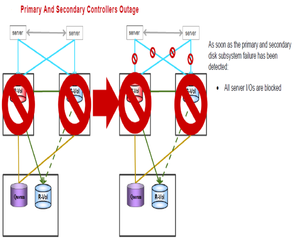

#### Recovering from failure of Primary and Secondary at the Same time or Secondary first then Primary
---
---





##### Steps for recovery from the failure
---

1. To start working from HUR remote storage
	```pairsplit -g S0134LEASDBV1_3DCP  -RS –I3 ```

After Primary and secondary  Storage Online again
The path between servers and primary/secondary should be offline as they would see old data 

2. Run
	```pairresync -g S0134LEASDBV1_3DCP   -swaps –I3```

3. Stop server I/O on remote site in order to switch to GAD primary site
	```pairsplit -g S0134LEASDBV1_3DCP  -RS –I1```
	```pairresync -g S0134LEASDBV1_3DCP  -swaps –I1```

Servers start I/O from Primary storage

4. Resync all GAD pairs
	```pairresync -g S0134LEASDBV1_GAD –I100```
