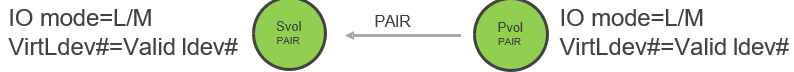
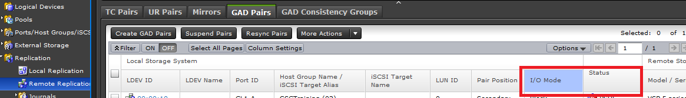
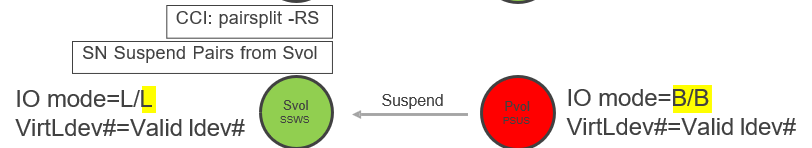
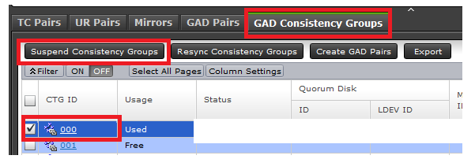
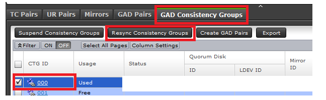

### CHANGING GAD TIMEOUT
---
---

#### Set SOMs
	raidcom modify user_system_opt -opt_id 784 -opt enable
	raidcom modify user_system_opt -opt_id 1185 -opt enable
	raidcom get system_opt -key mode -lpr system -Ixxx

#### Suspend and Resync GAD Pairs 	https://docs.hitachivantara.com/r/en-us/svos/9.8.7/mk-98rd9024/gad-pair-operations/suspending-gad-pairs
	pairsplit -g oraHA
	pairresync -g oraHA

or
	https://knowledge.hitachivantara.com/Knowledge/Storage/VSP_G130_GF350_GF370_GF700_GF900/How_to_Reverse_Gad_Replication_Direction

1. Verify status of the GAD pair. Make sure status is PAIR and both PVOL, SVOL are having I/O Mode Mirror on Storage Navigator.
	
	

2. Suspend the pair from SVOL.  Select  Consistency Group related to the GAD pairs on Storage Navigator (the storage array with SVOL), and perform "Suspend Consistency Groups" operation.  You can click the CTG ID and confirm the GAD volumes that you would like to operate belongs to this CTG Group. Example below  is using CTG group ID 000.
	
	

	
3. Once Suspend completes, pair status of SVOL become SSWS and pair status of PVOL become PSUE or PSUS.  At this status, PVOL of GAD volumes is Block status - no access allowed. (Refresh Storage Navigator for latest pair status if required). SVOL is having I/O Mode Local and accessible.

5. On Storage Navigator of PVOL, perform "Resync Consistency Group" operation against the CTG group.  Example below  is using CTG group ID 000.
	

