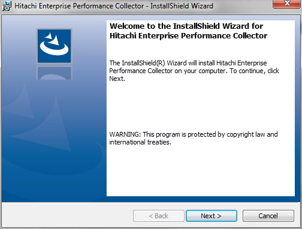
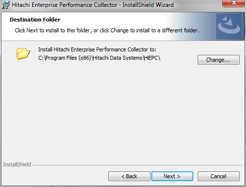
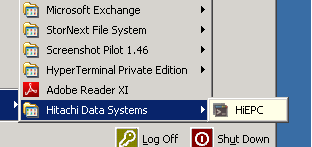
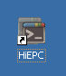

### INSTALLATION
---
---

HiEPC will likely come in a zipped file.  First extract the zip and run the setup.exe to bring up the window below.

**Note**:  HiEPC requires that .Net Framework 4.0 is installed!  This is often the case on newer operating systems but for older O/S it will need to be installed prior.  Any SVP running the latest version of HiTrack will already have this in place.  Newer O/S’s will also likely request elevated security permission; you will be prompted on execution if this is the case.

 

On completion the ‘Programs’ menu in ‘Start’ will be updated.  A desktop icon will also be available.

 
