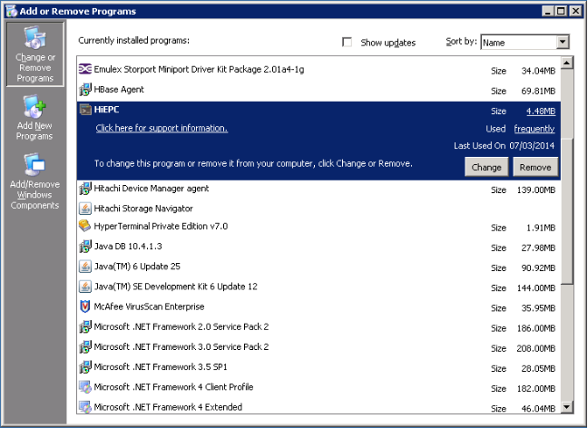

### UNINSTALLATION
---
---

Close the interface and proceed to uninstall through the O/S. If a ‘reboot required’ message is seen, it may be necessary to start HiEPC again, and stop the service to avoid interruption.

After de-installation, the installation folder structure will likely still be intact, under which ‘HiEPC_shared’ will still remain. If you should reinstall HiEPC in the same location as before, the configuration and settings will be reloaded from here – this folder can also be used if it is necessary to relocate the installation to an alternate server.  It is not essential that this folder is removed as the likelihood of sensitive information (such as user credentials) being retrieved is quite slim.  All files deemed sensitive have been programmatically encrypted.

The HiEPC managed directory will also remain intact, preserving most recent data collections and export tools.
