### CONFIGURATION
---
---

#### 1. First Run
---

Remember to start the service before leaving the interface, as well as setting the default schedule with at least 1 collection time.  
See ‘Day and Time Scheduler’ for detail.
Note: The service will start automatically on subsequent server reboots. You can also start/stop the service from the windows service manager.

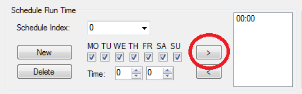 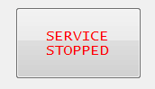 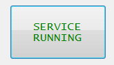
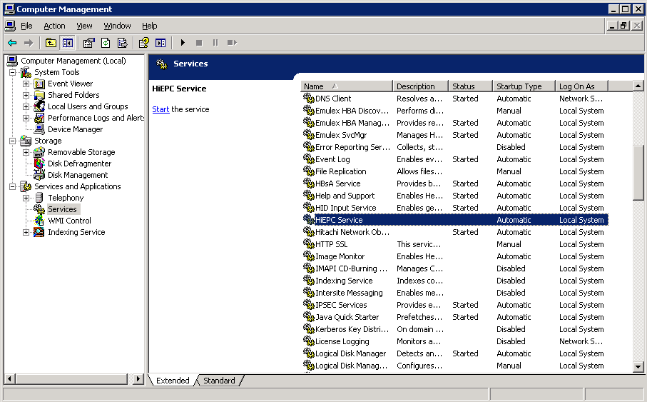

#### 2. The Managed Directory
---

The managed directory defines the root location of performance collection outputs, from which HiEPC will construct its own folder structure.  Beyond defining the location and retrieving data, no interaction should take place in this folder.  A short cut for this and other useful folders has been provided under the ‘Menu’ drop down. 
Note: The directory can be entered manually.  If the directory does not already exist, it will be written in RED.

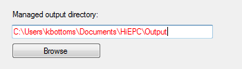

An alternative method of selecting the managed directory is to use the browse function.

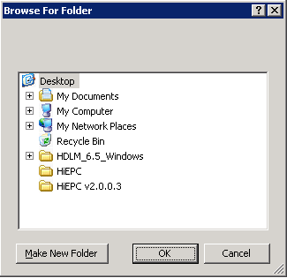

If the service start is attempted and the directory does not exist, then the user will be prompted to create it.  Otherwise the start attempt will be aborted.

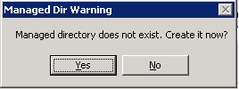

#### 3. Day and Timing Scheduler
---

HiEPC is capable of running 7 days a week and several times a day.  Changes to these setting will take effect immediately.  To add a time to the schedule the user must first select it from the numeric fields and hit the ‘>’ button.  If they wish to remove one or more times these must be highlighted and then the ‘<’ button hit.  

As of version 2.2, users are able to create separate instances of time/day configuration by creating one or more additional ‘Schedule Index’.  While an index is selected, all changes are commited to that index. Select ‘New’ and the index is incremented with the next available number and a default configuration if applied to it. You can delete any index including ‘0’ but you cannot delete the last index in the configuration.  The index number is later used in conjunction with individual items in the batch list.

Note: For machines using more than 64 CU’s it may be necessary to collect more than once during a day, with smaller collection periods defined in the ‘command.txt’ file or via the ‘Over-ride Shortrange’. This is an ideal use of the index capability where multiple machines are managed under one instance. See your ‘command.txt’ file for details.

#### 4. File management settings
---

In this area we define the behavior of HiEPC. We can run in 2 different modes:
	- Subfolders exceeded – delete oldest folder when the maximum defined number of folders exist for each subsystem.  (Operation regardless of age of oldest collection)
	- Days old – delete oldest folder when it exceeds the defined number (folder lifespan).  Ideal for when creating multiple outputs in a day, or if manually triggering a collection often.

These settings can be changed at any time, and are only used on successful completion of a collection to tidy up the individual subsystems folder structure where appropriate.  Therefore, if a subsystem existed in the configuration in the past, but was subsequently removed from HiEPC, any files collected will remain in the subsystems folder until the user manually deletes them.

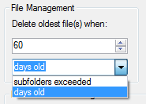

**Note**: The default settings are ideal in most use cases.

#### 5. Folder structure preparation
---

As HiEPC is capable of managing multiple platform types and multiple microcode levels, it is recommended to establish a folder structure to reflect this.  The reason being, that each variant often requires its own Export Tool, unique to the microcode level.  It is the users’ responsibility to make appropriate changes to the folder structure whenever microcode maintenance is performed.

An ideal folder structure can be seen below.

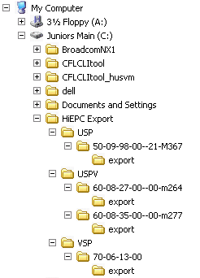

If custom command.txt’s are used these will need to be imported into the new code folder.  These are generally compatible from one version to the next.
Note:  The command.txt file you intend to use must ALWAYS reside in the appropriate export tool folder you intend to use it with! – refer to your microcode disc set for this tool. Also, pay attention to the exporttool pre-req’s as all versions require a minimum Java version.

#### 6. Adding a managed subsystem
---

Export tool is in Customer Tools CD - Extract it on HiEPC folder under Documents
In order to add a subsystem to HiEPC you will first need to import the export tool in to the server (see above).  No file manipulation is required by the user.
Once selected you will need to specify the command.txt file you want to use.  This can input manually and will appear red if the input does not exist, or you can browse to the files location.

Note: You do not have to use a strict ‘command.txt’ file name.  You can if you wish give it a more meaningful file name, such as ‘HUSVM 211135.txt’ as seen below. 
There are a few reasons for and against doing this. 

	* Using a custom file name will be practical where you want to have multiple command.txt files in the same export tool directory.
	* Using a custom file name means you can create a file containing all machine specific details, such as IP, user, password.
	* If you use a custom file name, but do not use the ‘Nickname’ function while adding, and do not use the over-rides to specify an IP, then the subfolder name inside of the managed directory will take the command.txt file name (minus the file extension) – This is very bad if done for multiple subsystems, as all outputs will all be dumped to the same sub-directory!
		Tips regarding these comments: 
		If an IP address is specified in the over-rides this will be used as the name of the subsystems directory.
		If a Nickname is specified when adding the system, this will be used as the name of the subsystem directory, regardless of all above.  

All user credentials and IP’s stored in HiEPC which can be password protected at the interface, and for sensitive config files are encryption protected.

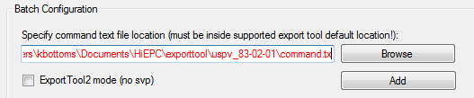

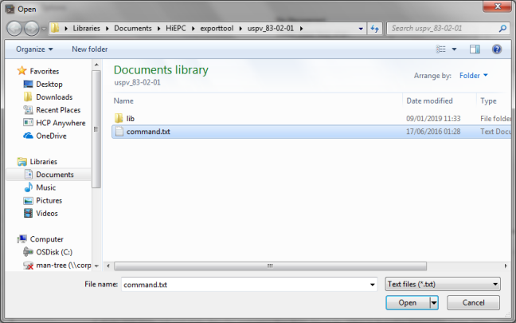

For G350/G370/G700/G900 the option exists to install a subsystem without the presence of an SVP. This is not preferable for truly granular performance collection as the current lowest interval that can be set is for only 5 minutes, but this implementation is supported as of HiEPC 2.8.  To collect direct from the DKC you will need to use the ‘ExportTool2’ which may also be referred to a ‘monitor2’, and to use the option ‘ExportTool2 mode’ before browsing to the tool.  HiEPC will create a file called ‘placeholder.txt’ in the ExportTool2 directory simply to satisfy programitical conditions, and as a means of identifying the tools location when it is invoked.  Other than that the add process is very similar to the original ExportTool.

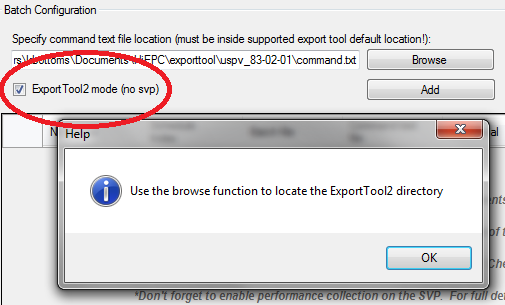

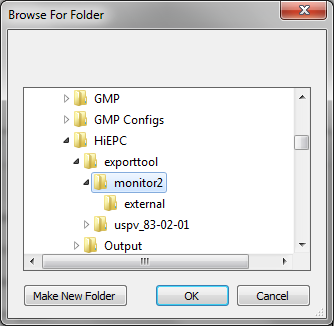

You will always be prompted for a ‘Nickname’ when adding a new subsystem, the entry is optional but recommended for at least folder/filing purposes:

You will also always be prompted for a ‘Schedule Index’ when adding a new subsystem this is not optional but does not have to use an existing index. In this case the list item will never run automatically but will still be available to the user for selection when performing manual runs. Only 1 index can be used per list item and that item will only conform to the indexes run time configuration:

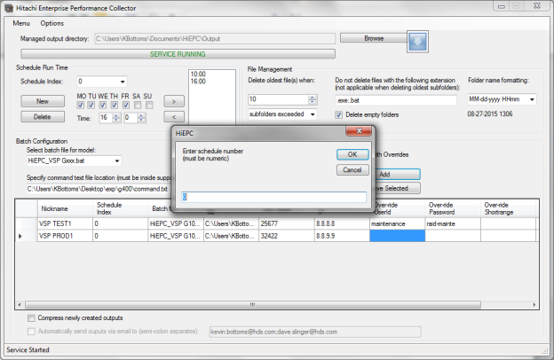

For VSP G200/400/600/800 and G350/etc, the DKC serial number is required for the command.txt file.  This option is otherwise optional for all other machine types but the interface will not stop you skipping this step incorrectly.

If you use the over-rides but cancel at this point, the adding of a subsystem will be aborted.  If an incorrect IPv4 address is entered, the interface will prompt again for a further attempt. 

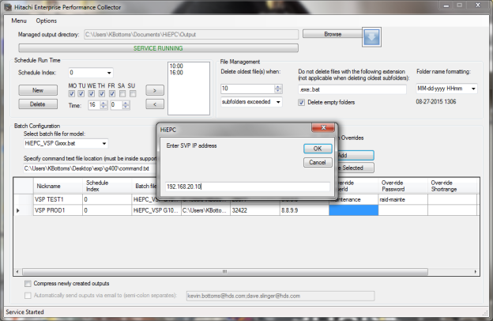

Cancelling at this point will simply leave the field empty, and the credentials in the command.txt will be used instead. If no user is specified, you will not be prompted for a password. 
Create Storage Administrator (View Only) account and use it.

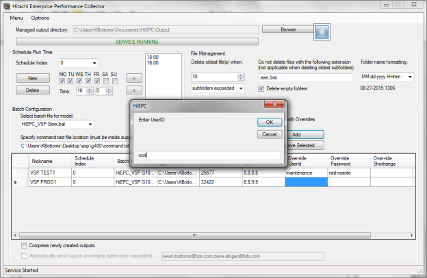

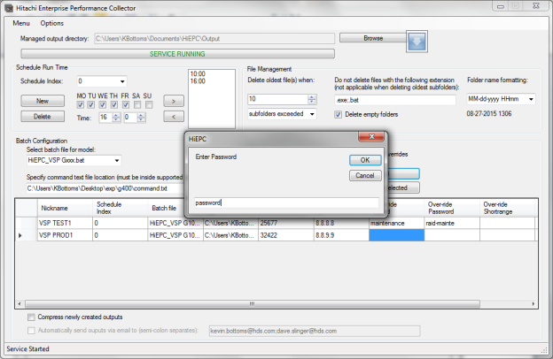

Over-ride Shortrange is optional is optional, but available to all current machine types.

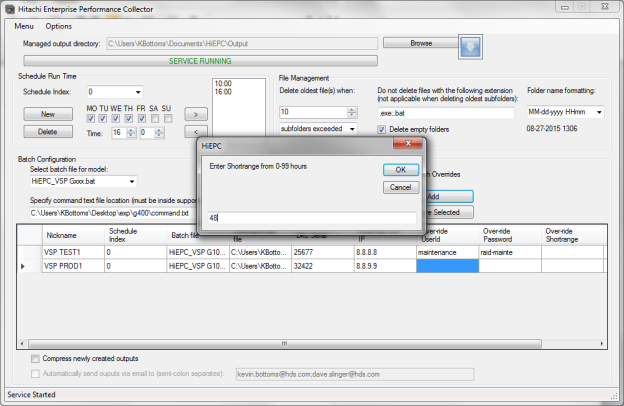

This option is not available to G200/400/600/800 systems. Longrange is only prompted if Shortrange is specified. 

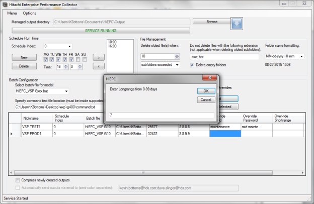

On successful adding, a new entry will be added to the table, and the file will automatically be updated. 
Note: No Nickname was specified for this entry.  In this case, the collections will be created in a subfolder ‘..\132.13.132.2\’. (screenshot from v2.0, but the information is still relevant)

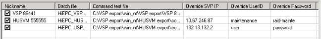

After a system is added, the collection for all systems will take place the next time the schedule matches time and day.  If required, it is possible for HiEPC to compress the output to either minimize space or prepare it for an email delivery.  This option is at the bottom of the window and is a global setting.

#### 7. Multi-threading parameters
---

Users now have the option to throttle HiEPC operation to a limited number of threads to protect system resources where a single instance manages a larger environment.  By default the number of threads is 0, representing an unlimited number.  Each thread is assigned a token when running which is returned when the thread completes or aborts, when a token is available the next waiting thread will commence. 

We can also choose how long a job can run for before it expires.  This enhancement is designed to stop jobs that hang due to external factors running for infinity.  The default may seem high as of v2.8, this is because ExportTool2 run-time can be considerably longer.

As of version 2.3 we have been able to perform a console dump on job error.  This function is now performed automatically during a job, though the user can choose to either archive or discard the output after job termination.  Collecting console outputs is particularly useful for jobs which end abruptly and with no exportlog output, therefore it is recommend to leave this ticked.

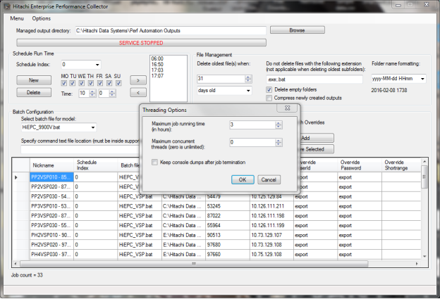

Note applicable to v2.2+: Threading is only effective on a per schedule index basis.  If multiple schedules are run at the same time the thread limit will be anything up to the number of running schedules multiplied by the thread limit. Please bear this in mind.

#### 8. Retry Options
---

For failing jobs, HiEPC will automatically re-schedule a job to try again after a determined time.  This is intended to counter schedule conflicts such as other agents trying to collect data at the same time.  Additonally HiEPC can learn to change the runtime automatically on the event of a successful retry.  This may require it to create a separate index schedule where more than one item is listed, which is why the option is disabled by default.

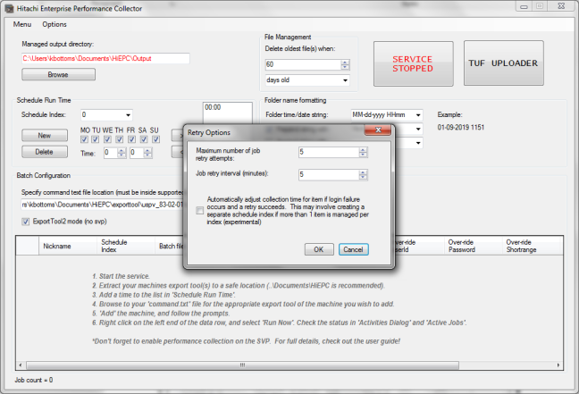

#### 9. Manually triggering a performance collection
---

From time to time it may be necessary to manually perform a performance collection.  This does not have to be for all systems listed.  It is possible to select 1+ machines and then locate the ‘Work Selected’ function under the right click menu as below.

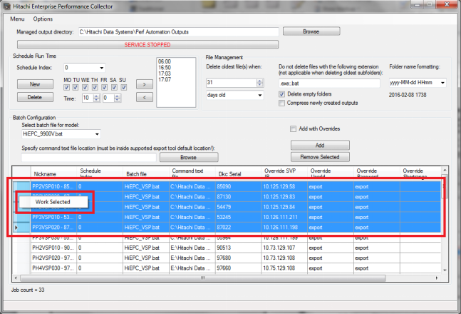

Note: This does not affect the running automated by the HiEPC service, it will still trigger collection of all machines in the list, though it may fail to collect on machines that already have a job running.

It should also be recognized that any job started from the interface will still continue running if the interface is exit, though these jobs will no longer be managed (due to the resources being disposed) and therefore no HiEPC related data will be collected and the job will be unmanageable once you return to the interface

#### 10. Observing performance collection progress
---

Where triggered manually or automatically, it is possible to see the managed progress and results of a collection job by observing the ‘Activities’ dialog.  Activies is an observation of the programs wrap_log and is a brief roling daily log view only.  If more information is required, the daily log can be accessed under ‘About’.

Also under the menu dropdown is the ‘Active Jobs’ dialog which can be used in conjunction with the interface or service to monitor the progress of running tasks as well as their duration.  On the right click of an item you can also open the console view by selecting ‘Current Progress’ and stop a job abruptly with ‘Kill Job’.

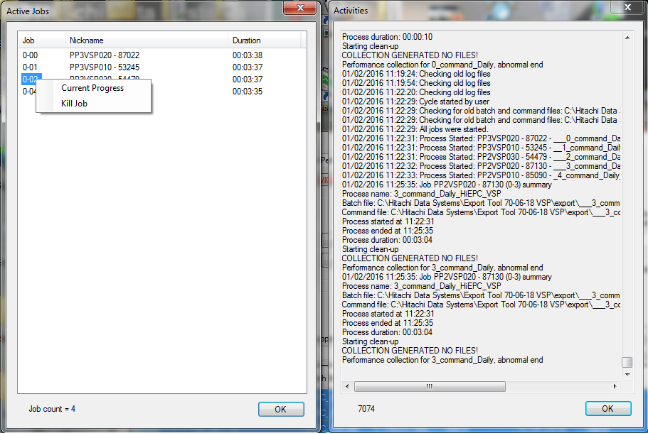

**Note**: From v2.3 the logs have been optimized for debugging, as well as including 2 new logs holding just summary data.  These as jobcomplete_* and jobfail_*, a new instance is created daily and these can be found in the HiEPC_shared folder.

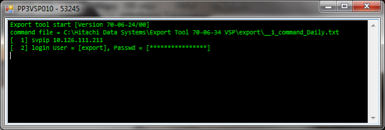

#### 11. The output-collection structure
---

Below is output folder structure (under the managed directory), and collection structure of our test environment.

**Note**: This output is created with the compress function set as of v2.8 (the file and folder structure are completely intact and unaltered by the compression function).  Filename format can be changed at the interface main window.

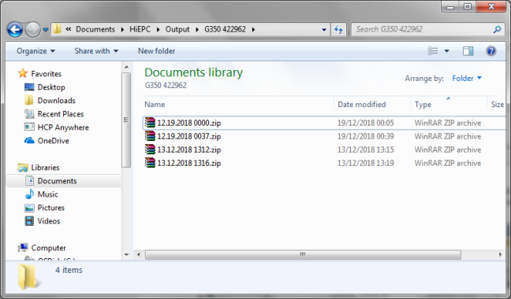

A typical collection output. 
Note: the final sub-folder is named by time and date (local)

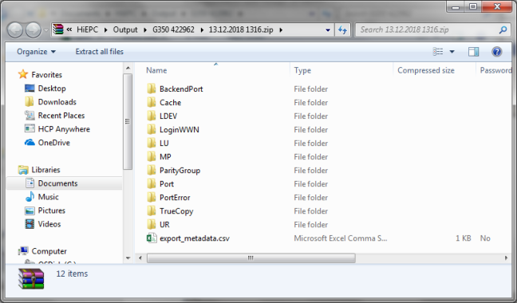

Example is from an ExportTool2 collection.

#### 12. Configuring the interface password
---

For additional protection, when the interface is not executed, it can be password protected.  This is very simply done by populating the password field under ‘Options’.
**Note**: Minimizing the interface will not lock it, but will send it to the system tray.  To maximize it again, the icon will need to be double clicked.

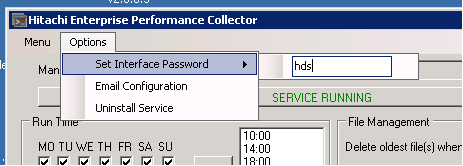 

When the interface is next loaded, the template screen will be loaded, and the password prompt will be presented.  Only when the password is entered correctly will the interface load the current configuration.

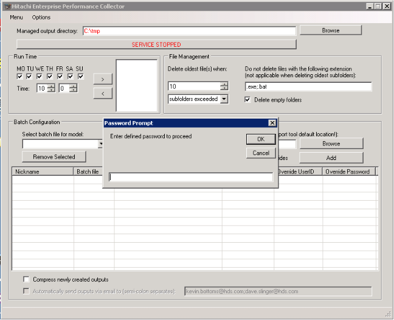

#### 13. Configuring email delivery
---

HiEPC is equipped with the capability to delivery newly created exports via either a web instance of Exchange (over HTTPS  and via a proxy server) or as is more widely used, SMTP.  For this example we have configured both but only HTTPS is used.  Test functionality also exists for interface settings, but if these are changed they need to be ‘Saved’ to take effect on HiEPC.  Any tests performed will be sent to the recipients defined at the bottom of the email config  window.

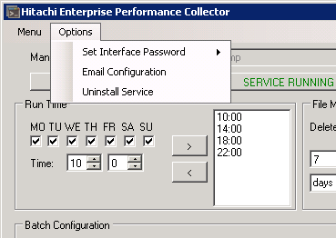

Only one method can be selected at a time. The window is the current standard.  In v2.3 we have also  introduced 2 new email functions. The user can opt to send all job summarys on completion (no data) or only send summary of jobs which have ended abnormally.

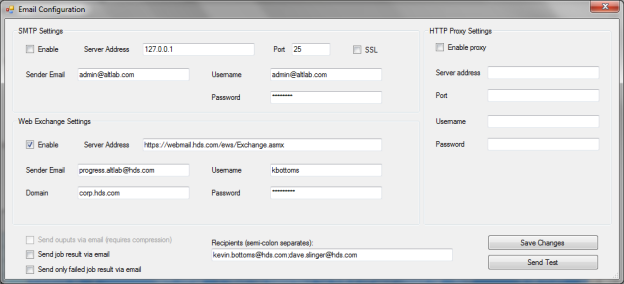

Successful delivery of a test email from within the email configuration window.
Note: when sending a test attempt please be patient as it may take several seconds before you receive a response. (an immediate response is often a failure!)  The below example is for an earlier version of HiEPC but the result is the same.

An ‘abnormal ending’ is any job that either ends without generating an output, completes in under 30 seconds, or runs causing an exception such as missing sources files or unaccessible destination.

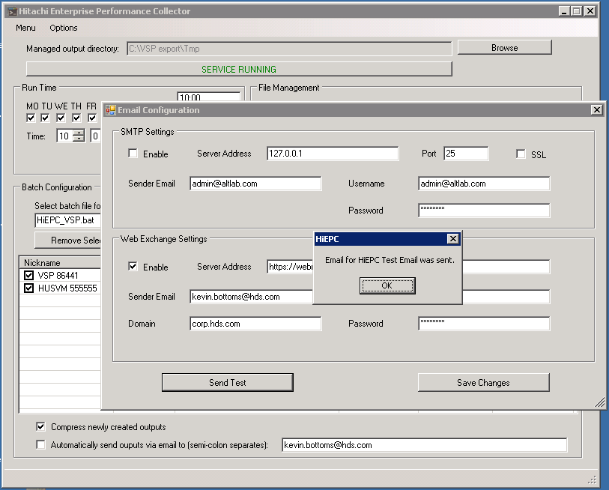

The received email by the client.

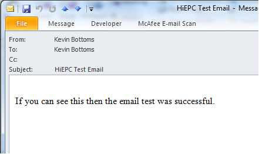

Failed delivery attempt due to incorrect configuration with meaningful output message. (an incorrect password has been used for this example).

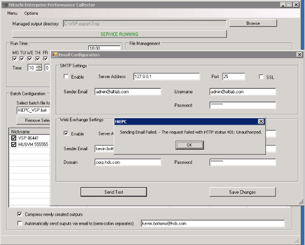

Setting changed and saved.

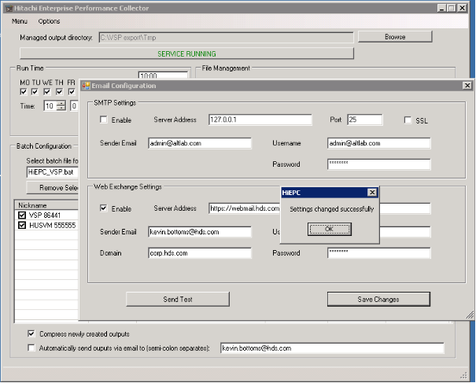

#### 14. Miscellaneous areas of configuration
---

Aside area already explored above, the following options are also available under the ‘Menu’ dropdown.

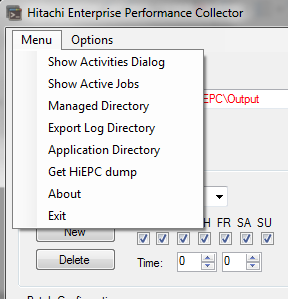

	* Show Activities Dialog – will bring up the wrap log in a new window.
	* Show Active Jobs – will bring up the running jobs in HiEPC, with run time and monitoring/termination options.
	* Managed Directory – opens the managed directory in explorer.
	* Export Log Directory – opens the export tool log files organized in a similar structure to the managed directory.  Ideal for historic troubleshooting and auditing, across all machines that are monitored in HiEPC.
	* Application Directory – the application installation directory.  Usually only required for troubleshooting.
	* Get HiEPC dump – capture all logs (including export logs), configuration, environment info, for developer or engineer diagnostics.
	* About – brief interface information and access to the daily log (more comprehensive than the wrap log in ‘Activities’, and will contain exception information in the event of a handled error).
	* Exit – same as close at top right of window.

#### 15. Firewall
---

HiePC → SVP				443,1099,5443,11099,51099,51100 			TCP
