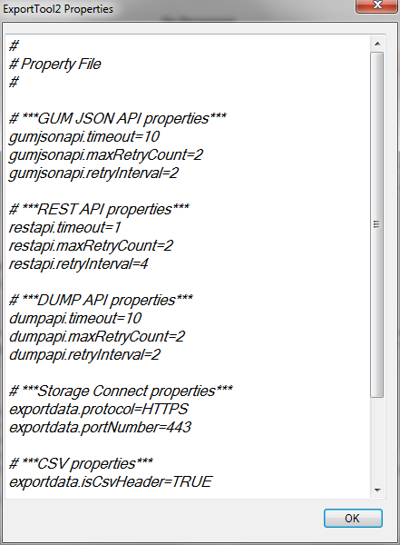
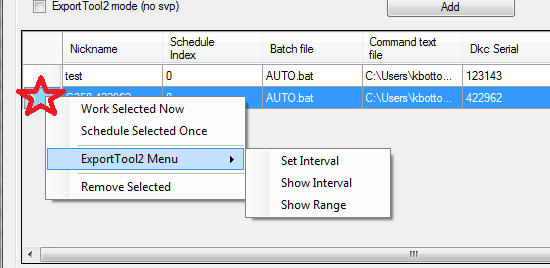
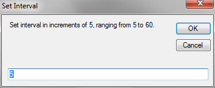
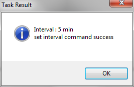
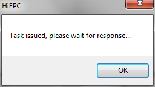
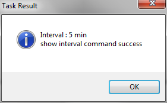
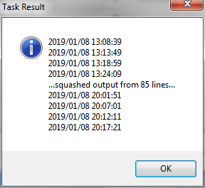

### EXPORTTOOL2
---
---

#### Global Properties
---

Exclusive functions and options for no-SVP models:

These settings will be applied to all instances of ExportTool2 that are run from HiEPC, but do not delete the default value in the folder structure.  Refer to the ExportTool2 instructions for details regarding what can be set.  HiEPC incorporates all currently available settings, but these do not all need to be declared.

#### ExportTool2 functions menu
---

Systems added with the ExportTool2 mode will have access to additional functions under the right click menu to add all the same cli functionality available using the tool manually in a quick and simplified manor.

##### Set Interval
  

##### Show Interval
 

##### Show Range
 
