### TUF UPLOADER
---
---

#### 1. TUF Uploader facility
---

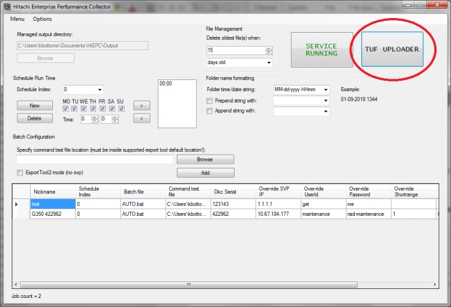

#### 2. General settings and point-in-time collections
---

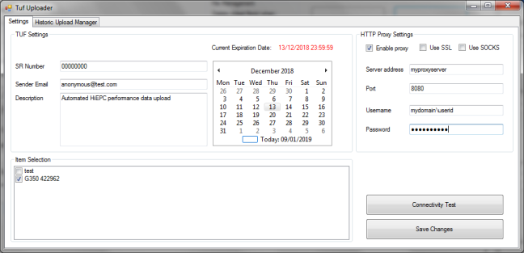

As the TUF uploaders name suggests, this function space enables HiEPC to be set to upload exporttool data immediately after collection without interaction.  As this can not be left running permanently though, the user is responsible for setting an appropriate ‘expiration date’ in the form.

This can be useful for when responding to ongoing performance issues, or when monitoring for upcoming maintenance.  

Each time it is set, as a minimum, the SR number must be configured using an active SR issued by Hitachi, tick the nickname or the machine(s) you need data for each time, and set the expiration date. It must be green and at least 1 day in to the future. After this is saved, every collection that completes between the current time and expiration time will automatically be uploaded to the SR.  
Note: only active SR’s will prompt an email response.

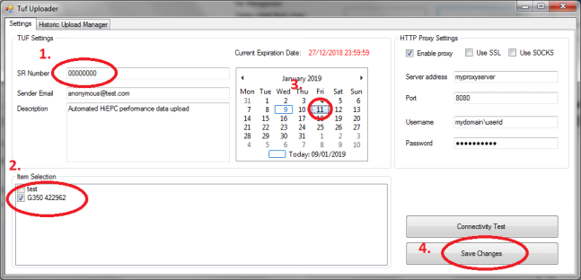
Required options.

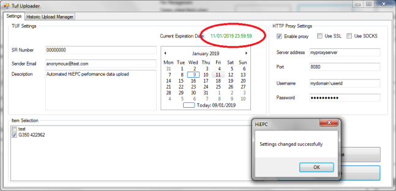
Date has been validated.

HiEPC also supports a range of tested proxy configurations. Use the example provided as a guide, save changes, and always perform a connectivity test on completion.

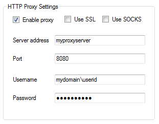 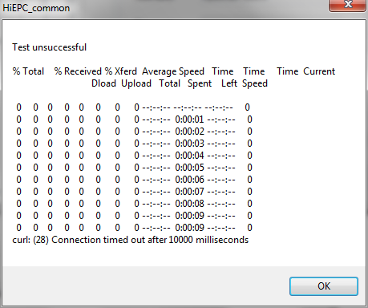

Unsuccessful test: Operation timed out
More comprehensive messages will result from http response based messages, such as authentication failure.  

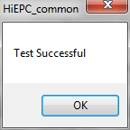

#### 3. The Historic Upload Manager
---

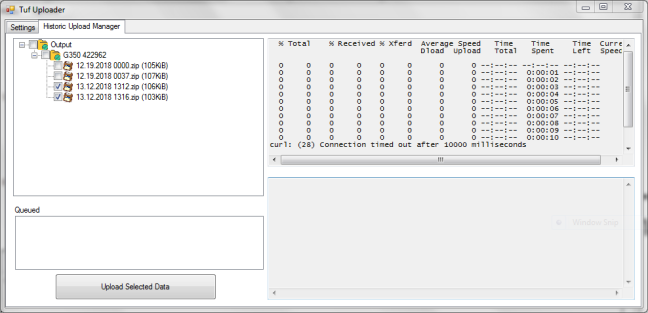

As well a point-in-time collections we can also use the TUF Uploader, with setting made in the previous section, to select and upload any previously created performance collections to the defined SR.  Simply expand the system you desire and select 1 or more collections and hit the upload button.

Files will then be added to the queue and uploaded while the window is open, with results posted back to the user.  This can be performed by any user under instruction.

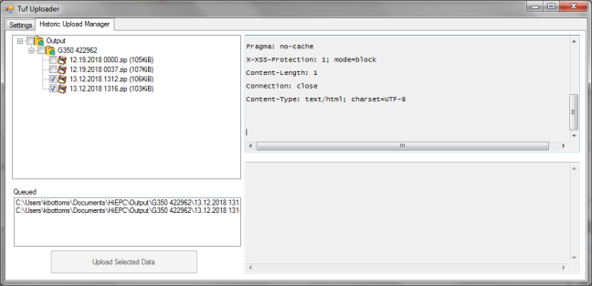

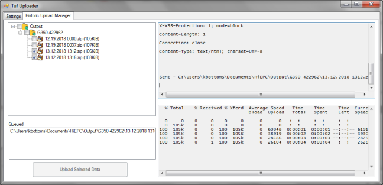

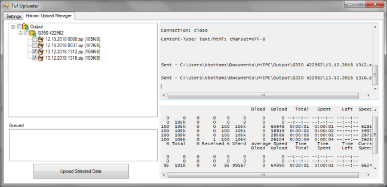
