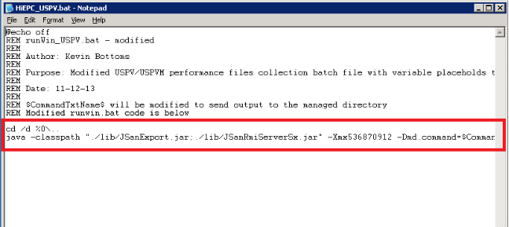

### TROUBLESHOOT
---
---

#### 1. Creating a new batch file for future model subsystems
---

This area is depretiated since the AUTO.bat functionality in v2.4, but may have a use in very limited use cases.
As new models are released it may become necessary to author an additional batch file in HiEPC to add to its compatibility.  This is relatively simple and can be done using an existing batch file as a template and command information found in the export tool batch file of the next generation.
The batch files can be found under the application installation directory inside the ‘batch’ folder.
**Note**: For a new batch to operate the markers starting and ending in the dollar sign ($) must remain in place!  These markers are used by the software.
The highlighted lines show the working area of this batch as all else is REM.  The ‘cd’ line should no longer be required following changes in v2.3+.

#### 2. Interface lost password recovery
---

The password is stored in the ‘General Configuration.txt’ file (which is encrypted) located in ‘HiEPC_shared’ directory which can be location before the application installation directory.  Do NOT simply delete this with the expectation that the interface will repopulate it with a blank file.

It will repopulate it with a new file, but has code to detect tampering and will destroy the encrypted ‘BatchLst.txt’ and ‘Email Settings.txt’ file at the same time.

You will have no choice but to sacrifice the settings, but instead, back-up the other files in a different directory. Then restart the interface and then close the interface, then restore all but the ‘General Settings.txt’ file, and restart once more.  
Failure to shutdown the interface before importing the files back may result in the files being overwritten with blank information as the interface performs a final save when closing!

#### 3. Log collection
---

In the event that a fault should occur and the cause cannot be determined, you may wish to collect the available logs to be forward to an appropriate technical resource.
The easiest way to do this is to go into the Menu drop down and select ‘Get HiEPC dump’. The output of this will be send to the desktop for you to upload.

These logs as well as configuration information can be found in the ‘HiEPC_shared’ directory. This is located in the same parent directory used to install HiEPC.
The default location of which would be:  C:\Program Files\Hitachi Data Systems\HiEPC_shared

#### 4. Upgrading HiEPC
---

Peridically an updated version of HiEPC may become available. Prior to upgrading it will be nessecary to stop the HiEPC Service. This action can be done through the HiEPC interface.  Then proceed to uninstall HiEPC as normal, and install the new software. 

Following installation, log in to the interface and verify the service operation, installing and/or re-starting if appropriate.

All prior settings and file structure outside of the install directory will remain intact.  However, if any custom batch scripts have been created these may be lost.
