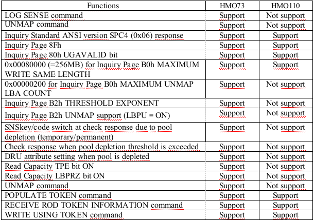

#### HMO
---

##### Host Modes: https://docs.hitachivantara.com/r/en-us/svos/9.8.7/mk-90rd7037/host-modes-and-host-mode-options
	SVC: 2,22,25,39,68,96
	Linux: 2,5,22,25,68 + 7 - 5
	Windows: 2,7,22,25,40,73/110 (73 requires SOM 905) (73/110 https://knowledge.hitachivantara.com/Knowledge/Storage/How_to_enable_Windows_ODX_support_on_storage_systems)
	Vmware: 2,7,22,25,54,63,68,110,114 (2,7,22,25,40,54,63,68,114) → Use 75,110,114 for big chunk delete
	HNAS: 7, 68

##### HMO 114 - HMO related tasks https://knowledge.hitachivantara.com/Knowledge/Storage/Optimal_Unmap_Granularity_for_Vmware_%2F%2F_Esx_When_Hmo_114_Is_Enabled
		* Following document explains how to check it.
			https://knowledge.hitachivantara.com/Knowledge/Storage/Optimal_Unmap_Granularity_for_Vmware_%2F%2F_Esx_When_Hmo_114_Is_Enabled
			If you can reach ESX server cli than you do not need to get vmsupport.
			Just run command.
				esxcli storage core device vaai delete list
		* To trigger zero page reclaim on the storage
			raidcom modify ldev -ldev_id 0x03ea -status discard_zero_page -Ixxx
			After this command run 
				raidcom get ldev
			If you see ZPR at processing section it means process started.
			If it shows - it means there is no process

##### HMO 7 - Enabled on each host group being accessed by HNAS.
		This mode is used to switch the setting of whether to return the Unit Attention response when adding a LUN; this will prevent the need to run "scsi-refresh" after presenting LUNs to HNAS; the newly presented LUNs should be auto-discovered.
		From the SAM spec, the functionality is as follows: If the logical unit inventory changes for any reason (e.g., completion of initialization, removal of a logical unit, or creation of a logical unit), then the device server shall establish a unit attention condition for the initiator port associated with every I_T nexus, with the additional sense code set to REPORTED LUNS DATA HAS CHANGED.
		Note: HNAS will support this  bit in v12.5(and on). Enabling this bit when using earlier versions of HNAS is acceptable, but does not remove the requirement to run "scsi-refresh".

##### HMO 68 - Enabled on each host group being accessed by HNAS.  
		This will allow the server to access information about the device that is required to support HDP page reclaim functionality using the UNMAP and WriteSame SCSI commands in order to determine the amount of vacated chunks to process as part of the command span-unmap-vacated-chunks.  Whilst the command to vacate chunks is not expected to be widely used, enabling HMO 68 is nonetheless required.
	
##### HMO 78 (GAD olduğu durumda)
		Enabled on each host group being accessed by "remote" HNAS in a GAD solution. HNAS obtains the information from VPD Pg 0xE0, byte 4, to determine whether the SD is accessed from the local or remote array. For optimal performance the choice of local access path takes greater precedence than access to P-Vol. 
		The cross path configuration in GAD environment is supported. In the configuration, if cross paths are active (prioritized), I/Os run on the cross paths so that I/O response performance degrades for the roundtrip working on the cross paths.
		· VSP (F)Gx00, VSP G1000
	
##### SOM 896 
		It ensures that pages are formatted in the background rather than at allocation.  Setting this incorrectly will cause pages to be formatted upon allocation, incurring a performance penalty.
		· HUS-VM, verify SOM 896 is OFF (this is the default) - note, the desired HUS VM functionality occurs as default; setting this bit to ON will disable the functionality.
		· VSP, set SOM 896 to ON.
		· VSP G1000/Gx00, verify SOM 896 is ON(this is the default) - note, the desired VSP G1000/Gx00 functionality occurs as default; setting this bit to OFF will disable the functionality.

##### SOM 901 to ON (Tiering olduğu durumda).  
		By setting this mode to ON while the drive type of DT tier1 is SSD, page allocation of Tier Level ALL will not go to the next tier until the capacity reaches the limit without consideration of performance potential.  This makes sure that the pages are not demoted when the performance utilization on an SSD tier exceeds 60%. As the response times from the SSD are relatively good, the performance utilization on the SSD tier can exceed the 60% recommended limit.
		· NA for HUS-VM
	
##### SOM 904 to ON(Tiering olduğu durumda).   (but not by default, be guided by GSC analysis).  
		This mode is used to reduce the load of drive so as to improve host I/O performance by reducing the amount of page migration per second (42MB/s) at tier relocation.  This option should be explored if an HNAS system experiences storage response time degradation in the environments with frequent relocation and rebalancing.
		· NA for HUS-VM

##### SOM 905 to ON https://knowledge.hitachivantara.com/Knowledge/Storage/Windows_Quick_Format_Taking_Long_Time_on_Windows_2012_and_higher_with_HMO_73_Enabled
		Windows Quick Format taking a very long time to completed when HMO 73 is Enabled
		UNMAP operation mode:
			SOM 905 OFF (Default)
				In the zero data writing synchronous mode, upon receipt of the UNMAP command, zero data is written on all of the target area, page reclamation request information is set, and then the status is sent.
			SOM 905 ON
				In the zero data writing asynchronous mode, upon receipt of the UNMAP command, page reclamation request information is set and the status is sent. The zero data writing is not executed and page reclamation is executed in asynchronous manner.

##### SOM 917 to ON
		This mode supports rebalancing to average page usage rate among parity groups or external volume groups in which pool volumes are defined to reduce drive workload of the parity groups or external volume groups.
	

