#### AUDITING
---
---

##### FILE SYSTEM CONFIGURATION
---
File system audit logging is performed and controlled on a per file system basis.
To enable file system auditing on a file system, use the **filesystem-audit** console command or, in the NAS Manager, navigate to **File Services > File Systems Audit Policies**.

	evs-select 1
	filesystem-audit add -s 50MB auditfilesystem

##### EVS CONFIGURATION
---
If audit records are to be collected by a third party service or viewed with Windows Event Viewer, this must be enabled with the **audit-log-consolidated-cache** console command. 

	evs-select 1
	audit-log-consolidated-cache add -s 50MB auditfilesystem

When events are viewed with Windows Event Viewer, NAS file system auditing events are shown in the FS event log.
**Note**: Events for any user who is a member of the Audit Service Accounts local group are excluded from the audit log. Adding the third party auditing sof

##### SMB AUDITING
---
Auditing of SMB is based on the open and close operations. The events logged by HNAS follow the formats described by Microsoft for object access auditing.
For a concise list, see here. For further information, see here.

The following sections describe the supported events and variations from the equivalent Windows events.

###### 560 Object Open
Create / Open Direcory 																																						Create or open a file
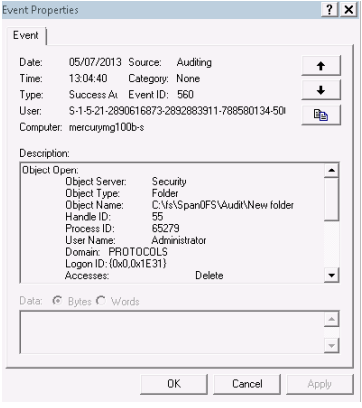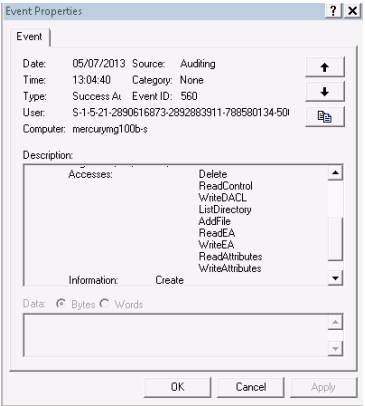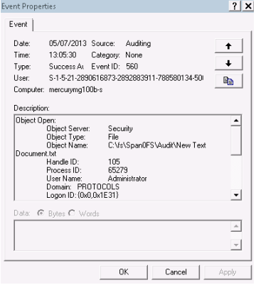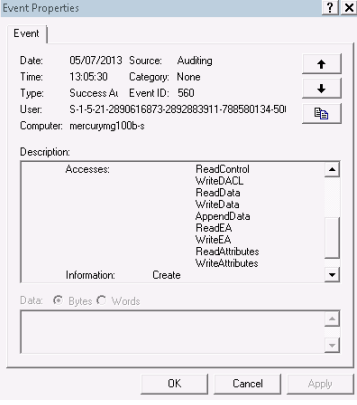
	
###### 562 Handle Closed
Rename a directory																Change security on a directory											Rename a file																		Change security on a file
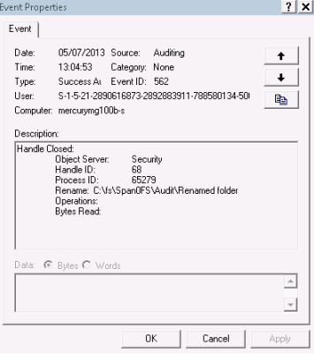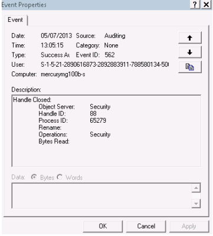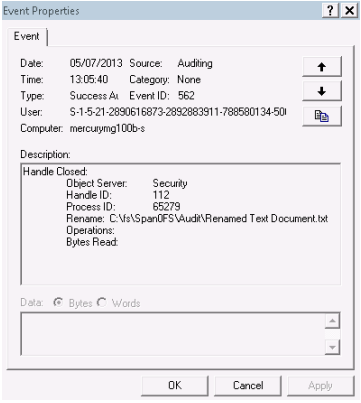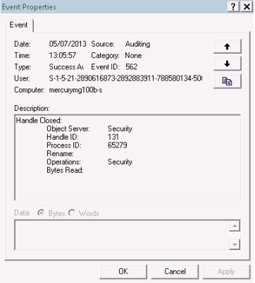
	
###### 563 Object Open for Delete
Delete a directory
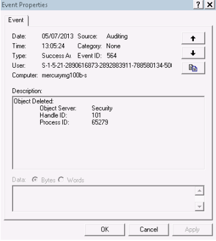

###### 564 Object Deleted
Delete a file
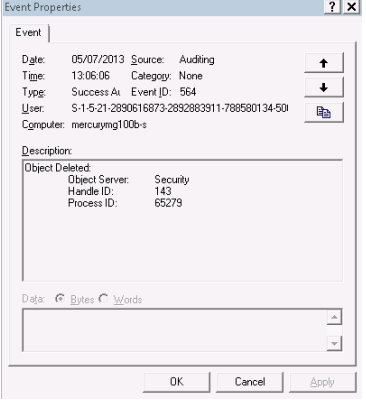

##### CONFIGURE WINDOWS AFTER HNAS SETUP
---

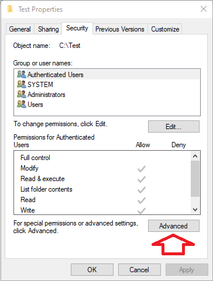
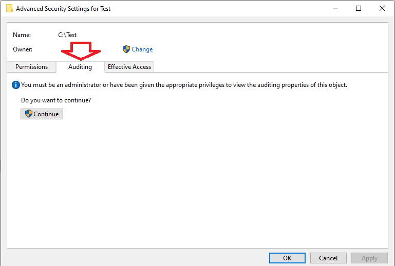
