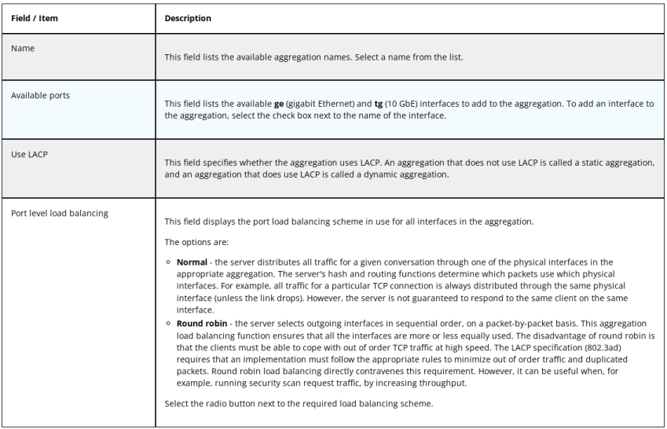
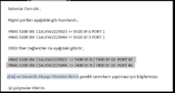
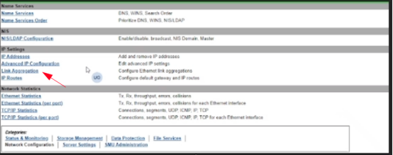
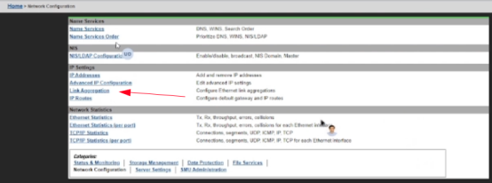
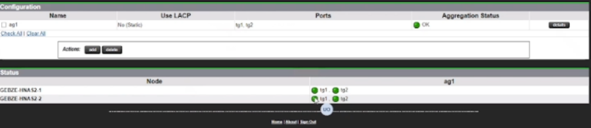
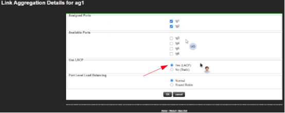
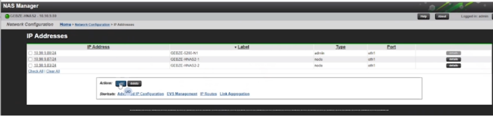
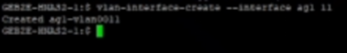
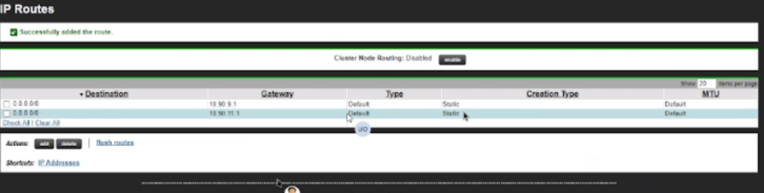

### NETWORK CONFIGURATION
---
---

#### LINK AGGREGATION
---

Connect 10GB Ethernets to different network switches on each HNAS Controller. Make them LACP.
**Navigate to Network Configuration** → **Link Aggregation** 
   - Then click add to display the Add Link Aggregation page.
   - Specify the configuration of the aggregation as required.
   - Verify the settings, then click OK to apply the settings, or cancel to decline.

 

#### VLAN INTERFACES
---

VLAN interfaces are explicitly created and deleted by the Administrator. To create a VLAN interface, supply the base aggregation interface name and the VLAN tag. Then associate IP addresses with those VLAN interfaces using the evs or evsipaddr commands.

VLAN interfaces that have been dynamically created by the deprecated vlan command only appear in the ifconfig display. For further information on converting a dynamic VLAN interface into a static VLAN interface, see the VLAN conversion Appendix.

##### Procedure
**1. To create a VLAN interface, use the vlan-interface-create command and supply the base aggregation interface name and the VLAN tag as shown in the examples below:**

	$ vlan-interface-create --interface ag1 433
		Created ag1-vlan0433
	
	 $ vlan-interface-create --interface ag1 499
		Created ag1-vlan0499
 
	For further details on vlan-interface-create, see the CLI Reference.

**2. Use the vlan-interface-show command to display the existing VLAN interface names.**
	 
	$ vlan-interface-show
		ag1-vlan0433
		ag1-vlan0499

	For further details on vlan-interface-show, see the CLI Reference.

#### GATEWAY
---

