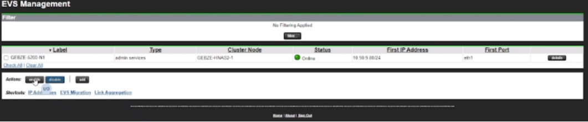
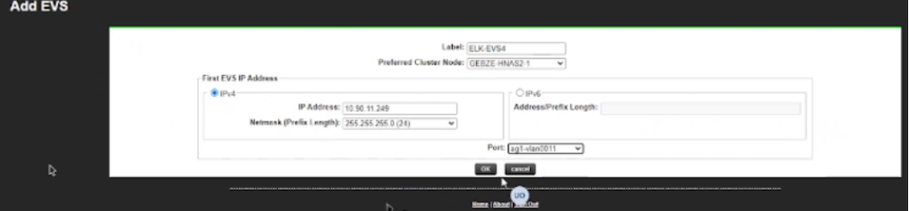
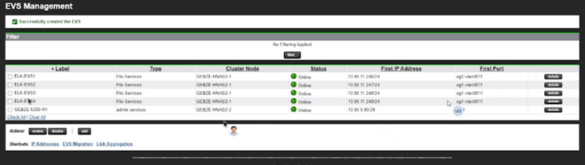
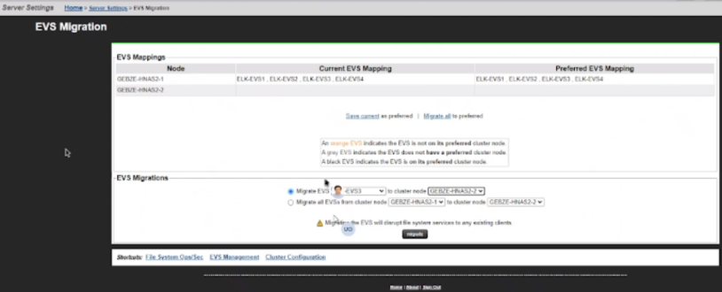

### EVS CONFIGURATION
---
---

#### CREATE EVS
---

**1. Associate IP addresses with the VLAN interfaces using the evs create command. Use the evs list command to show a list of the VLAN interfaces with IP addresses.**

	 $ evs create -l EVS1 -i 10.0.0.10/8 -p ag1-vlan0433
	 $ evs create -l EVS2 -i 172.16.0.10/16 -p ag1-vlan0499
	
	 $ evs list
		 5     Service  EVS1   Yes    Online   10.0.0.10        ag1-vlan0433
		 6     Service  EVS2   Yes    Online   172.16.0.10      ag1-vlan0499
		
	For further details on evs create and evs list, see the CLI Reference.

	
**2. You can also use evsipaddr to associate IP addresses with VLAN interfaces**

	 $ evsipaddr -e 1 -a -i 192.168.1.1 -m 255.255.255.0 -p ag1-vlan0433

Change securiity to individual for different AD integration.

Test ping.

Set cifs nfs min and max.

