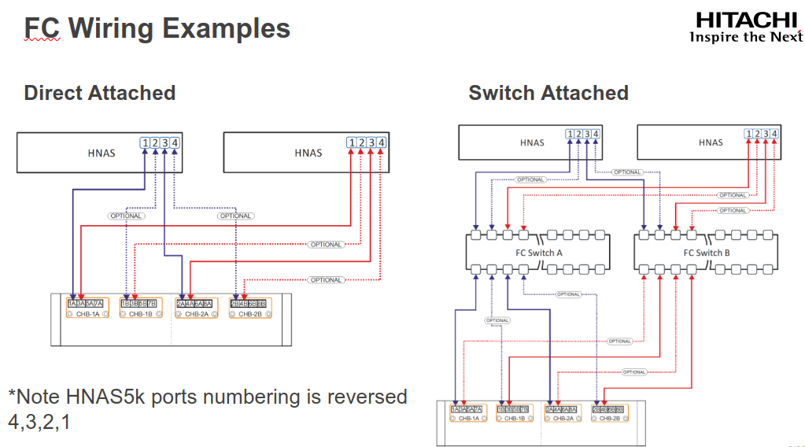
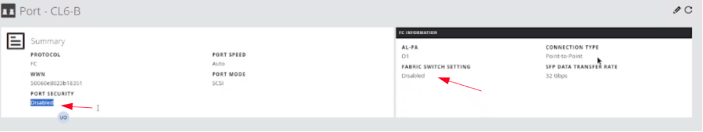
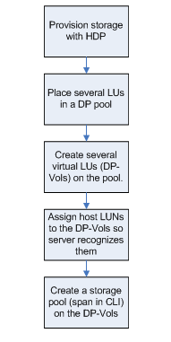
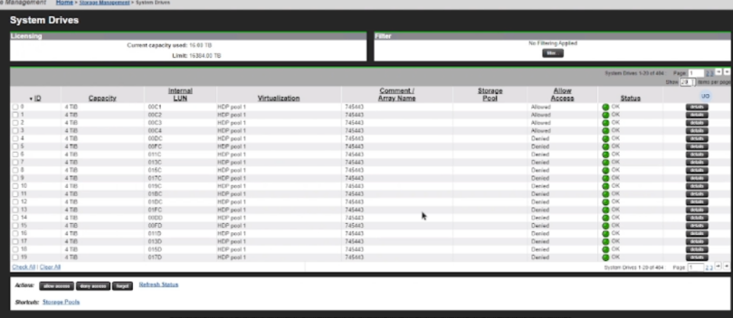
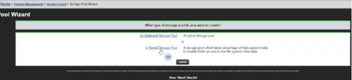
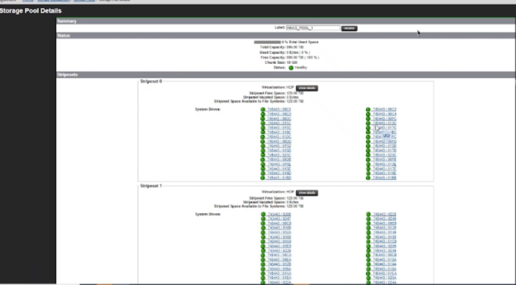

### POOL CONFIGURATION
---
---

#### CONNECTIONS
---

You can display information about host and target port load and paths via the CLI

	fc-host-port-load
	fc-target-port-load
	sdpath

**Example**

	HNAS-5000-DC1-1:$ fc-host-port-load
		1:    3 devices
		2:    3 devices
		3:    3 devices
		4:    3 devices

	HNAS-5000-DC1-1:$ fc-target-port-load
		03/A/5040D327-1:   12 devices
		03/A/5040D327-2:   12 devices

#### STORAGE POOL
---

The use of Hitachi Dynamic Provisioning (HDP) is strongly recommended: 
	* Improves performance by striping I/O across all available disks
	* Supports larger LUs, up to 64 TiB
	* Reduces the need to use the span-expand command. 
File system creation and expansion are safe, even on thinly provisioned HDP pools, because they check the amount of available space
See HDP Section later in

#### CREATE LDEVs
---

If you configure storage:

**1. Set Port Security and Fabric to disabled.**
	

**2. Set Host mode Options to 7, 68.**

**3. Create 4TB volumes and assign them to HNAS.**

#### CREATE POOL
---

Allow access to disk drives.

Create Tiered (SSD and nearline) or Non-Tiered Pools (max 1PB)

##### 1TB size-limit on allocations on HDP
Span Manager must always know how much free space is on a DP pool, and so it writes to each HDP page in every newly allocated chunk
This takes time, and so
	* A new File System on a DP pool can’t exceed 1TiB
	* A manual fs-expansion on a DP pool can’t exceed 1TiB
	* You can still use multiple expansions to get to 1PiB, or (even better) create a small file system and let it auto-expand
CLI filesystem-expand has the ability to performed looped 1TB expansions, but should be used cautiously
Better to use filesystem-thin and filesystem/span confine if concerned about client perception of capacity. Let auto-expansion do it’s job.

##### File System Block Size
HNAS Supports 2 block sizes – 4kb or 32kb
	4kb is more capacity efficient when storing many small files
	32kb provides best performance for most scenarios – especially large block or streaming workloads where throughput is most important
4kb block size tends to place heavier requirement on back-end – more IOPS requires to read/write a given amount of data. Avoid using 4kb on NL-SAS configuration even when storing smaller files.
32kb is and should be the default choice – in most cases it provides the best performance. Most customers say performance isn’t important until it is. If in doubt, use 32kb – especially with NL-SAS drives.
The one exception where 4kb provides better performance is where applications perform small block random write IO into 32kb FS resulting in RMW (Read/Modify/Write) 
