### JOINING HNAS TO ACTIVE DIRECTORY
---
---

#### WITH DOMAIN ADMIN ACCOUNT
---

This is the method that is officially required in the documentation, which states that in order to join HNAS to an Active Directory Domain, it is required to use an account that is a member of the Domain Admins Group.
The account used when joining is “administrator” which is part of the Active Directory Domain Admins group.

##### Create and Join
---
This is the most basic scenario. The computer account does not exist in Active Directory. So we create and join the domain in one step from HNAS. We use a domain admin account to join.

	arena-1[EVS04]:$ cifs-name add -m ads -a 172.20.252.131 MyHNAS1
	Adding name(s) to ADS domain corp.bigo.local
	
	Please enter account with administrative rights in domain.
	User name: administrator
	Password: ********
	Adding names to EVS 4 and to CIFS domain "corp.bigo.local"
	JoinDomain: Creating acct "MyHNAS1" using LDAP
	* Added name(s) to ADS domain corp.bigo.local.
	[cifs-name took 6 s.]

A computer account is created as part of the process in the “Computers” container in AD. The AD administrator will probably want to move this object to a different OU structure. Also worth noting that the Operating System attributes are updated accordingly.

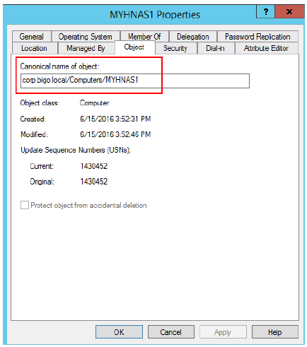 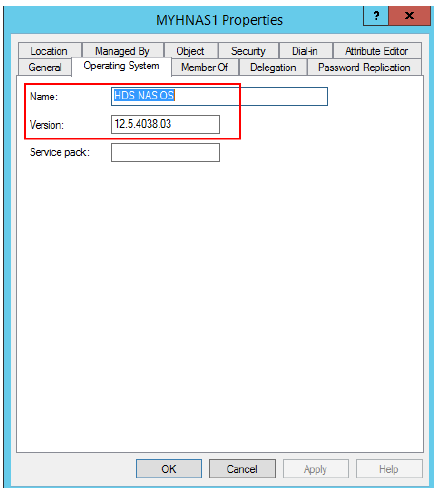

##### Using Domain Admin account, pre-staged computer account
---
The AD Domain Admin can create the Computer account ahead of time in Active Directory. Then he/she can later join the HNAS. This is what we call the prestaged account method.
The domain admin first goes to Active Directory Users and Computers, and creates the Computer Account in the preferred OU (in this case TestOU > Servers)

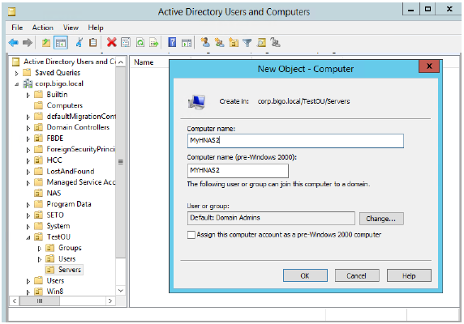

Then the domain administrator joins the HNAS

	arena-1[EVS04]:$ cifs-name add -m ads -a 172.20.252.131 MyHNAS2
	Adding name(s) to ADS domain corp.bigo.local

	Please enter account with administrative rights in domain.
	User name: administrator
	Password: ********
	Adding names to EVS 4 and to CIFS domain "corp.bigo.local"
	JoinDomain: Joining pre-created account "MyHNAS2" using SAMR
	* Added name(s) to ADS domain corp.bigo.local.
	[cifs-name took 6 s.]

#### With Delegated Account
---

##### Account
---
This is appropriate for situations where the person who is responsible for administering HNAS does not have Admin access to the Active Directory Domain. It is not practical or desirable to have the Domain Admin enter his/her credentials in the HNAS when joining the domain.

In the use cases that follows, we will use an Active Directory group called “NASAdmins”. This group does not have any special privileges in Active Directory. We will use this as the group for delegation. We will use the account “admartinez” which is a member of this group.

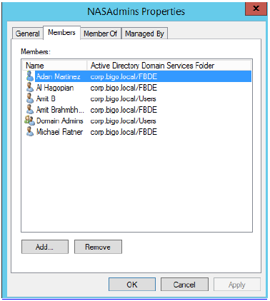

##### Computer Account pre-staged by Domain Admin
---
The first and simplest option is to have a Domain Admin create the computer account for HNAS in Active Directory. Then the NAS Admin can join the HNAS to the domain at his/her convenience.
This is appropriate in larger organizations, where Active Directory and HNAS are managed by different entities. So it’s not practical for the AD Domain Admin to enter his/her credentials during the HNAS join domain operation.
As a Domain Admin, we first create the Computer account for HNAS in Active Directory. We make sure we set the permission to allow the NASAdmins group to join the domain.

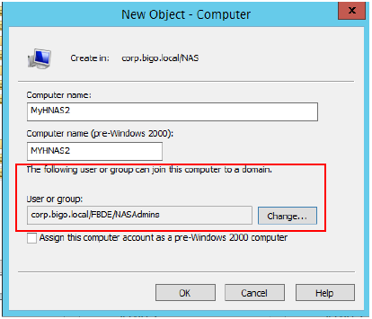

Now we join the domain as ‘admartinez’, who is part of the delegated group NASAdmins

	arena-1[EVS04]:$ cifs-name add -m ads -a 172.20.252.131 MyHNAS2
	Adding name(s) to ADS domain corp.bigo.local
	
	Please enter account with administrative rights in domain.
	User name: admartinez
	Password: ********
	Adding names to EVS 4 and to CIFS domain "corp.bigo.local"
	JoinDomain: Joining pre-created account "MyHNAS2" using SAMR
	* Added name(s) to ADS domain corp.bigo.local.
	[cifs-name took 8 s.]

##### Full Delegation
---
In some cases, is not even practical to have the NASAdmin group make requests to the Domain Admins group to pre-stage (create) the Computer account with delegation, and then join, every time an EVS gets created. This could be an environment where multiple EVS’s get created at different times. The NASAdmin group needs to have more autonomy to be able to both create Computer accounts for the HNAS and join the HNAS.
However, the only way that a Computer account can be created while HNAS joins the domain (without prestaging) is by entering domain admin credentials. So instead, the Active Directory domain admin creates an OU where permission to create Computer accounts is delegated, which allows the NAS admin to create Computer accounts and then join in separate steps.

The recommended approach here is:

**Domain Admin (one time):**
	1. creates a special OU for HNAS
	2. delegates the proper permissions to the HNASAdmins group to that OU

**NAS Admin (every time an EVS needs to join the domain)**
	1. creates a Computer Account for the EVS in the OU, making sure that the option is set for theNAS Admin to join the domain (still required)
	2. Joins the HNAS to the domain, using the same computer name of the account created, and usinghis/her credentials.

##### Creating the OU for the NAS, with Delegation
---

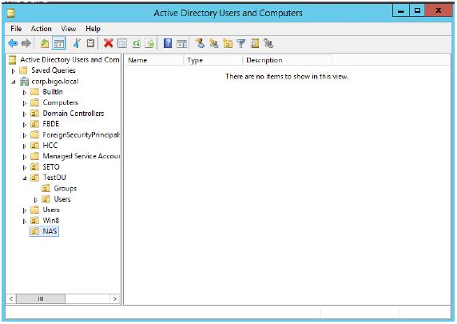
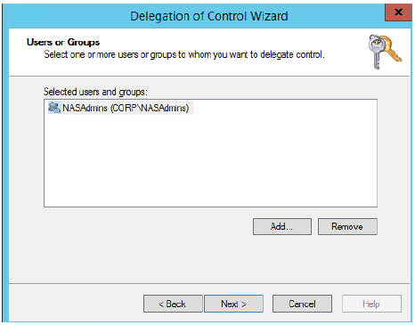 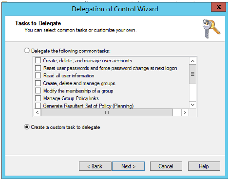
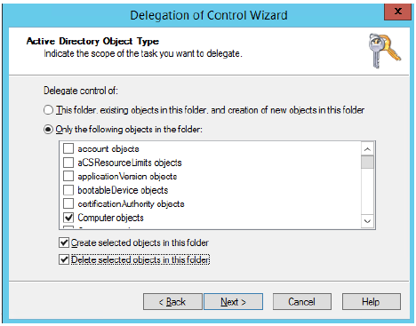 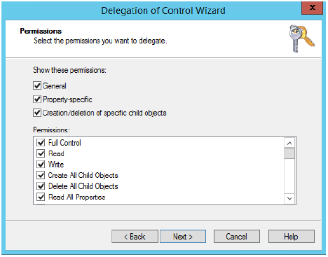
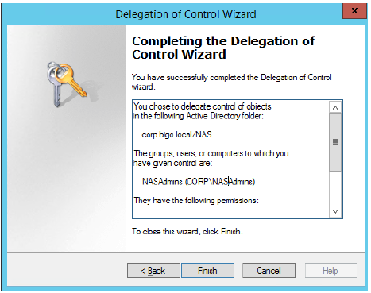

You chose to delegate control of objects in the following Active Directory folder:

	corp.bigo.local/NAS
	
The groups, users, or computers to which you have given control are:

	NASAdmins (CORP\NASAdmins)
	
They have the following permissions:

	Full Control
	
For the following object types:

	Computer

##### Joining the Domain
---
As CORP\admartinez (part of NASAdmins)

	Z:\>whoami
	corp\admartinez

Here we create the Computer Account as a delegated user. However, we forget to change the user/group that can join the domain.

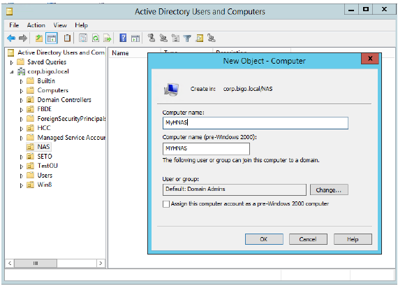

	arena-1[EVS04]:$ cifs-name add -m ads -a 172.20.252.131 MyHNAS
	Adding name(s) to ADS domain corp.bigo.local
	
	Please enter account with administrative rights in domain.
	User name: admartinez
	Password: ********
	Adding names to EVS 4 and to CIFS domain "corp.bigo.local"
	JoinDomain: Creating acct "MyHNAS" using LDAP
	! AddNewLdapAccount failed (main), ret = 19 (Constraint violation)
	Domain join failed ([ldap] Constraint violation): Constraint violation
	Add operation failed: Constraint violation [1073741843]
	Add attempt failed.

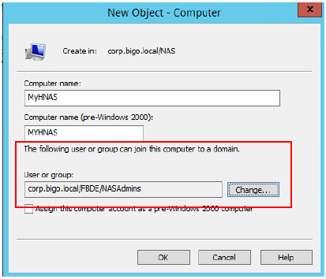

	arena-1[EVS04]:$ cifs-name add -m ads -a 172.20.252.131 MyHNAS
	Adding name(s) to ADS domain corp.bigo.local
	
	Please enter account with administrative rights in domain.
	User name: admartinez
	Password: ********
	Adding names to EVS 4 and to CIFS domain "corp.bigo.local"
	JoinDomain: Creating acct "MyHNAS" using LDAP
	! AddNewLdapAccount failed (main), ret = 19 (Constraint violation)
	Domain join failed ([ldap] Constraint violation): Constraint violation
	Add operation failed: Constraint violation [1073741843]
	Add attempt failed.
	[cifs-name took 6 s.]

Now we create a Computer Account again, but this time correctly

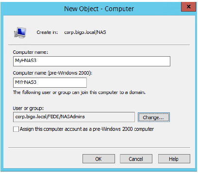

	arena-1[EVS04]:$ cifs-name add -m ads -a 172.20.252.132 MyHNAS3
	Adding name(s) to ADS domain corp.bigo.local
	
	Please enter account with administrative rights in domain.
	User name: admartinez
	Password: ********
	Adding names to EVS 4 and to CIFS domain "corp.bigo.local"
	JoinDomain: Joining pre-created account "MyHNAS3" using SAMR
	* Added name(s) to ADS domain corp.bigo.local.
	[cifs-name took 11 s.]
