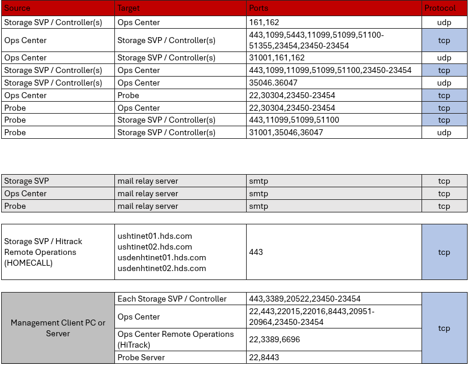
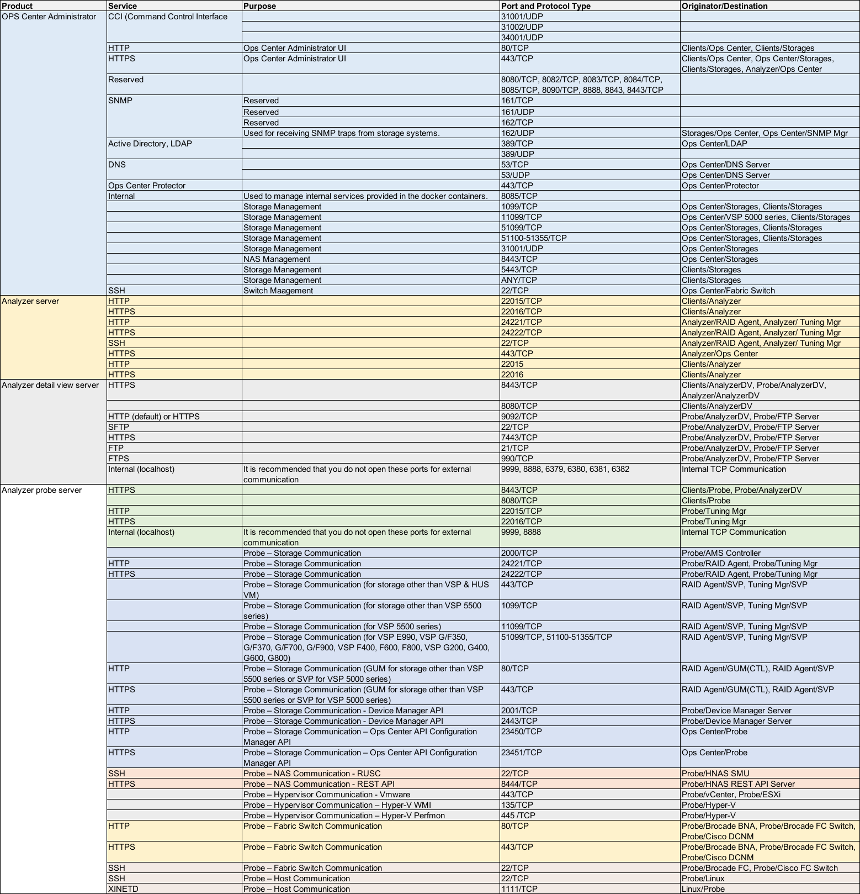
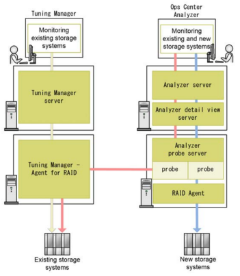

#### FIREWALL PORTS
---

	
   

|  Source |  Target |  Ports |  Protocol |
|---|---|---|---|
|  Storage SVP / Controller(s)   |  Ops Center     |  161,162, 35046, 36047    |  udp |
|                Storage SVP / Controller(s)                |     Ops Center           |       443, 1099, 11099, 51099, 51100, 23450-23454       |   tcp   |
|  Ops Center   |  Storage SVP / Controller(s)    |   31001,161,162  |  udp |
|      Ops Center         |             Storage SVP / Controller(s)                   |                              443,1099, 5443, 11099, 51099, 51100-51355, 23454, 23450-23454                               |   tcp   |
|      Ops Center               |             Probe                                  |                                      22, 30304, 23450-23454                                      |     tcp    |
|     Probe                     |             Ops Center                                       |                                                22, 30304, 23450-23454                                                |      tcp      |
|     Probe                     |             Storage SVP / Controller(s)                                       |                                                31001, 35046, 36047                                                |      udp      |
|     Probe                     |             Storage SVP / Controller(s)                                       |                                                443, 11099, 51099, 51100                                                |      tcp      |
|                                    |                                                                                             |                                                                                                                       |               |
|     SVP                             |           mail relay server                                                       |                                                            smtp                                                           |        tcp       |
|     Ops Center                          |             mail relay server                                                                        |                                                              smtp                                                             |         tcp         |
|     Probe                          |             mail relay server                                                                        |                                                              smtp                                                             |         tcp         |
|                                            |                                                                                                                                                          |                                                                                                                               |                     |
|             Storage SVP / Hitrack Remote Operations (HOMECALL)                               |                                                                 ushtinet01.hds.com                                                                                             |                                                                443                                                               |           tcp          |
|                                                                                              |                                                                                                                                                                                |                                                                                                                                  |                        |
|     Management Client PC or Server                                                                                 |             SVP / Controller                                                                                                               |                                                                 443,3389,20522,23450-23454                                                                 |            tcp            |
Management Client PC or Server                                                                                  |             Ops Center                                                                                                                |                                                                 22,443,22015,22016,8443,20951-20964,23450-23454                                                                 |            tcp            |
|     Management Client PC or Server                                                                                  |    Ops Center Remote Operations (HiTrack)                                                                                                                |                                                                 22, 3389, 6696                                                                 |            tcp            |
|                                                           Management Client PC or Server                                                          |Probe                                                                                                                                              |                                                                 228, 8443                                                                 |            tcp            |

   

**Storages**: SVP if it exists or controller(s) of storages
**Raid Agent**: This agent is installed with Ops Center Analyzer.
**Tuning Manager - Agent for RAID**: This agent is used in environments where Tuning Manager was previously used to monitor storage system performance.

**PS**: RAID Agent and Tuning Manager - Agent for RAID cannot connect to the same storage system.

