#### PRECONFIGURATION
---

##### 1. Talk to prelases for config
---
---

	-Encryption
	-Dedup
	-Compression
	-Pool
	-Tiering

##### 2.Define Port Usages
---
---

###### VSP5600
---

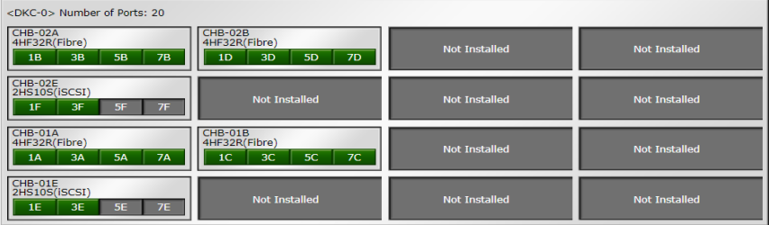

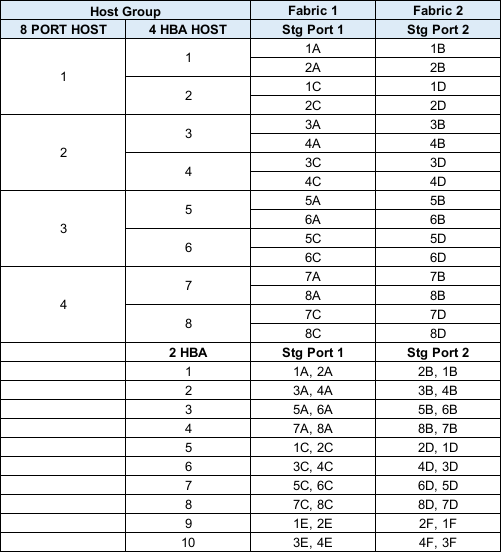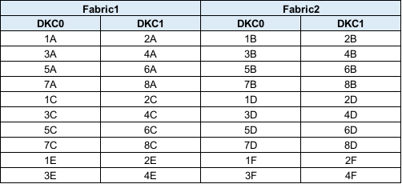

###### E1090
---

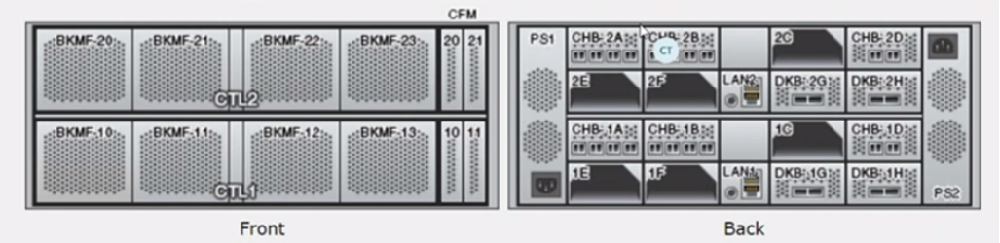
 or 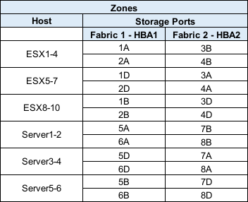 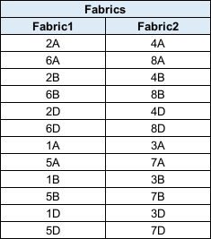

###### VSP5500 (Ziraat)
---

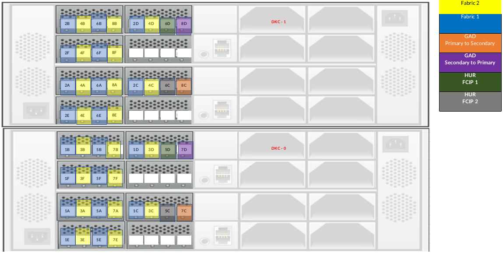
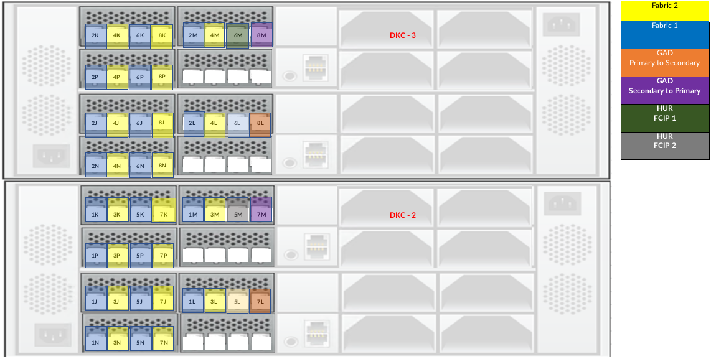
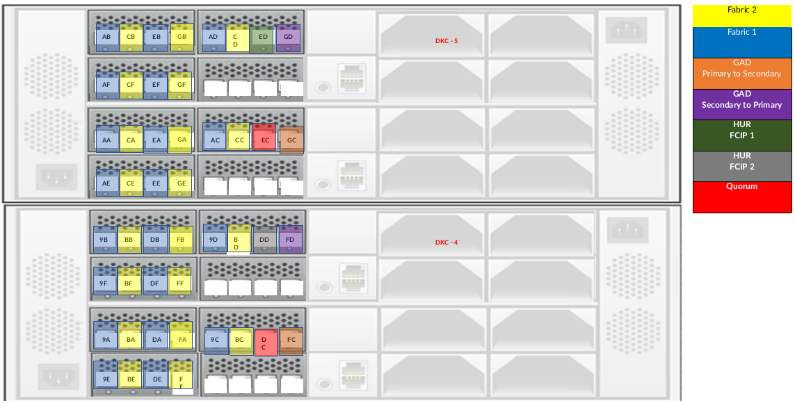
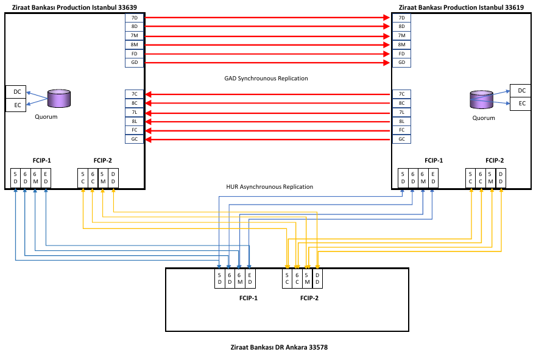

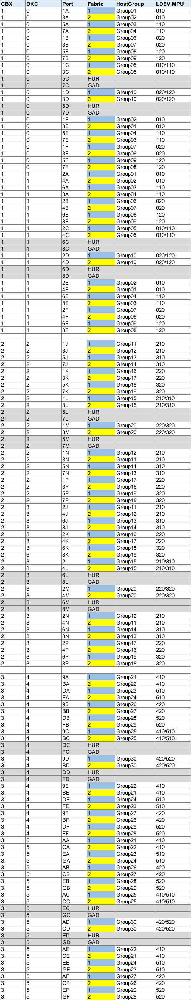

###### G800 (Takasbank)
---

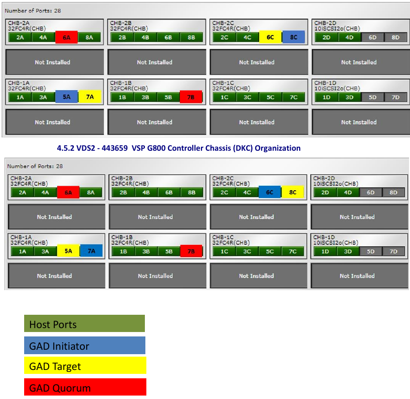
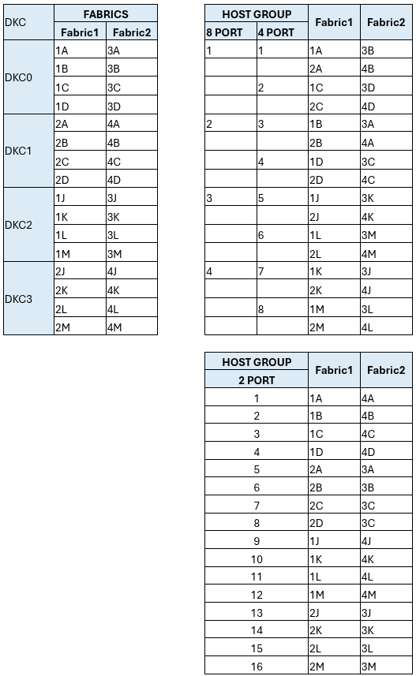

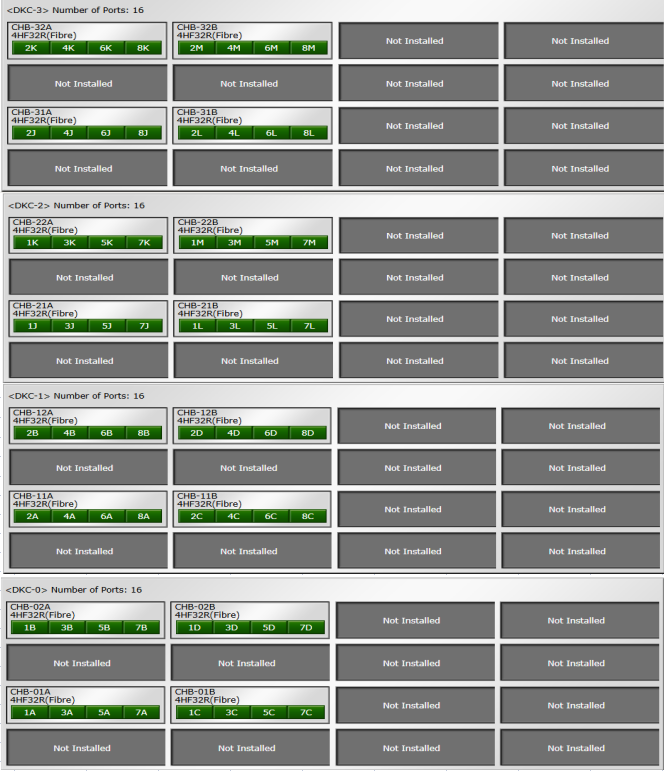

