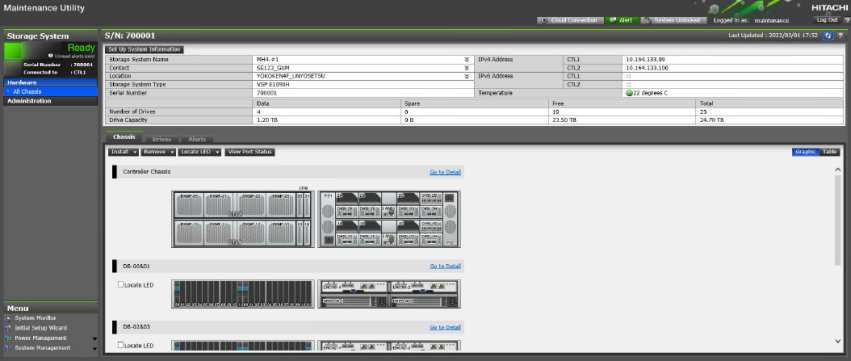
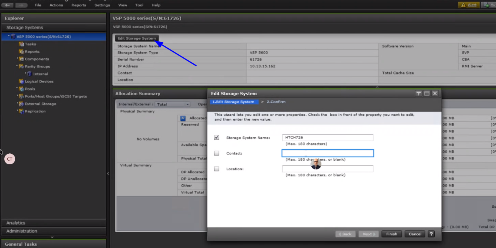

#### INITIAL SETUP
---

###### For VSP5500:
https://knowledge.hitachivantara.com/Knowledge/Storage/VSP_5000_Series/How_to_Configure_Date_Time_Time_Zone_and_NTP_on_VSP_5000_Series 
		
###### Setup System Information
- Setup Network settings (Controller ip config) - Reenter Storage Advisor Embedded with new IP
- Change Date&Time, Storage System Name, Contact, Cloud Config
- In the maintenance utility navigation tree, under Menu, click Initial Setup Wizard.

