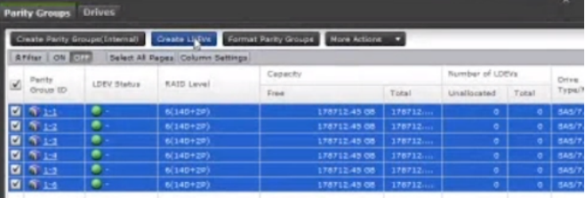
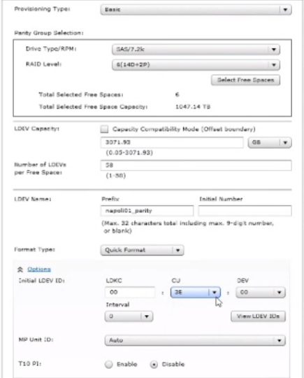
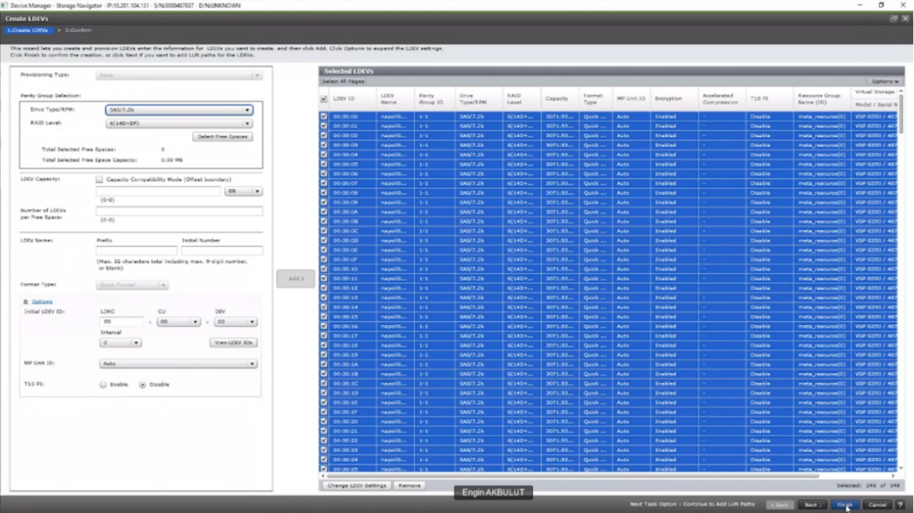
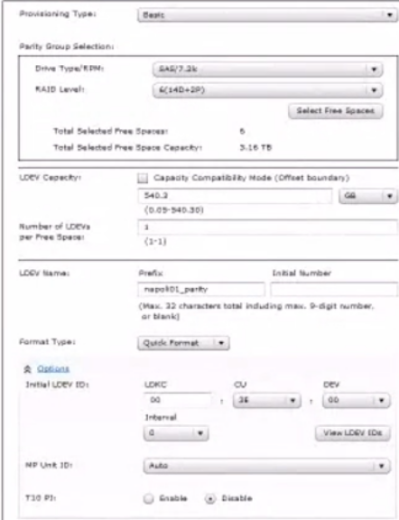

### CREATE BASIC LDEVS
---
---

 

###### What is T10-PI ?
---
	
	T10 Protection Information (PI) allows a checksum to be transmitted from the HBA and application to the disk drive. Why is this important ?
	
	Traditionally, protecting the integrity of customers’ data has been done with multiple discrete solutions, including Error Correcting Code (ECC) and Cyclic Redundancy Check (CRC), but there have been gaps across the I/O path from the operating system to the storage. The implementation of the T10-PI standard, in conjunction with other industry player’s implementations, ensures that data is validated as it moves through the data path, from the application, to the HBA, to storage, enabling seamless end-to-end integrity.
	
	So how great is the chance that you get a hit from Bit error ?
	
	Fibre Channel originally developed at 25 MBs; today it is at 1600 MBs (8 Gb FC full duplex). The Channel error rate is 1 in 10E12 bits.
	
	IDE channel originally was .625 MBs and it is now 480 times faster at 300 MBs. The channel error rate is 1 in 10E12 bits. 
	
	It has dramatically increased. So the T10 PI should protect the channels from silent errors.

Use the space left for Basic LDEVs.

#### CREATE PARITY GROUP AND BASIC LDEVS (CCI)
---

##### ADD Parity Group
	raidcom add parity_grp -parity_grp_id 1-1 -drive_location 0-0 0-1 0-2 0-3 -raid_type 3D1P

##### CREATE Basic Ldevs
	raidcom add ldev -parity_group_id 1-1 -ldev_id 0xFA00 -capacity 3072G
	raidcom add ldev -parity_group_id 1-1 -ldev_id 0xFA01 -capacity 3072G
	raidcom add ldev -parity_group_id 1-1 -ldev_id 0xFA02 -capacity 3072G
	raidcom add ldev -parity_group_id 1-1 -ldev_id 0xFA03 -capacity 3072G
	raidcom add ldev -parity_group_id 1-1 -ldev_id 0xFA04 -capacity 3072G
	raidcom add ldev -parity_group_id 1-1 -ldev_id 0xFA05 -capacity 3072G  

	raidcom add ldev -parity_group_id 1-2 -ldev_id 0xFB00 -capacity 3072G
	raidcom add ldev -parity_group_id 1-2 -ldev_id 0xFB01 -capacity 3072G
	raidcom add ldev -parity_group_id 1-2 -ldev_id 0xFB02 -capacity 3072G
	raidcom add ldev -parity_group_id 1-2 -ldev_id 0xFB03 -capacity 3072G
	raidcom add ldev -parity_group_id 1-2 -ldev_id 0xFB04 -capacity 3072G
	raidcom add ldev -parity_group_id 1-2 -ldev_id 0xFB05 -capacity 3072G  

##### CREATE POOL from Basic Ldevs
	raidcom add dp-pool -pool_id 0 -pool_name Pool0 -ldev_id 0xFA00 -cnt 6
	raidcom add dp-pool -pool_id 0 -ldev_id 0xFB00 -cnt 6
