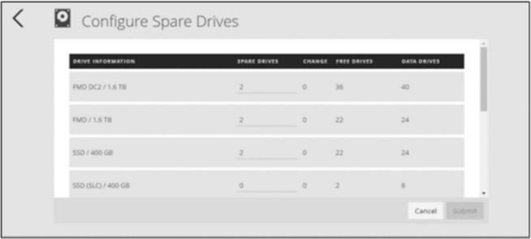
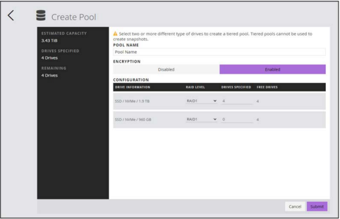
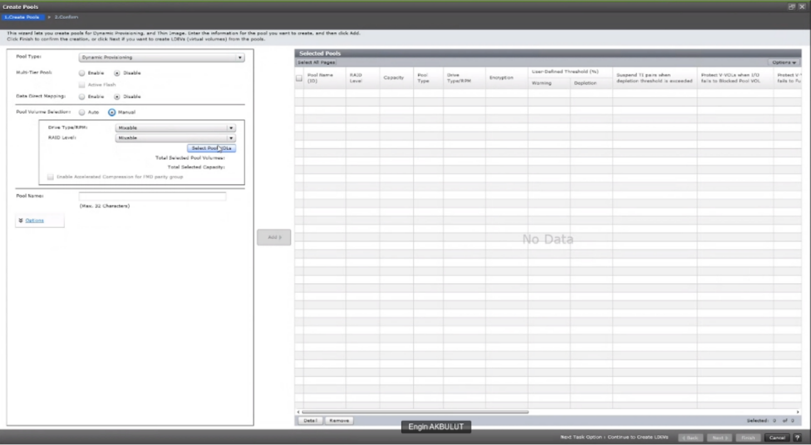
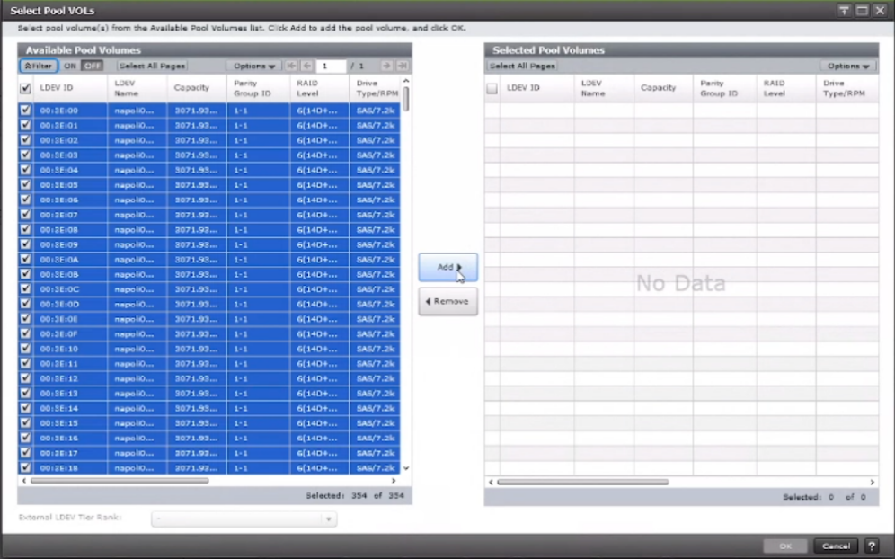
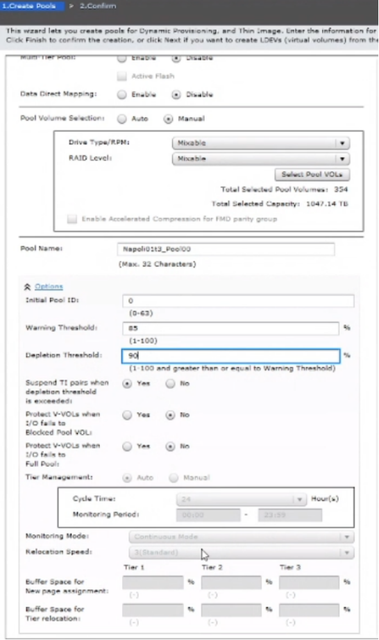
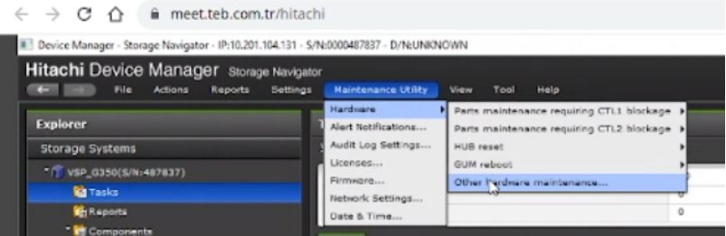
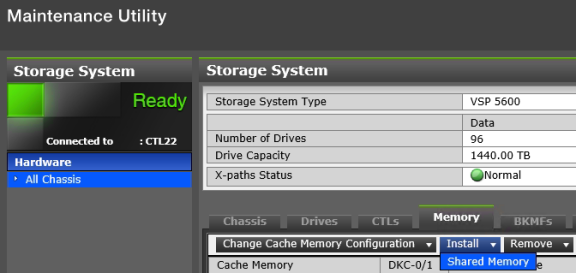
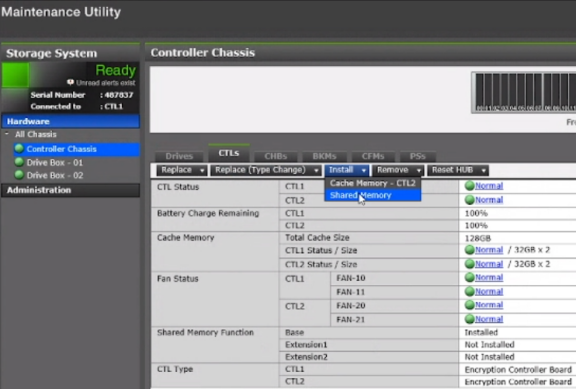
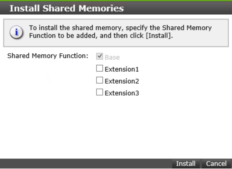

### CREATE POOL(s)
---
---

#### CREATE POOL(s) - Storage Advisor Embedded
---

Set up spare drives: In the navigation bar, click **Others > Configure Spare Drives.**

Create Pool:  In the navigation bar, click **Pools**.

#### CREATE POOL(s) - SVP
---

**Multi-Tier Pool**: If main pool is tiered then create “Thin Image” pool for snapshots. Otherwise use “Dynamic Provisioning” pool for both DP V-Vols and snapshots and disable “Multi-Tier Pool”.
**Data Direct Mapping**: This is used for the migration from external volumes bigger than 4TB.
**Depletion Threshold**: Stop recording differential data of snapshots when it is exceeded.

#### Increase Shared Memory if Pool creation fails (takes ~ 30/45 min)
---

