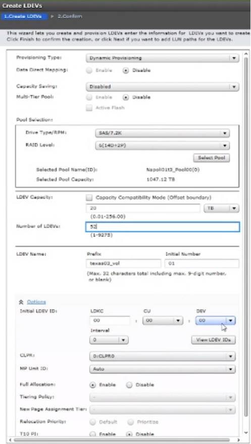
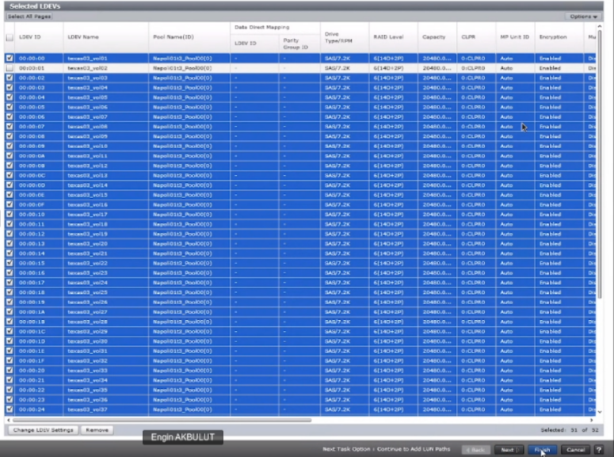

#### CREATE LDEV(s)
---
---

##### Create LDEV(s) - SVP
---

 

##### Create LDEV(s) - CCI
---

###### AKTIBANK EXAMPLE
	raidcom add ldev -pool 0 -ldev_id 0x1001 -capacity 20T -capacity_saving deduplication_compression -I642833
	raidcom add ldev -pool 0 -ldev_id 0x1002 -capacity 20T -capacity_saving deduplication_compression -I642833
	raidcom add ldev -pool 0 -ldev_id 0x1003 -capacity 20T -capacity_saving deduplication_compression -I642833
	raidcom add ldev -pool 0 -ldev_id 0x1004 -capacity 20T -capacity_saving deduplication_compression -I642833
	raidcom add ldev -pool 0 -ldev_id 0x1005 -capacity 20T -capacity_saving deduplication_compression -I642833
	raidcom add ldev -pool 0 -ldev_id 0x1006 -capacity 20T -capacity_saving deduplication_compression -I642833
	raidcom add ldev -pool 0 -ldev_id 0x1007 -capacity 20T -capacity_saving deduplication_compression -I642833
	raidcom add ldev -pool 0 -ldev_id 0x1008 -capacity 20T -capacity_saving deduplication_compression -I642833
	raidcom add ldev -pool 0 -ldev_id 0x1009 -capacity 20T -capacity_saving deduplication_compression -I642833
	raidcom add ldev -pool 0 -ldev_id 0x1010 -capacity 20T -capacity_saving deduplication_compression -I642833
	raidcom add ldev -pool 0 -ldev_id 0x1011 -capacity 20T -capacity_saving deduplication_compression -I642833
	raidcom add ldev -pool 0 -ldev_id 0x1012 -capacity 20T -capacity_saving deduplication_compression -I642833
	raidcom add ldev -pool 0 -ldev_id 0x1013 -capacity 20T -capacity_saving deduplication_compression -I642833
	raidcom add ldev -pool 0 -ldev_id 0x1014 -capacity 20T -capacity_saving deduplication_compression -I642833
	raidcom add ldev -pool 0 -ldev_id 0x1015 -capacity 20T -capacity_saving deduplication_compression -I642833
	
	raidcom modify ldev -ldev_id 0x1001 -ldev_name LINUX_E790_DS_01_LUN_01 -I642833
	raidcom modify ldev -ldev_id 0x1002 -ldev_name LINUX_E790_DS_02_LUN_02 -I642833
	raidcom modify ldev -ldev_id 0x1003 -ldev_name LINUX_E790_DS_03_LUN_03 -I642833
	raidcom modify ldev -ldev_id 0x1004 -ldev_name LINUX_E790_DS_04_LUN_04 -I642833
	raidcom modify ldev -ldev_id 0x1005 -ldev_name LINUX_E790_DS_05_LUN_05 -I642833
	raidcom modify ldev -ldev_id 0x1006 -ldev_name LINUX_E790_DS_06_LUN_06 -I642833
	raidcom modify ldev -ldev_id 0x1007 -ldev_name LINUX_E790_DS_07_LUN_07 -I642833
	raidcom modify ldev -ldev_id 0x1008 -ldev_name LINUX_E790_DS_08_LUN_08 -I642833
	raidcom modify ldev -ldev_id 0x1009 -ldev_name LINUX_E790_DS_09_LUN_09 -I642833
	raidcom modify ldev -ldev_id 0x1010 -ldev_name LINUX_E790_DS_10_LUN_10 -I642833
	raidcom modify ldev -ldev_id 0x1011 -ldev_name WINDOWS_E790_DS_01_LUN_11 -I642833
	raidcom modify ldev -ldev_id 0x1012 -ldev_name WINDOWS_E790_DS_02_LUN_12 -I642833
	raidcom modify ldev -ldev_id 0x1013 -ldev_name WINDOWS_E790_DS_03_LUN_13 -I642833
	raidcom modify ldev -ldev_id 0x1014 -ldev_name WINDOWS_E790_DS_04_LUN_14 -I642833
	raidcom modify ldev -ldev_id 0x1015 -ldev_name WINDOWS_E790_DS_05_LUN_15 -I642833
	