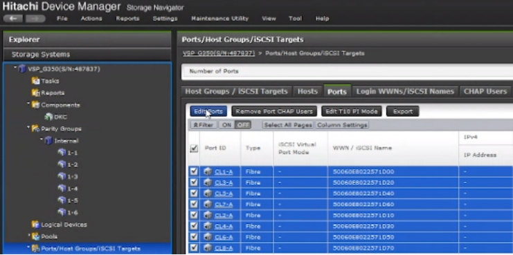
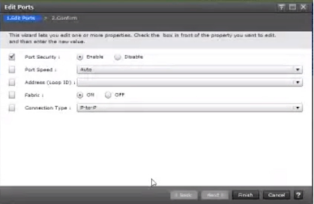

#### CHANGE PORT SETTINGS
---

**Fabric**: ON when SAN connected, OFF when host connected port directly.
**Port Security**: ON: LDEVs will not be seen all host groups connected to the port. LU path defines LDEV mapping. OFF when host connected port directly.

 

Wait until task completed.