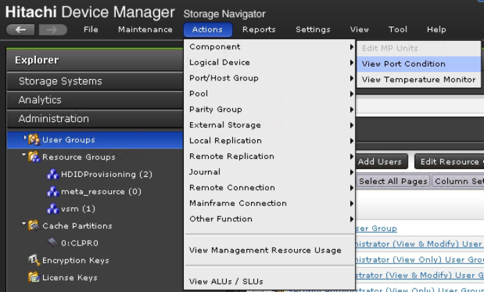
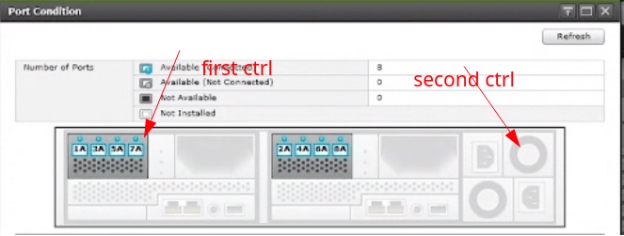
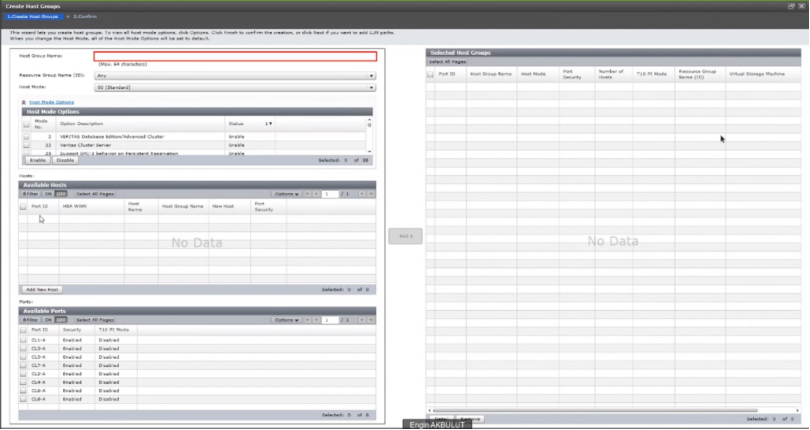
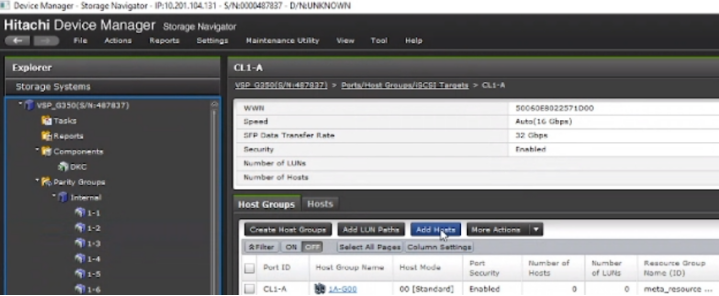
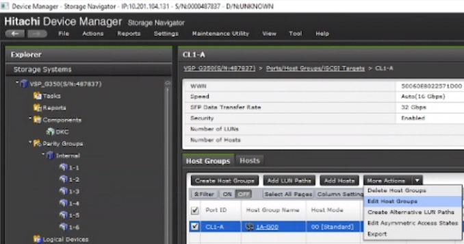

### HOST GROUP(s)
---
---

#### Create Host Group(s) - SVP
---

Check port location
 

Create Host Group (It is not possible to add wwn more than one to same port here)

Add another wwn to same port of existing Host Group (It is possible to give a name to wwn)

Change Host Group name of added wwn

#### Create Host Group(s) - CCI
---

###### 1. CREATE HOST GROUPS
---
	raidcom add host_grp -port CL1-A-50 -host_grp_name ODM_E790_HG -I642833
	raidcom add host_grp -port CL2-A-50 -host_grp_name ODM_E790_HG -I642833
	raidcom add host_grp -port CL1-B-50 -host_grp_name ODM_E790_HG -I642833
	raidcom add host_grp -port CL2-B-50 -host_grp_name ODM_E790_HG -I642833
	raidcom add host_grp -port CL3-A-50 -host_grp_name ODM_E790_HG -I642833
	raidcom add host_grp -port CL3-B-50 -host_grp_name ODM_E790_HG -I642833
	raidcom add host_grp -port CL4-A-50 -host_grp_name ODM_E790_HG -I642833
	raidcom add host_grp -port CL4-B-50 -host_grp_name ODM_E790_HG -I642833

##### 2. SET HOST MODE & OPTIONS
---
	raidcom modify host_grp -port CL1-A-50 -host_mode VMWARE_EX -set_host_mode_opt 2 22 25 40 54 63 114 -I642833
	raidcom modify host_grp -port CL2-A-50 -host_mode VMWARE_EX -sehost_mode_opt 2 22 25 40 54 63 114 -I642833
	raidcom modify host_grp -port CL1-B-50 -host_mode VMWARE_EX -set_host_mode_opt 2 22 25 40 54 63 114 -I642833
	raidcom modify host_grp -port CL2-B-50 -host_mode VMWARE_EX -set_host_mode_opt 2 22 25 40 54 63 114 -I642833
	raidcom modify host_grp -port CL3-A-50 -host_mode VMWARE_EX -set_host_mode_opt 2 22 25 40 54 63 114 -I642833
	raidcom modify host_grp -port CL3-B-50 -host_mode VMWARE_EX -set_host_mode_opt 2 22 25 40 54 63 114 -I642833
	raidcom modify host_grp -port CL4-A-50 -host_mode VMWARE_EX -set_host_mode_opt 2 22 25 40 54 63 114 -I642833
	raidcom modify host_grp -port CL4-B-50 -host_mode VMWARE_EX -set_host_mode_opt 2 22 25 40 54 63 114 -I642833

###### 3. ADD WWNS & GIVE NICKNAME
---

**WINDOWS CLUSTER**

	raidcom add hba_wwn -port CL1-A-50 -hba_wwn 51402ec012c8c6ac -I642833
	raidcom add hba_wwn -port CL1-A-50 -hba_wwn 51402ec012c9ad9a -I642833
	raidcom add hba_wwn -port CL1-A-50 -hba_wwn 51402ec012c9a7ba -I642833
	raidcom add hba_wwn -port CL1-A-50 -hba_wwn 51402ec012c9adf0 -I642833
	raidcom add hba_wwn -port CL1-A-50 -hba_wwn 51402ec012c902ca -I642833
	raidcom add hba_wwn -port CL1-A-50 -hba_wwn 51402ec012c9ad9e -I642833
	raidcom add hba_wwn -port CL1-A-50 -hba_wwn 51402ec012c9ad76 -I642833
	raidcom add hba_wwn -port CL1-A-50 -hba_wwn 51402ec012c9ad70 -I642833
	raidcom add hba_wwn -port CL1-A-50 -hba_wwn 51402ec012c8c34a -I642833
	raidcom add hba_wwn -port CL1-A-50 -hba_wwn 51402ec012c902be -I642833
	raidcom add hba_wwn -port CL1-A-50 -hba_wwn 51402ec012c9ad9c -I642833
	raidcom add hba_wwn -port CL1-A-50 -hba_wwn 51402ec012c8c1d2 -I642833
	raidcom add hba_wwn -port CL1-A-50 -hba_wwn 51402ec012c8c1da -I642833
	
	raidcom set hba_wwn -port CL1-A-50 -hba_wwn 51402ec012c8c6ac -wwn_nickname sprck101pesx01_HBA1 -I642833
	raidcom set hba_wwn -port CL1-A-50 -hba_wwn 51402ec012c9ad9a -wwn_nickname sprck101pesx03_HBA1 -I642833
	raidcom set hba_wwn -port CL1-A-50 -hba_wwn 51402ec012c9a7ba -wwn_nickname sprck101pesx04_HBA1 -I642833
	raidcom set hba_wwn -port CL1-A-50 -hba_wwn 51402ec012c9adf0 -wwn_nickname sprck101pesx07_HBA1 -I642833
	raidcom set hba_wwn -port CL1-A-50 -hba_wwn 51402ec012c902ca -wwn_nickname sprck101pesx08_HBA1 -I642833
	raidcom set hba_wwn -port CL1-A-50 -hba_wwn 51402ec012c9ad9e -wwn_nickname sprck101pesx10_HBA1 -I642833
	raidcom set hba_wwn -port CL1-A-50 -hba_wwn 51402ec012c9ad76 -wwn_nickname sprck101pesx11_HBA1 -I642833
	raidcom set hba_wwn -port CL1-A-50 -hba_wwn 51402ec012c9ad70 -wwn_nickname sprck101pesx12_HBA1 -I642833
	raidcom set hba_wwn -port CL1-A-50 -hba_wwn 51402ec012c8c34a -wwn_nickname sprck101pesx14_HBA1 -I642833
	raidcom set hba_wwn -port CL1-A-50 -hba_wwn 51402ec012c902be -wwn_nickname sprck101pesx15_HBA1 -I642833
	raidcom set hba_wwn -port CL1-A-50 -hba_wwn 51402ec012c9ad9c -wwn_nickname sprck101pesx18_HBA1 -I642833
	raidcom set hba_wwn -port CL1-A-50 -hba_wwn 51402ec012c8c1d2 -wwn_nickname sprck101pesx25_HBA1 -I642833
	raidcom set hba_wwn -port CL1-A-50 -hba_wwn 51402ec012c8c1da -wwn_nickname sprck101pesx26_HBA1 -I642833
	
	raidcom add hba_wwn -port CL2-A-50 -hba_wwn 51402ec012c8c6ac -I642833
	raidcom add hba_wwn -port CL2-A-50 -hba_wwn 51402ec012c9ad9a -I642833
	raidcom add hba_wwn -port CL2-A-50 -hba_wwn 51402ec012c9a7ba -I642833
	raidcom add hba_wwn -port CL2-A-50 -hba_wwn 51402ec012c9adf0 -I642833
	raidcom add hba_wwn -port CL2-A-50 -hba_wwn 51402ec012c902ca -I642833
	raidcom add hba_wwn -port CL2-A-50 -hba_wwn 51402ec012c9ad9e -I642833
	raidcom add hba_wwn -port CL2-A-50 -hba_wwn 51402ec012c9ad76 -I642833
	raidcom add hba_wwn -port CL2-A-50 -hba_wwn 51402ec012c9ad70 -I642833
	raidcom add hba_wwn -port CL2-A-50 -hba_wwn 51402ec012c8c34a -I642833
	raidcom add hba_wwn -port CL2-A-50 -hba_wwn 51402ec012c902be -I642833
	raidcom add hba_wwn -port CL2-A-50 -hba_wwn 51402ec012c9ad9c -I642833
	raidcom add hba_wwn -port CL2-A-50 -hba_wwn 51402ec012c8c1d2 -I642833
	raidcom add hba_wwn -port CL2-A-50 -hba_wwn 51402ec012c8c1da -I642833
	
	raidcom set hba_wwn -port CL2-A-50 -hba_wwn 51402ec012c8c6ac -wwn_nickname sprck101pesx01_HBA1 -I642833
	raidcom set hba_wwn -port CL2-A-50 -hba_wwn 51402ec012c9ad9a -wwn_nickname sprck101pesx03_HBA1 -I642833
	raidcom set hba_wwn -port CL2-A-50 -hba_wwn 51402ec012c9a7ba -wwn_nickname sprck101pesx04_HBA1 -I642833
	raidcom set hba_wwn -port CL2-A-50 -hba_wwn 51402ec012c9adf0 -wwn_nickname sprck101pesx07_HBA1 -I642833
	raidcom set hba_wwn -port CL2-A-50 -hba_wwn 51402ec012c902ca -wwn_nickname sprck101pesx08_HBA1 -I642833
	raidcom set hba_wwn -port CL2-A-50 -hba_wwn 51402ec012c9ad9e -wwn_nickname sprck101pesx10_HBA1 -I642833
	raidcom set hba_wwn -port CL2-A-50 -hba_wwn 51402ec012c9ad76 -wwn_nickname sprck101pesx11_HBA1 -I642833
	raidcom set hba_wwn -port CL2-A-50 -hba_wwn 51402ec012c9ad70 -wwn_nickname sprck101pesx12_HBA1 -I642833
	raidcom set hba_wwn -port CL2-A-50 -hba_wwn 51402ec012c8c34a -wwn_nickname sprck101pesx14_HBA1 -I642833
	raidcom set hba_wwn -port CL2-A-50 -hba_wwn 51402ec012c902be -wwn_nickname sprck101pesx15_HBA1 -I642833
	raidcom set hba_wwn -port CL2-A-50 -hba_wwn 51402ec012c9ad9c -wwn_nickname sprck101pesx18_HBA1 -I642833
	raidcom set hba_wwn -port CL2-A-50 -hba_wwn 51402ec012c8c1d2 -wwn_nickname sprck101pesx25_HBA1 -I642833
	raidcom set hba_wwn -port CL2-A-50 -hba_wwn 51402ec012c8c1da -wwn_nickname sprck101pesx26_HBA1 -I642833
	
	raidcom add hba_wwn -port CL3-B-50 -hba_wwn 51402ec012c8c1ee -I642833
	raidcom add hba_wwn -port CL3-B-50 -hba_wwn 51402ec012c9ada2 -I642833
	raidcom add hba_wwn -port CL3-B-50 -hba_wwn 51402ec012c99d0c -I642833
	raidcom add hba_wwn -port CL3-B-50 -hba_wwn 51402ec012c9adf4 -I642833
	raidcom add hba_wwn -port CL3-B-50 -hba_wwn 51402ec012c90266 -I642833
	raidcom add hba_wwn -port CL3-B-50 -hba_wwn 51402ec012c9ade4 -I642833
	raidcom add hba_wwn -port CL3-B-50 -hba_wwn 51402ec012c9ad40 -I642833
	raidcom add hba_wwn -port CL3-B-50 -hba_wwn 51402ec012c99d12 -I642833
	raidcom add hba_wwn -port CL3-B-50 -hba_wwn 51402ec012c8c658 -I642833
	raidcom add hba_wwn -port CL3-B-50 -hba_wwn 51402ec012c902c8 -I642833
	raidcom add hba_wwn -port CL3-B-50 -hba_wwn 51402ec012c9add0 -I642833
	raidcom add hba_wwn -port CL3-B-50 -hba_wwn 51402ec012c8c1d4 -I642833
	raidcom add hba_wwn -port CL3-B-50 -hba_wwn 51402ec012c8c1e0 -I642833
	
	raidcom set hba_wwn -port CL3-B-50 -hba_wwn 51402ec012c8c1ee -wwn_nickname sprck101pesx01_HBA2 -I642833
	raidcom set hba_wwn -port CL3-B-50 -hba_wwn 51402ec012c9ada2 -wwn_nickname sprck101pesx03_HBA2 -I642833
	raidcom set hba_wwn -port CL3-B-50 -hba_wwn 51402ec012c99d0c -wwn_nickname sprck101pesx04_HBA2 -I642833
	raidcom set hba_wwn -port CL3-B-50 -hba_wwn 51402ec012c9adf4 -wwn_nickname sprck101pesx07_HBA2 -I642833
	raidcom set hba_wwn -port CL3-B-50 -hba_wwn 51402ec012c90266 -wwn_nickname sprck101pesx08_HBA2 -I642833
	raidcom set hba_wwn -port CL3-B-50 -hba_wwn 51402ec012c9ade4 -wwn_nickname sprck101pesx10_HBA2 -I642833
	raidcom set hba_wwn -port CL3-B-50 -hba_wwn 51402ec012c9ad40 -wwn_nickname sprck101pesx11_HBA2 -I642833
	raidcom set hba_wwn -port CL3-B-50 -hba_wwn 51402ec012c99d12 -wwn_nickname sprck101pesx12_HBA2 -I642833
	raidcom set hba_wwn -port CL3-B-50 -hba_wwn 51402ec012c8c658 -wwn_nickname sprck101pesx14_HBA2 -I642833
	raidcom set hba_wwn -port CL3-B-50 -hba_wwn 51402ec012c902c8 -wwn_nickname sprck101pesx15_HBA2 -I642833
	raidcom set hba_wwn -port CL3-B-50 -hba_wwn 51402ec012c9add0 -wwn_nickname sprck101pesx18_HBA2 -I642833
	raidcom set hba_wwn -port CL3-B-50 -hba_wwn 51402ec012c8c1d4 -wwn_nickname sprck101pesx25_HBA2 -I642833
	raidcom set hba_wwn -port CL3-B-50 -hba_wwn 51402ec012c8c1e0 -wwn_nickname sprck101pesx26_HBA2 -I642833
	
	raidcom add hba_wwn -port CL4-B-50 -hba_wwn 51402ec012c8c1ee -I642833
	raidcom add hba_wwn -port CL4-B-50 -hba_wwn 51402ec012c9ada2 -I642833
	raidcom add hba_wwn -port CL4-B-50 -hba_wwn 51402ec012c99d0c -I642833
	raidcom add hba_wwn -port CL4-B-50 -hba_wwn 51402ec012c9adf4 -I642833
	raidcom add hba_wwn -port CL4-B-50 -hba_wwn 51402ec012c90266 -I642833
	raidcom add hba_wwn -port CL4-B-50 -hba_wwn 51402ec012c9ade4 -I642833
	raidcom add hba_wwn -port CL4-B-50 -hba_wwn 51402ec012c9ad40 -I642833
	raidcom add hba_wwn -port CL4-B-50 -hba_wwn 51402ec012c99d12 -I642833
	raidcom add hba_wwn -port CL4-B-50 -hba_wwn 51402ec012c8c658 -I642833
	raidcom add hba_wwn -port CL4-B-50 -hba_wwn 51402ec012c902c8 -I642833
	raidcom add hba_wwn -port CL4-B-50 -hba_wwn 51402ec012c9add0 -I642833
	raidcom add hba_wwn -port CL4-B-50 -hba_wwn 51402ec012c8c1d4 -I642833
	raidcom add hba_wwn -port CL4-B-50 -hba_wwn 51402ec012c8c1e0 -I642833
	                            
	raidcom set hba_wwn -port CL4-B-50 -hba_wwn 51402ec012c8c1ee -wwn_nickname sprck101pesx01_HBA2 -I642833
	raidcom set hba_wwn -port CL4-B-50 -hba_wwn 51402ec012c9ada2 -wwn_nickname sprck101pesx03_HBA2 -I642833
	raidcom set hba_wwn -port CL4-B-50 -hba_wwn 51402ec012c99d0c -wwn_nickname sprck101pesx04_HBA2 -I642833
	raidcom set hba_wwn -port CL4-B-50 -hba_wwn 51402ec012c9adf4 -wwn_nickname sprck101pesx07_HBA2 -I642833
	raidcom set hba_wwn -port CL4-B-50 -hba_wwn 51402ec012c90266 -wwn_nickname sprck101pesx08_HBA2 -I642833
	raidcom set hba_wwn -port CL4-B-50 -hba_wwn 51402ec012c9ade4 -wwn_nickname sprck101pesx10_HBA2 -I642833
	raidcom set hba_wwn -port CL4-B-50 -hba_wwn 51402ec012c9ad40 -wwn_nickname sprck101pesx11_HBA2 -I642833
	raidcom set hba_wwn -port CL4-B-50 -hba_wwn 51402ec012c99d12 -wwn_nickname sprck101pesx12_HBA2 -I642833
	raidcom set hba_wwn -port CL4-B-50 -hba_wwn 51402ec012c8c658 -wwn_nickname sprck101pesx14_HBA2 -I642833
	raidcom set hba_wwn -port CL4-B-50 -hba_wwn 51402ec012c902c8 -wwn_nickname sprck101pesx15_HBA2 -I642833
	raidcom set hba_wwn -port CL4-B-50 -hba_wwn 51402ec012c9add0 -wwn_nickname sprck101pesx18_HBA2 -I642833
	raidcom set hba_wwn -port CL4-B-50 -hba_wwn 51402ec012c8c1d4 -wwn_nickname sprck101pesx25_HBA2 -I642833
	raidcom set hba_wwn -port CL4-B-50 -hba_wwn 51402ec012c8c1e0 -wwn_nickname sprck101pesx26_HBA2 -I642833

**LINUX CLUSTER**

	raidcom add hba_wwn -port CL1-B-50 -hba_wwn 51402ec012c8c326 -I642833
	raidcom add hba_wwn -port CL1-B-50 -hba_wwn 51402ec012c99c1a -I642833
	raidcom add hba_wwn -port CL1-B-50 -hba_wwn 51402ec012c9ae7a -I642833
	raidcom add hba_wwn -port CL1-B-50 -hba_wwn 51402ec012c9ae72 -I642833
	raidcom add hba_wwn -port CL1-B-50 -hba_wwn 51402ec012c9ade2 -I642833
	raidcom add hba_wwn -port CL1-B-50 -hba_wwn 51402ec012c8c1f8 -I642833
	raidcom add hba_wwn -port CL1-B-50 -hba_wwn 51402ec012c9adea -I642833
	raidcom add hba_wwn -port CL1-B-50 -hba_wwn 51402ec012c9ad34 -I642833
	raidcom add hba_wwn -port CL1-B-50 -hba_wwn 51402ec012c9a290 -I642833
	raidcom add hba_wwn -port CL1-B-50 -hba_wwn 51402ec012c9ad74 -I642833
	raidcom add hba_wwn -port CL1-B-50 -hba_wwn 51402ec012c9a088 -I642833
	raidcom add hba_wwn -port CL1-B-50 -hba_wwn 51402ec012c8c346 -I642833
	raidcom add hba_wwn -port CL1-B-50 -hba_wwn 51402ec012c8c69a -I642833
	
	raidcom set hba_wwn -port CL1-B-50 -hba_wwn 51402ec012c8c326 -wwn_nickname sprck101pesx02_HBA1 -I642833
	raidcom set hba_wwn -port CL1-B-50 -hba_wwn 51402ec012c99c1a -wwn_nickname sprck101pesx05_HBA1 -I642833
	raidcom set hba_wwn -port CL1-B-50 -hba_wwn 51402ec012c9ae7a -wwn_nickname sprck101pesx06_HBA1 -I642833
	raidcom set hba_wwn -port CL1-B-50 -hba_wwn 51402ec012c9ae72 -wwn_nickname sprck101pesx09_HBA1 -I642833
	raidcom set hba_wwn -port CL1-B-50 -hba_wwn 51402ec012c9ade2 -wwn_nickname sprck101pesx13_HBA1 -I642833
	raidcom set hba_wwn -port CL1-B-50 -hba_wwn 51402ec012c8c1f8 -wwn_nickname sprck101pesx16_HBA1 -I642833
	raidcom set hba_wwn -port CL1-B-50 -hba_wwn 51402ec012c9adea -wwn_nickname sprck101pesx17_HBA1 -I642833
	raidcom set hba_wwn -port CL1-B-50 -hba_wwn 51402ec012c9ad34 -wwn_nickname sprck101pesx19_HBA1 -I642833
	raidcom set hba_wwn -port CL1-B-50 -hba_wwn 51402ec012c9a290 -wwn_nickname sprck101pesx20_HBA1 -I642833
	raidcom set hba_wwn -port CL1-B-50 -hba_wwn 51402ec012c9ad74 -wwn_nickname sprck101pesx21_HBA1 -I642833
	raidcom set hba_wwn -port CL1-B-50 -hba_wwn 51402ec012c9a088 -wwn_nickname sprck101pesx22_HBA1 -I642833
	raidcom set hba_wwn -port CL1-B-50 -hba_wwn 51402ec012c8c346 -wwn_nickname sprck101pesx23_HBA1 -I642833
	raidcom set hba_wwn -port CL1-B-50 -hba_wwn 51402ec012c8c69a -wwn_nickname sprck101pesx24_HBA1 -I642833
	
	raidcom add hba_wwn -port CL2-B-50 -hba_wwn 51402ec012c8c326 -I642833
	raidcom add hba_wwn -port CL2-B-50 -hba_wwn 51402ec012c99c1a -I642833
	raidcom add hba_wwn -port CL2-B-50 -hba_wwn 51402ec012c9ae7a -I642833
	raidcom add hba_wwn -port CL2-B-50 -hba_wwn 51402ec012c9ae72 -I642833
	raidcom add hba_wwn -port CL2-B-50 -hba_wwn 51402ec012c9ade2 -I642833
	raidcom add hba_wwn -port CL2-B-50 -hba_wwn 51402ec012c8c1f8 -I642833
	raidcom add hba_wwn -port CL2-B-50 -hba_wwn 51402ec012c9adea -I642833
	raidcom add hba_wwn -port CL2-B-50 -hba_wwn 51402ec012c9ad34 -I642833
	raidcom add hba_wwn -port CL2-B-50 -hba_wwn 51402ec012c9a290 -I642833
	raidcom add hba_wwn -port CL2-B-50 -hba_wwn 51402ec012c9ad74 -I642833
	raidcom add hba_wwn -port CL2-B-50 -hba_wwn 51402ec012c9a088 -I642833
	raidcom add hba_wwn -port CL2-B-50 -hba_wwn 51402ec012c8c346 -I642833
	raidcom add hba_wwn -port CL2-B-50 -hba_wwn 51402ec012c8c69a -I642833
	
	raidcom set hba_wwn -port CL2-B-50 -hba_wwn 51402ec012c8c326 -wwn_nickname sprck101pesx02_HBA1 -I642833
	raidcom set hba_wwn -port CL2-B-50 -hba_wwn 51402ec012c99c1a -wwn_nickname sprck101pesx05_HBA1 -I642833
	raidcom set hba_wwn -port CL2-B-50 -hba_wwn 51402ec012c9ae7a -wwn_nickname sprck101pesx06_HBA1 -I642833
	raidcom set hba_wwn -port CL2-B-50 -hba_wwn 51402ec012c9ae72 -wwn_nickname sprck101pesx09_HBA1 -I642833
	raidcom set hba_wwn -port CL2-B-50 -hba_wwn 51402ec012c9ade2 -wwn_nickname sprck101pesx13_HBA1 -I642833
	raidcom set hba_wwn -port CL2-B-50 -hba_wwn 51402ec012c8c1f8 -wwn_nickname sprck101pesx16_HBA1 -I642833
	raidcom set hba_wwn -port CL2-B-50 -hba_wwn 51402ec012c9adea -wwn_nickname sprck101pesx17_HBA1 -I642833
	raidcom set hba_wwn -port CL2-B-50 -hba_wwn 51402ec012c9ad34 -wwn_nickname sprck101pesx19_HBA1 -I642833
	raidcom set hba_wwn -port CL2-B-50 -hba_wwn 51402ec012c9a290 -wwn_nickname sprck101pesx20_HBA1 -I642833
	raidcom set hba_wwn -port CL2-B-50 -hba_wwn 51402ec012c9ad74 -wwn_nickname sprck101pesx21_HBA1 -I642833
	raidcom set hba_wwn -port CL2-B-50 -hba_wwn 51402ec012c9a088 -wwn_nickname sprck101pesx22_HBA1 -I642833
	raidcom set hba_wwn -port CL2-B-50 -hba_wwn 51402ec012c8c346 -wwn_nickname sprck101pesx23_HBA1 -I642833
	raidcom set hba_wwn -port CL2-B-50 -hba_wwn 51402ec012c8c69a -wwn_nickname sprck101pesx24_HBA1 -I642833
	
	raidcom add hba_wwn -port CL3-A-50 -hba_wwn 51402ec012c8c1d8 -I642833
	raidcom add hba_wwn -port CL3-A-50 -hba_wwn 51402ec012c99972 -I642833
	raidcom add hba_wwn -port CL3-A-50 -hba_wwn 51402ec012c9aea0 -I642833
	raidcom add hba_wwn -port CL3-A-50 -hba_wwn 51402ec012c9ae70 -I642833
	raidcom add hba_wwn -port CL3-A-50 -hba_wwn 51402ec012c9adb0 -I642833
	raidcom add hba_wwn -port CL3-A-50 -hba_wwn 51402ec012c8c6e2 -I642833
	raidcom add hba_wwn -port CL3-A-50 -hba_wwn 51402ec012c9ada4 -I642833
	raidcom add hba_wwn -port CL3-A-50 -hba_wwn 51402ec012c9adb6 -I642833
	raidcom add hba_wwn -port CL3-A-50 -hba_wwn 51402ec012c9a23c -I642833
	raidcom add hba_wwn -port CL3-A-50 -hba_wwn 51402ec012c9adee -I642833
	raidcom add hba_wwn -port CL3-A-50 -hba_wwn 51402ec012c9ae08 -I642833
	raidcom add hba_wwn -port CL3-A-50 -hba_wwn 51402ec012c8c1e4 -I642833
	raidcom add hba_wwn -port CL3-A-50 -hba_wwn 51402ec012c8c1d0 -I642833
	
	raidcom set hba_wwn -port CL3-A-50 -hba_wwn 51402ec012c8c1d8 -wwn_nickname sprck101pesx02_HBA2 -I642833
	raidcom set hba_wwn -port CL3-A-50 -hba_wwn 51402ec012c99972 -wwn_nickname sprck101pesx05_HBA2 -I642833
	raidcom set hba_wwn -port CL3-A-50 -hba_wwn 51402ec012c9aea0 -wwn_nickname sprck101pesx06_HBA2 -I642833
	raidcom set hba_wwn -port CL3-A-50 -hba_wwn 51402ec012c9ae70 -wwn_nickname sprck101pesx09_HBA2 -I642833
	raidcom set hba_wwn -port CL3-A-50 -hba_wwn 51402ec012c9adb0 -wwn_nickname sprck101pesx13_HBA2 -I642833
	raidcom set hba_wwn -port CL3-A-50 -hba_wwn 51402ec012c8c6e2 -wwn_nickname sprck101pesx16_HBA2 -I642833
	raidcom set hba_wwn -port CL3-A-50 -hba_wwn 51402ec012c9ada4 -wwn_nickname sprck101pesx17_HBA2 -I642833
	raidcom set hba_wwn -port CL3-A-50 -hba_wwn 51402ec012c9adb6 -wwn_nickname sprck101pesx19_HBA2 -I642833
	raidcom set hba_wwn -port CL3-A-50 -hba_wwn 51402ec012c9a23c -wwn_nickname sprck101pesx20_HBA2 -I642833
	raidcom set hba_wwn -port CL3-A-50 -hba_wwn 51402ec012c9adee -wwn_nickname sprck101pesx21_HBA2 -I642833
	raidcom set hba_wwn -port CL3-A-50 -hba_wwn 51402ec012c9ae08 -wwn_nickname sprck101pesx22_HBA2 -I642833
	raidcom set hba_wwn -port CL3-A-50 -hba_wwn 51402ec012c8c1e4 -wwn_nickname sprck101pesx23_HBA2 -I642833
	raidcom set hba_wwn -port CL3-A-50 -hba_wwn 51402ec012c8c1d0 -wwn_nickname sprck101pesx24_HBA2 -I642833
	
	raidcom add hba_wwn -port CL4-A-50 -hba_wwn 51402ec012c8c1d8 -I642833
	raidcom add hba_wwn -port CL4-A-50 -hba_wwn 51402ec012c99972 -I642833
	raidcom add hba_wwn -port CL4-A-50 -hba_wwn 51402ec012c9aea0 -I642833
	raidcom add hba_wwn -port CL4-A-50 -hba_wwn 51402ec012c9ae70 -I642833
	raidcom add hba_wwn -port CL4-A-50 -hba_wwn 51402ec012c9adb0 -I642833
	raidcom add hba_wwn -port CL4-A-50 -hba_wwn 51402ec012c8c6e2 -I642833
	raidcom add hba_wwn -port CL4-A-50 -hba_wwn 51402ec012c9ada4 -I642833
	raidcom add hba_wwn -port CL4-A-50 -hba_wwn 51402ec012c9adb6 -I642833
	raidcom add hba_wwn -port CL4-A-50 -hba_wwn 51402ec012c9a23c -I642833
	raidcom add hba_wwn -port CL4-A-50 -hba_wwn 51402ec012c9adee -I642833
	raidcom add hba_wwn -port CL4-A-50 -hba_wwn 51402ec012c9ae08 -I642833
	raidcom add hba_wwn -port CL4-A-50 -hba_wwn 51402ec012c8c1e4 -I642833
	raidcom add hba_wwn -port CL4-A-50 -hba_wwn 51402ec012c8c1d0 -I642833
	
	raidcom set hba_wwn -port CL4-A-50 -hba_wwn 51402ec012c8c1d8 -wwn_nickname sprck101pesx02_HBA2 -I642833
	raidcom set hba_wwn -port CL4-A-50 -hba_wwn 51402ec012c99972 -wwn_nickname sprck101pesx05_HBA2 -I642833
	raidcom set hba_wwn -port CL4-A-50 -hba_wwn 51402ec012c9aea0 -wwn_nickname sprck101pesx06_HBA2 -I642833
	raidcom set hba_wwn -port CL4-A-50 -hba_wwn 51402ec012c9ae70 -wwn_nickname sprck101pesx09_HBA2 -I642833
	raidcom set hba_wwn -port CL4-A-50 -hba_wwn 51402ec012c9adb0 -wwn_nickname sprck101pesx13_HBA2 -I642833
	raidcom set hba_wwn -port CL4-A-50 -hba_wwn 51402ec012c8c6e2 -wwn_nickname sprck101pesx16_HBA2 -I642833
	raidcom set hba_wwn -port CL4-A-50 -hba_wwn 51402ec012c9ada4 -wwn_nickname sprck101pesx17_HBA2 -I642833
	raidcom set hba_wwn -port CL4-A-50 -hba_wwn 51402ec012c9adb6 -wwn_nickname sprck101pesx19_HBA2 -I642833
	raidcom set hba_wwn -port CL4-A-50 -hba_wwn 51402ec012c9a23c -wwn_nickname sprck101pesx20_HBA2 -I642833
	raidcom set hba_wwn -port CL4-A-50 -hba_wwn 51402ec012c9adee -wwn_nickname sprck101pesx21_HBA2 -I642833
	raidcom set hba_wwn -port CL4-A-50 -hba_wwn 51402ec012c9ae08 -wwn_nickname sprck101pesx22_HBA2 -I642833
	raidcom set hba_wwn -port CL4-A-50 -hba_wwn 51402ec012c8c1e4 -wwn_nickname sprck101pesx23_HBA2 -I642833
	raidcom set hba_wwn -port CL4-A-50 -hba_wwn 51402ec012c8c1d0 -wwn_nickname sprck101pesx24_HBA2 -I642833

#### Create Host Group(s) - CSV
---

name,description,ipAddress,osType,wwns,wwnsUserDefinedNames
Win,WINDOWSHOST,10.30.91.80,WIN_EX,"10:00:00:05:33:26:f7:37,10:00:00:05:33:26:f7:36","HOST_HBA_1,HOST_HBA_2"

