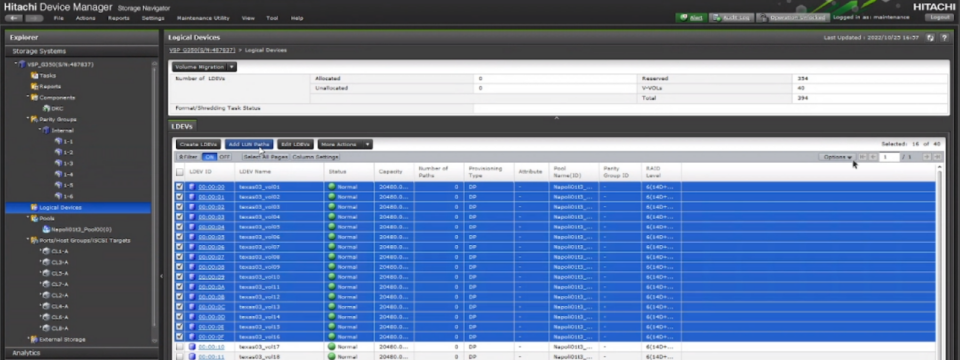
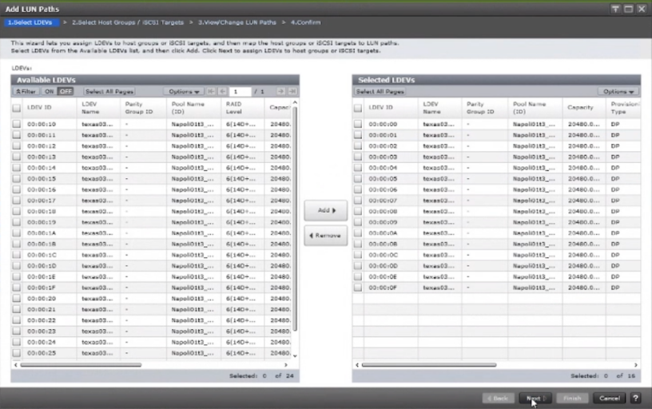
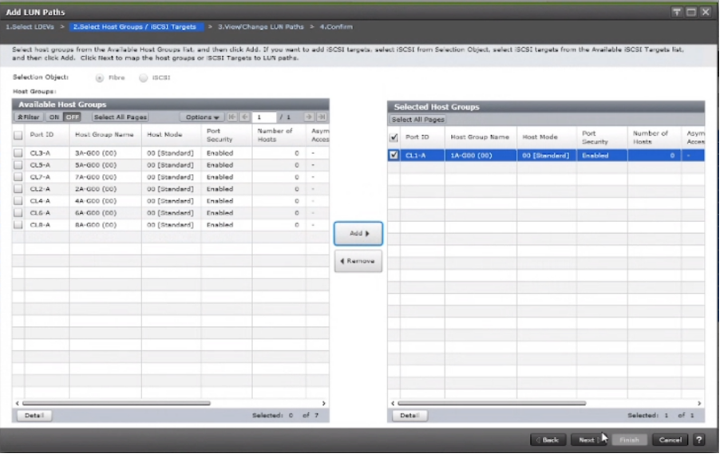
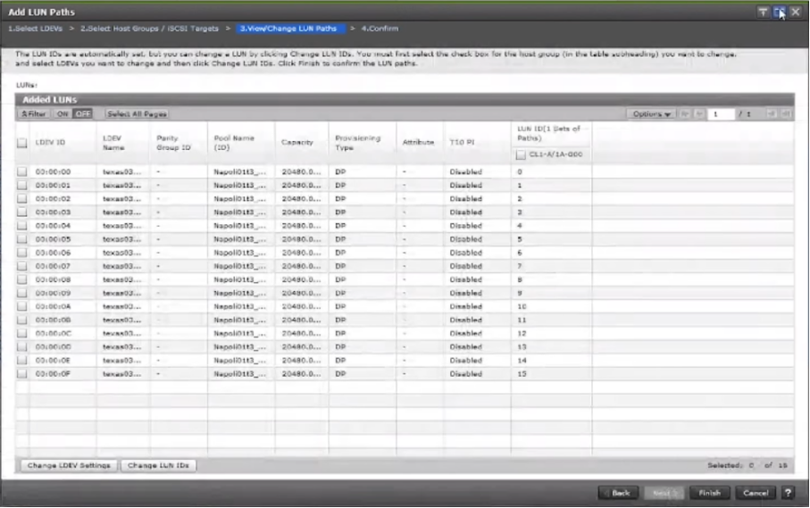

### LUN PATHS
---
---

#### ADD LUN PATHS - SVP
---

#### ADD LUN PATHS - CCI
---

	raidcom add lun -ldev_id 0x1001 -lun_id 1 -port CL1-A-50 -I642833
	raidcom add lun -ldev_id 0x1001 -lun_id 1 -port CL3-A-50 -I642833
	raidcom add lun -ldev_id 0x1001 -lun_id 1 -port CL1-B-50 -I642833
	raidcom add lun -ldev_id 0x1001 -lun_id 1 -port CL3-B-50 -I642833
	raidcom add lun -ldev_id 0x1001 -lun_id 1 -port CL2-A-50 -I642833
	raidcom add lun -ldev_id 0x1001 -lun_id 1 -port CL4-A-50 -I642833
	raidcom add lun -ldev_id 0x1001 -lun_id 1 -port CL2-B-50 -I642833
	raidcom add lun -ldev_id 0x1001 -lun_id 1 -port CL4-B-50 -I642833
	
	raidcom add lun -ldev_id 0x1002 -lun_id 2 -port CL1-A-50 -I642833
	raidcom add lun -ldev_id 0x1002 -lun_id 2 -port CL3-A-50 -I642833
	raidcom add lun -ldev_id 0x1002 -lun_id 2 -port CL1-B-50 -I642833
	raidcom add lun -ldev_id 0x1002 -lun_id 2 -port CL3-B-50 -I642833
	raidcom add lun -ldev_id 0x1002 -lun_id 2 -port CL2-A-50 -I642833
	raidcom add lun -ldev_id 0x1002 -lun_id 2 -port CL4-A-50 -I642833
	raidcom add lun -ldev_id 0x1002 -lun_id 2 -port CL2-B-50 -I642833
	raidcom add lun -ldev_id 0x1002 -lun_id 2 -port CL4-B-50 -I642833
	
	raidcom add lun -ldev_id 0x1003 -lun_id 3 -port CL1-A-50 -I642833
	raidcom add lun -ldev_id 0x1003 -lun_id 3 -port CL3-A-50 -I642833
	raidcom add lun -ldev_id 0x1003 -lun_id 3 -port CL1-B-50 -I642833
	raidcom add lun -ldev_id 0x1003 -lun_id 3 -port CL3-B-50 -I642833
	raidcom add lun -ldev_id 0x1003 -lun_id 3 -port CL2-A-50 -I642833
	raidcom add lun -ldev_id 0x1003 -lun_id 3 -port CL4-A-50 -I642833
	raidcom add lun -ldev_id 0x1003 -lun_id 3 -port CL2-B-50 -I642833
	raidcom add lun -ldev_id 0x1003 -lun_id 3 -port CL4-B-50 -I642833
	
	raidcom add lun -ldev_id 0x1004 -lun_id 4 -port CL1-A-50 -I642833
	raidcom add lun -ldev_id 0x1004 -lun_id 4 -port CL3-A-50 -I642833
	raidcom add lun -ldev_id 0x1004 -lun_id 4 -port CL1-B-50 -I642833
	raidcom add lun -ldev_id 0x1004 -lun_id 4 -port CL3-B-50 -I642833
	raidcom add lun -ldev_id 0x1004 -lun_id 4 -port CL2-A-50 -I642833
	raidcom add lun -ldev_id 0x1004 -lun_id 4 -port CL4-A-50 -I642833
	raidcom add lun -ldev_id 0x1004 -lun_id 4 -port CL2-B-50 -I642833
	raidcom add lun -ldev_id 0x1004 -lun_id 4 -port CL4-B-50 -I642833
	
	raidcom add lun -ldev_id 0x1005 -lun_id 5 -port CL1-A-50 -I642833
	raidcom add lun -ldev_id 0x1005 -lun_id 5 -port CL3-A-50 -I642833
	raidcom add lun -ldev_id 0x1005 -lun_id 5 -port CL1-B-50 -I642833
	raidcom add lun -ldev_id 0x1005 -lun_id 5 -port CL3-B-50 -I642833
	raidcom add lun -ldev_id 0x1005 -lun_id 5 -port CL2-A-50 -I642833
	raidcom add lun -ldev_id 0x1005 -lun_id 5 -port CL4-A-50 -I642833
	raidcom add lun -ldev_id 0x1005 -lun_id 5 -port CL2-B-50 -I642833
	raidcom add lun -ldev_id 0x1005 -lun_id 5 -port CL4-B-50 -I642833
	
	raidcom add lun -ldev_id 0x1006 -lun_id 6 -port CL1-A-50 -I642833
	raidcom add lun -ldev_id 0x1006 -lun_id 6 -port CL3-A-50 -I642833
	raidcom add lun -ldev_id 0x1006 -lun_id 6 -port CL1-B-50 -I642833
	raidcom add lun -ldev_id 0x1006 -lun_id 6 -port CL3-B-50 -I642833
	raidcom add lun -ldev_id 0x1006 -lun_id 6 -port CL2-A-50 -I642833
	raidcom add lun -ldev_id 0x1006 -lun_id 6 -port CL4-A-50 -I642833
	raidcom add lun -ldev_id 0x1006 -lun_id 6 -port CL2-B-50 -I642833
	raidcom add lun -ldev_id 0x1006 -lun_id 6 -port CL4-B-50 -I642833
	
	raidcom add lun -ldev_id 0x1007 -lun_id 7 -port CL1-A-50 -I642833
	raidcom add lun -ldev_id 0x1007 -lun_id 7 -port CL3-A-50 -I642833
	raidcom add lun -ldev_id 0x1007 -lun_id 7 -port CL1-B-50 -I642833
	raidcom add lun -ldev_id 0x1007 -lun_id 7 -port CL3-B-50 -I642833
	raidcom add lun -ldev_id 0x1007 -lun_id 7 -port CL2-A-50 -I642833
	raidcom add lun -ldev_id 0x1007 -lun_id 7 -port CL4-A-50 -I642833
	raidcom add lun -ldev_id 0x1007 -lun_id 7 -port CL2-B-50 -I642833
	raidcom add lun -ldev_id 0x1007 -lun_id 7 -port CL4-B-50 -I642833
	
	raidcom add lun -ldev_id 0x1008 -lun_id 8 -port CL1-A-50 -I642833
	raidcom add lun -ldev_id 0x1008 -lun_id 8 -port CL3-A-50 -I642833
	raidcom add lun -ldev_id 0x1008 -lun_id 8 -port CL1-B-50 -I642833
	raidcom add lun -ldev_id 0x1008 -lun_id 8 -port CL3-B-50 -I642833
	raidcom add lun -ldev_id 0x1008 -lun_id 8 -port CL2-A-50 -I642833
	raidcom add lun -ldev_id 0x1008 -lun_id 8 -port CL4-A-50 -I642833
	raidcom add lun -ldev_id 0x1008 -lun_id 8 -port CL2-B-50 -I642833
	raidcom add lun -ldev_id 0x1008 -lun_id 8 -port CL4-B-50 -I642833
	
	raidcom add lun -ldev_id 0x1009 -lun_id 9 -port CL1-A-50 -I642833
	raidcom add lun -ldev_id 0x1009 -lun_id 9 -port CL3-A-50 -I642833
	raidcom add lun -ldev_id 0x1009 -lun_id 9 -port CL1-B-50 -I642833
	raidcom add lun -ldev_id 0x1009 -lun_id 9 -port CL3-B-50 -I642833
	raidcom add lun -ldev_id 0x1009 -lun_id 9 -port CL2-A-50 -I642833
	raidcom add lun -ldev_id 0x1009 -lun_id 9 -port CL4-A-50 -I642833
	raidcom add lun -ldev_id 0x1009 -lun_id 9 -port CL2-B-50 -I642833
	raidcom add lun -ldev_id 0x1009 -lun_id 9 -port CL4-B-50 -I642833
	
	raidcom add lun -ldev_id 0x1010 -lun_id 10 -port CL1-A-50 -I64283
	raidcom add lun -ldev_id 0x1010 -lun_id 10 -port CL3-A-50 -I64283
	raidcom add lun -ldev_id 0x1010 -lun_id 10 -port CL1-B-50 -I64283
	raidcom add lun -ldev_id 0x1010 -lun_id 10 -port CL3-B-50 -I64283
	raidcom add lun -ldev_id 0x1010 -lun_id 10 -port CL2-A-50 -I64283
	raidcom add lun -ldev_id 0x1010 -lun_id 10 -port CL4-A-50 -I64283
	raidcom add lun -ldev_id 0x1010 -lun_id 10 -port CL2-B-50 -I64283
	raidcom add lun -ldev_id 0x1010 -lun_id 10 -port CL4-B-50 -I64283
	
	raidcom add lun -ldev_id 0x1011 -lun_id 11 -port CL1-A-50 -I64283
	raidcom add lun -ldev_id 0x1011 -lun_id 11 -port CL3-A-50 -I64283
	raidcom add lun -ldev_id 0x1011 -lun_id 11 -port CL1-B-50 -I64283
	raidcom add lun -ldev_id 0x1011 -lun_id 11 -port CL3-B-50 -I64283
	raidcom add lun -ldev_id 0x1011 -lun_id 11 -port CL2-A-50 -I64283
	raidcom add lun -ldev_id 0x1011 -lun_id 11 -port CL4-A-50 -I64283
	raidcom add lun -ldev_id 0x1011 -lun_id 11 -port CL2-B-50 -I64283
	raidcom add lun -ldev_id 0x1011 -lun_id 11 -port CL4-B-50 -I64283
	
	raidcom add lun -ldev_id 0x1012 -lun_id 12 -port CL1-A-50 -I64283
	raidcom add lun -ldev_id 0x1012 -lun_id 12 -port CL3-A-50 -I64283
	raidcom add lun -ldev_id 0x1012 -lun_id 12 -port CL1-B-50 -I64283
	raidcom add lun -ldev_id 0x1012 -lun_id 12 -port CL3-B-50 -I64283
	raidcom add lun -ldev_id 0x1012 -lun_id 12 -port CL2-A-50 -I64283
	raidcom add lun -ldev_id 0x1012 -lun_id 12 -port CL4-A-50 -I64283
	raidcom add lun -ldev_id 0x1012 -lun_id 12 -port CL2-B-50 -I64283
	raidcom add lun -ldev_id 0x1012 -lun_id 12 -port CL4-B-50 -I64283
	
	raidcom add lun -ldev_id 0x1013 -lun_id 13 -port CL1-A-50 -I64283
	raidcom add lun -ldev_id 0x1013 -lun_id 13 -port CL3-A-50 -I64283
	raidcom add lun -ldev_id 0x1013 -lun_id 13 -port CL1-B-50 -I64283
	raidcom add lun -ldev_id 0x1013 -lun_id 13 -port CL3-B-50 -I64283
	raidcom add lun -ldev_id 0x1013 -lun_id 13 -port CL2-A-50 -I64283
	raidcom add lun -ldev_id 0x1013 -lun_id 13 -port CL4-A-50 -I64283
	raidcom add lun -ldev_id 0x1013 -lun_id 13 -port CL2-B-50 -I64283
	raidcom add lun -ldev_id 0x1013 -lun_id 13 -port CL4-B-50 -I64283
	
	raidcom add lun -ldev_id 0x1014 -lun_id 14 -port CL1-A-50 -I64283
	raidcom add lun -ldev_id 0x1014 -lun_id 14 -port CL3-A-50 -I64283
	raidcom add lun -ldev_id 0x1014 -lun_id 14 -port CL1-B-50 -I64283
	raidcom add lun -ldev_id 0x1014 -lun_id 14 -port CL3-B-50 -I64283
	raidcom add lun -ldev_id 0x1014 -lun_id 14 -port CL2-A-50 -I64283
	raidcom add lun -ldev_id 0x1014 -lun_id 14 -port CL4-A-50 -I64283
	raidcom add lun -ldev_id 0x1014 -lun_id 14 -port CL2-B-50 -I64283
	raidcom add lun -ldev_id 0x1014 -lun_id 14 -port CL4-B-50 -I64283
	
	raidcom add lun -ldev_id 0x1015 -lun_id 15 -port CL1-A-50 -I64283
	raidcom add lun -ldev_id 0x1015 -lun_id 15 -port CL3-A-50 -I64283
	raidcom add lun -ldev_id 0x1015 -lun_id 15 -port CL1-B-50 -I64283
	raidcom add lun -ldev_id 0x1015 -lun_id 15 -port CL3-B-50 -I64283
	raidcom add lun -ldev_id 0x1015 -lun_id 15 -port CL2-A-50 -I64283
	raidcom add lun -ldev_id 0x1015 -lun_id 15 -port CL4-A-50 -I64283
	raidcom add lun -ldev_id 0x1015 -lun_id 15 -port CL2-B-50 -I64283
	raidcom add lun -ldev_id 0x1015 -lun_id 15 -port CL4-B-50 -I64283
