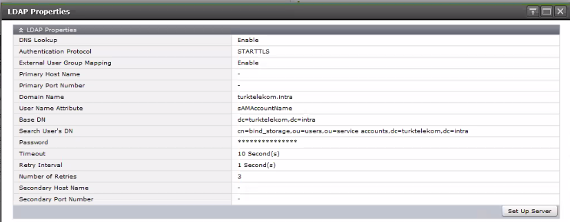

### ACTIVE DIRECTORY INTEGRATION
---
---

**Settings** → **User Settings** → **View External Authentication Server Properties**

- Create **User Group** which already defined in AD
- Add all **Roles** to the **User Group**
- Test