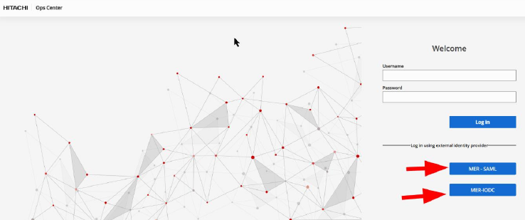

## 1. OPENID config using ubuntu (merubuntu24)
---
---
---


### 1.1. Keycloak Server
---
---

1. Connect keycloak admin console
	 ***https://merubuntu24:8443/***

2. Login with user/password which is created in ***02 - Installation 2.3*** 	
3. Click **Manage Realms**
	 A Realm in Keycloak represents an isolated space where users, applications, roles, and groups are managed. Each Realm has its own configurations and data. This allows for the creation of multiple independent authentication and authorization zones on a single Keycloak server.
	 
4. Click **Create Realm**
	 Give a name than click create. (For this server, example name opscenter76) This name will be seen at top of OPS Center when you click login with external provider.
	 
5. From **REALMS** list click newly created REALM (opscenter76)
6. You are in opscenter76 realm now.
7. Click **Clients** from left Menu.
8. Click **Create Client** and fill the fields (change merops1104 to your opscenter hostname). Click **Save** when you finished.
```clisp
	Client type                        : OpenID connect
	Client ID                          : Any name (opscenter-client in sample) Same name must be used in opscenter keycloak config.
	Name                               : Just display name (same with client ID in sample)
	Description                        : Optional
	Client authentication              : On
	Authorization                      : On
	Direct access grants               : Enable check box
	PKCE Method                        : Leave as default (choose)
	Root URL                           : https://merops1104/portal/
	Home URL                           : https://merops1104/portal/
	Valid redirect URIs                : https://merops1104/*
	Valid post logout redirect URIs    : Leave empty
	Web Origins                        : + (Just a plus sign)
	Admin URL                          : https://merops1104/portal
```

9. From the **Credentials** tab copy **Client secret** for later use in opscenter.
10. Click **Client scopes from** right then click **Create client scope**. Fill the fields and click **Save** when you finished.
```clisp
	Name                               : Any Name
	Description                        : Any
	Type                               : None
	Protocol                           : OpenID connect
	Display on consent screen          : On
	Consent screen text                :
	Include in token scope             : On
	Display Order                      :
```
11. Click **mappers** tab in created scope.
12. Configure a new mapper and click **User Attribute**.
13. Create **lastname-mapper** 
```clisp
	Mapper type                        : User Attribute
	Name                               : lastname-mapper
	User Attribute                     : lastName
	Token Claim Name                   : family_name
	Claim JSON Type                    : String
	Add to ID token                    : On
	Add to access token                : On
	Add to lightweight access token    : Off
	Add to userinfo                    : On
	Add to token introspection         : On
```
14. Create **firstname-mapper**
```clisp
	Mapper type                        : User Attribute
	Name                               : firstname-mapper
	User Attribute                     : firstName
	Token Claim Name                   : given_name
	Claim JSON Type                    : String
	Add to ID token                    : On
	Add to access token                : On
	Add to lightweight access token    : Off
	Add to userinfo                    : On
	Add to token introspection         : On
```
15. Create **email-mapper**
```clisp
	Mapper type                        : User Attribute
	Name                               : email
	User Attribute                     : email
	Token Claim Name                   : email
	Claim JSON Type                    : String
	Add to ID token                    : On
	Add to access token                : On
	Add to lightweight access token    : Off
	Add to userinfo                    : On
	Add to token introspection         : On
```
16. Click **Clients** from left and choose client created in step 8.
17. Go to **Client Scopes** tab in **Client Details** and **Add client scope** which is created in step 10 as default.
18. Choose user from left and add user.
19. Fill following fields and click **Create**
```clisp
	Username
	Email
	First Name
	Last Name
```
20. Go to **Credentials** tab and **Set password** for user.
	 Turn off Temporary.

If you want to enable OTP (One Time Password) option like Google Authenticator, Okta or freeOTP go on with section 1.1.1 otherwise keycloak config finished please go on with OPS Center configuration (1.2) or LDAP config on section 1.1.2


#### 1.1.1 OTP enable (OPTIONAL)
---

1. Connect keycloak admin console
	 ***https://merubuntu24:8443/***

2. Login with user/password which is created in ***02 - Installation 2.3***
3. Go to your **Realm**
4. Click **Authentication** on the left menu
5. Click **browser** on the **Flows** tab
6. Change following fields
```clisp
	flow/forms → flow/Browser Conditional OTP                   : Required
	flow/forms → flow/Browser Conditional OTP** → step/OTP Form : Required
```
7. Click **Required action** tab and set **Set as default action** value of **Configure OTP** to **On**

If you want to integrate Keycloak server with Active directory/LDAP server go on section 1.1.2. If not go on Section 1.2


#### 1.1.2 Integrate Keycloak with AD/LDAP server (OPTIONAL)
---

1. Connect keycloak admin console
	 ***https://merubuntu24:8443/***

2. Login with user/password which is created in ***02 - Installation 2.3***
3. Go to your **Realm**
4. Click **User federation** on the left menu
5. Click **Add new provider**
```clisp
	General Options                         --> UI display name                                         : ldap
	                                        --> Vendor                                                  : Active Directory
	Connection and authentication settings  --> Connection URL                                          : ldap://merdc2022:389
	                                        --> Enable StartTLS                                         : Off
	                                        --> Use Truststore SPI                                      : Always
	                                        --> Connection pooling                                      : On
	                                        --> Connection timeout                                      : 
	                                        --> Bind type                                               : Simple
	                                        --> Bind DN                                                 : CN=ldaptest1,CN=Users,DC=mer,DC=home
	                                        --> Bind credentials                                        : <password>
	LDAP searching and updating             --> Edit mode                                               : READ_ONLY
	                                        --> Users DN                                                : CN=Users,DC=mer,DC=home
	                                        --> Relative user creation DN                               : 
	                                        --> Username LDAP attribute                                 : sAMAccountName
	                                        --> RDN LDAP attribute                                      : sAMAccountName
	                                        --> UUID LDAP attribute                                     : objectGUID
	                                        --> User object classes                                     : person, organizationalPerson, user
	                                        --> User LDAP filter                                        : 
	                                        --> Search scope                                            : Subtree
	                                        --> Read timeout                                            : 
	                                        --> Pagination                                              : On
	                                        --> Referral                                                : 
	Synchronization setting                 --> Import users                                            : On
	                                        --> Sync Registrations                                      : On
	                                        --> Batch size                                              : 
	                                        --> Periodic full sync                                      : Off
	                                        --> Periodic changed full sync                              : On
	                                        --> Changed users sync period                               : 120
	                                        --> Remove invalid users during searches                    : On
	Kerberos integration                    --> Allow Kerberos authentication                           : Off
	                                        --> Use Kerberos for password authentication                : Off
	Cache settings                          --> Cache policy                                            : Default
	Advanced settings                       --> Enable the LDAPv3 password modify extended operation    : Off
	                                        --> Validate password policy*                               : Off
	                                        --> Trust email                                             : Off
	                                        --> Connection trace                                        : Off
```


### 1.2. OPS Center Keycloak client configuration
---
---

1. Login **OPS Center** with **ssh**
2. Run enable Keycloak command. It will ask a password for **idpadmin** user.
```bash
	/opt/hitachi/CommonService/utility/bin/csembeddedkeycloak -enable
```
3. Copy Keycloak.local.crt certificate file (generated in section ***02 - Installation 2.2**) to OPS Center **/var/opt/hitachi/CommonService/tls/** folder.
4. Import certificate to Common Service trust store. This is all in one line command. It will also ask trust store password. Default Password is **“changit”**
```bash
	keytool -importcert -alias keycloak24 -keystore /var/opt/hitachi/CommonService/tls/cacerts -file /var/opt/hitachi/CommonService/tls/keycloak.local.crt
```
   To list imported certificates
```bash
	keytool -list -keystore /var/opt/hitachi/CommonService/tls/cacerts
```
   Restart common service
```bash
	systemctl restart csportal
```
5. Login **OPS Center Portal** with sysadmin or **admin** privilege user.
6. Go to **Manage users**. Click **Identity providers (Other)** on the left. Click **Embedded Keycloak**
7. Login to embedded Keycloak with **idpadmin** user and password
8. You will be **Identity providers** section by default. Click on **OpenID Connect v1.0**
9. Fill the fields with your Keycloak server details on **Setting** tab. Change merubuntu24 with your Keycloak server hostname and opscenter76 with your REALM name created in section 1.1 step 4. Click **Save** when you finished.
```clisp
	Redirect URI                        : OPS Center will fill automatically
	Alias                               : Give a unique name to identify this configuration
	Display name                        : Give a Display name for this configuration
	Display order                       : Leave blank
	Authorization URL                   : https://merubuntu24:8443/realms/opscenter76/protocol/openid-connect/auth
	Token URL                           : https://merubuntu24:8443/realms/opscenter76/protocol/openid-connect/token
	Logout URL                          : https://merubuntu24:8443/realms/opscenter76/protocol/openid-connect/logout
	Issuer                              : https://merubuntu24:8443/realms/opscenter76
	Client authentication               : Leave as default
	Client ID                           : Same name in Section 1.1 step 8 (opscenter-client in sample)
	Client secret                       : Paste secret key which in Section 1.1 step 9
	Client assertion signature algorithm: Leave default
	Trust email                         : On
	Sync mode                           : force
	Other options                       : Default
```
10. Click **Mappers** tab and click **Add mapper** button. Id field will not exist while adding mappers.it will be assigned automatically.
	   Users from Keycloak will be assigned to opscenter-users group default. If you would like to assign any user admin role, you must login OPS Center with sysadmin and assign admin role to user from Manage user/users screen.

	1. Email-mapper
```clisp
	Name                               : email-mapper
	Sync mode override                 : Force
	Mapper type						   : Attribute importer
	Claim							   : email
	User Attribute Name				   : email
```

   2. Lastname-mapper
```clisp
	Name                               : lastname-mapper
	Sync mode override                 : Force
	Mapper type						   : Attribute importer
	Claim							   : family_name
	User Attribute Name				   : lastName
```

   3. Firstname-mapper
```clisp
	Name                               : firstname-mapper
	Sync mode override                 : Force
	Mapper type						   : Attribute importer
	Claim							   : given_name
	User Attribute Name				   : firstName
```

   4. Hardcoded-group
```clisp
	Name                               : hardcoded-group
	Sync mode override                 : Force
	Mapper type						   : Hardcoded Group
	Group							   : /opscenter-users
```	


All setup completed.
OPS Center portal screen will show login with external provider link Right-below of screen

Sample login screen:


	                  
	                  