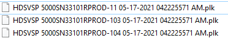
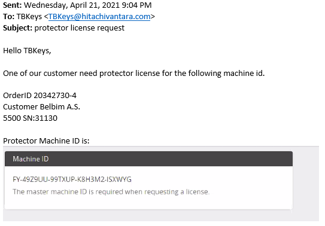
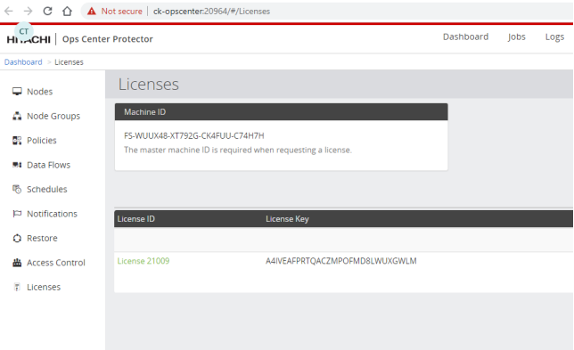

#### LICENSES
---
---

##### Storage, HDLM, Automator and Analyzer Licenses
---

→ SSO ->  License Management

→ Select product and click download:

**11**	→ Licenses to be installed to Storage (must already be installed)
**103** 	→ HDLM License
**104** 	→ Automator & Analyzer Licenses (Extra license is needed for Analyzer )

##### Analyzer Detail View License
---

1. Collect customer and order information (VPN Connection is needed):
	**SSO** → **HOMT** → **Orders per country with POD** → **Turkey** → **SFDC**#

2. Find serial number of the storage.

3. Login to the external site:
	http://cumulus-systems.com/hdcalicense 
	**USER**: hdcalic
	**PASSWORD**: hdcalic123 #password

5. Enter required information and submit the form:
	**Capacity**: Unlimited
	License can be ordered for more than one storage by providing storage information one by one

##### Protector License
---

**- Default license is only valid for 45 days.**
  
**- Send an email to TBKeys**

**- Email: TBKeys@hitachivantara.com**
**- Order ID: SSO → HOMT → Orders per country with POD → Turkey → SFDC#**
**- Machine ID: Ops Center → Protector → License**

**- Customer Name**
**- Storage Type**
**- Storage Serial Number**

