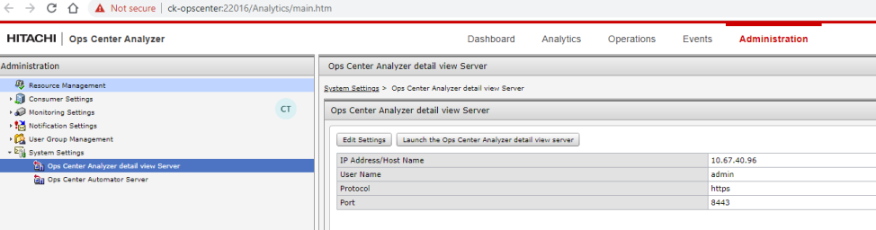

#### OPS CENTER CONFIGURATION
---
---

**1. Change the names of the items in the dashboard.**

**2. Enter Licenses by clicking “not ready” link on the dashboard.**

**3. Go to https://opscenter:8443**
	Enter the license.
	Set the password:
		**USER**: admin
		**PASSWORD**: Set the password first time

**4. Go to Analyzer → System Settings → Ops Center Analyzer Detail View Server**
	Enter following information:
		**IP Address/Host Name**: Ops Center
		**USER**: admin
		**PROTOCOL**: https
		**PORT**: 8443
		

**5. Go to OPS Center Administrator (Let Administrator to access Protector for Switch zonning)**
	Click Gear Icon top right
	Click OPS Center Protector Settings
		**IP**: Opscenter
		**PORT**: 20964
		**USER**: root@master #user
		**PASSWORD**: root password

**6. Add Storages**
	On the Ops Center Administrator dashboard, click the plus sign (+) to add a storage system.
	**IP**: For a storage system with an SVP, enter the IP address (IPv4) of the external service processor. Or enter IP address of the controller.
	**ADDRESS**: IP-address:Port-number.
	**USER**: maintenance

**7. Add Fabric Switches**
	On the Ops Center Administrator dashboard, select Fabric Switches to open the Fabric Switches window and click the plus sign (+).
		Virtual Fabric ID: For Cisco switches, the VSAN ID. Not applicable to Brocade switches.
		Fabric Switch Type: Select Brocade or Cisco.
		Fabric Switch IP Address: To add or update a core switch, use the Management IP address of the switch or the Active CP IP address.
		Port Number
		Username
		Password

**8. Add Servers**
	On the Ops Center Administrator dashboard, click Servers. Then click the plus sign (+) to open the Add Server window.
		- Enter all parameters manually or create a csv file:
			Name,Description,IPAddress,OSType,WWNS
			Esxi,ESXI HOST,10.30.90.200,VMWARE_EX,10:00:00:05:33:26:f7:21
			Win,WINDOWS HOST,10.30.91.80,WIN_EX,"10:00:00:05:33:26:f7:37,10:00:00:05:33:26:f7:36"
			ESXi_Cisco_1,ESXi HOST connected to Cisco Fabric,,VMWARE_EX,"10:00:00:05:33:26:e0:fc,10:00:00:05:33:26:e0:fd"
			ESXi_Cisco_2,ESXi HOST connected to CiscoFabric,,VMWARE_EX,"100000053326df1a,100000053326df1b"
		- Or use following format to add both Fibre and iSCSI servers:
			Name,Description,IPAddress,OSType,WWNS,IscsiNames,CHAPUserName,CHAPUserSecret
			linux-iscsi,test dummy host,20.10.10.10,Linux,,"iqn. linux-iscsi-1,iqn. linux-iscsi-2,eui.1234567890abCDef",,,,
			-windows-iscsi-uni-chap,test dummy host,20.10.10.20,Win,,"iqn.-windows-iscsi-uni-chap",chapUserName,chapUserSecret,,
			-windows-iscsi-bi-chap,test dummy host,20.10.10.30,Win,,"iqn.-windows-iscsi-bi-chap",chapUserName,chapUserSecret,chapUserName,chapUserSecret-vmware-iscsi-longest,
			test dummy host,20.10.10.40,VMWARE,,"iqn.123456789012345678901234567890123456789012345678901234567890123456789012345678901234567890123456789012345678901234567890123456789012345678901234567890123456789012345678901234567890123456789012345678901234567890123456789,eui.3234567890abCDef",,,,
			ed801h,Windows,10.197.73.57,WIN,"10:00:00:90:fa:b4:a8:71"
			ed800n,ESX Host,10.197.73.7,VMWARE,"10:00:00:90:fa:55:85:5d"
			-linux,test dummy host,10.10.10.10,Linux,10:10:10:10:10:10:10:10
			-windows,test dummy host,10.10.10.20,Win,10:10:10:10:10:10:10:20
			-vmware,test dummy host,10.10.10.30,VMWARE,10:10:10:10:10:10:10:30
