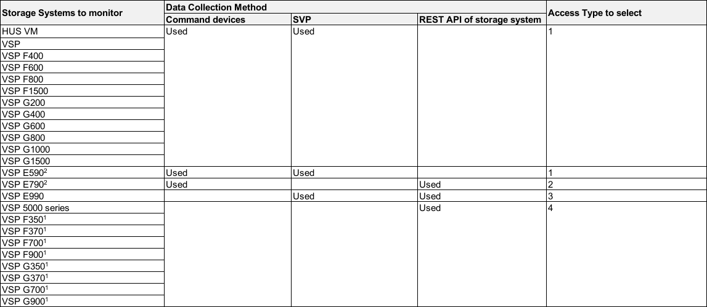
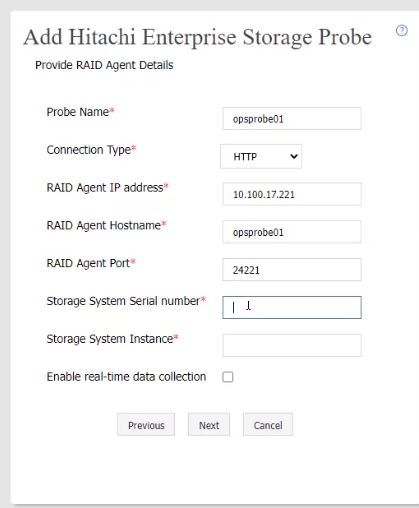
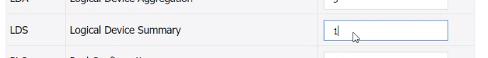
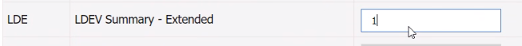
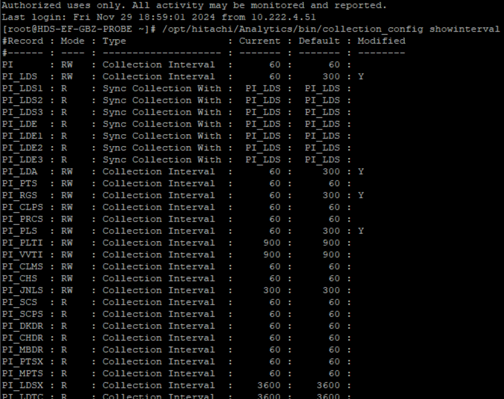
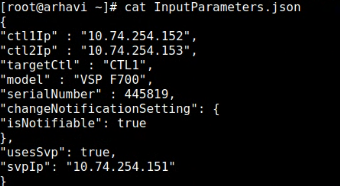
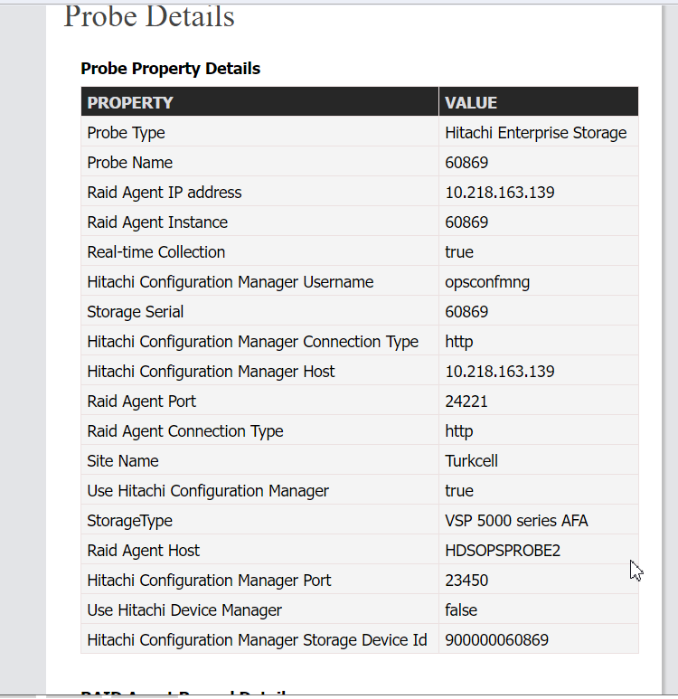

### PROBE CONFIGURATION
---
---


If you want to monitor VSP family or HUS VM, you must enable access from a guest OS to the command device. Use a VMware vSphere Client file to add a device to the guest OS. By doing so, if you designate a command device as the device to add, the command device can be accessed from the guest OS. When configuring settings to add a device, make sure that the following requirements are met:
	- **Device type**: Hard disk
	- **Disk selection**: Raw device mapping
	- **Compatibility mode**: Physical
	- Virtual disks (including VMware VVols) are not used for the command device.


#### Initial setup of Analyzer probe server
---

##### Configure RAID Agent
---

* Check DATA COLLECTION METHODS
	
	
	1. The methods for collecting performance data depend on the microcode version:
		When using the command device and the SVP, microcode version 88-01-03 or later is required.
		When using the command device and the REST API, microcode version 88-02-01 or later is required.
		When using the SVP and the REST API, microcode version 88-02-01 or later is required.
		When using only the REST API, microcode version 88-02-01 or later is required.
	2. You can only select Access Type 2 or 4.
	   
* Check Pages starting from page 147 of “Hitachi Ops Center Analyzer Installation and Configuration Guide.pdf” 
* Commands:
```bash
C:\HORCM\etc>inqraid $Phys –CLI
/opt/jp1pc/tools/jpctdlistraid
/opt/jp1pc/tools/jpcinssetup agtd -inst instance-name (instance_name-SERIAL NUMBER)
/opt/jp1pc/tools/jpctdchkinst -inst instance-name (instance_name-SERIAL NUMBER)
/opt/jp1pc/tools/jpcstart all 
	/opt/jp1pc/tools/jpcstop agtd inst=<instance-number>
	/opt/jp1pc/tools/jpcstart agtd inst=<instance-number>
/opt/jp1pc/tools/jpcctrl list "*"
/opt/jp1pc/htnm/bin/htmsrv start -all
/opt/jp1pc/tools/jpcinsunsetup agtd -inst instance-name (instance_name-SERIAL NUMBER)
```

		
##### Settings from UI
---

**- Go to https://Analyzer-probe-server-IP-address:8443** 

**- When you first launch the Analyzer probe server UI, you see the license agreement details. Read it and then click Next.**

**- In the Upload License window, click Choose File (the license you used for Analyzer Detail View) to browse to a license file and click Open. Submit it.**

**- In the Create Administrator Account window, provide the following and then click Submit:**
	Username and password (admin)
	First name, last name, and email address of the user
	**Locale**: Only the U.S. English locale is currently supported
	**Group**: Select Admin to create an administrator account
	
**- In the Analyzer probe login window, enter the administrator user credentials and click Login.**

**- The Basic Information window displays the Customer Name (which cannot be changed). Provide the following contact information and click Next:**
	Administrator Contact Name and email
	Technical Contact Name and email

**- In the Select Time zone window, make a selection and then click Next.**

**- In the Primary Analyzer detail view Server Information window, specify the following details:**
		If you are connecting the Analyzer detail view server to the Analyzer probe server using the host name and a proxy server, you must add the IP address and host name of the Analyzer detail view server to the /etc/hosts file on the Analyzer probe server.
		If you edit the existing connection details, make sure that you update these details on the Analyzer detail view server by updating the downloader. For more information, refer to Updating the downloader on the Analyzer detail view server (on page 416) of Hitachi Ops Center Analyzer Installation and Configuration Guide.pdf.
						* **PROTOCOL**: FTP, FTPS, SFTP, or HTTPS. (SFTP)<
						* **HOST**: Analyzer detail view server or intermediate FTP server IP address.
						* **PORT**: Based on the selected protocol.
						* **USER**: Username for the host. 
										For an Analyzer detail view server, the user name is: **meghadata**
						* **PASSWORD**: Password for the host. 
										For an Analyzer detail view server, the default #password is: **meghadata123**
						* **Advanced Settings**:
										Proxy: Select to configure a proxy server.
										Real-time Server: By default the Real time server field uses the value that you entered in the Host field.
		
**- Click Next.**
	In addition to sending Analyzer probe server data to a single (local) Analyzer detail view server, you can configure a secondary (cloud-based or on-premises) Analyzer detail view server, or intermediate FTP server. The purpose is to host a copy of the probe data where it can be accessed outside of your internal network. You can add this secondary server from the Analyzer probe server UI. You need to click Reconfigure button and go to Analyzer Detail Server View tab for that.
	
	
**- In the Data Collection duration window, verify the license expiry date in your license, and then click Next.**

**- From the list of probes, select the probe type and configure it to collect data from the monitoring target. You must add at least one probe to complete the installation. To add additional probes, go to the Analyzer probe server web UI home page and click Add Probe. The following are available:**
	* Hitachi Adaptable Modular Storage (AMS) probe
	* Hitachi Enterprise Storage probe
	* Hitachi NAS probe
	* VMware probe
	* Brocade FC Switch (BNA) probe
	* Brocade FC Switch probe
	* Cisco FC Switch (DCNM) probe
	* Cisco FC Switch (CLI) probe
	* Linux probe


#### Registering Probe to Common Services
---
```bash
	setupcommonservice -csUri https://example.com/portal -csUsername sysadmin -appHostname MyHost -appPort 8443 -appName MyProbe -appDescription ""
```

#### Changing Data Collection Interval
---

This is per design of the Analyzer Detail View server.
Analyzer Detail View server GUI reports such as "Storage IOPS Vs Response Time" show performance data based on the metric of the LDEV mainly.
This metric is calculated based on the PI_LDS of RAID Agent and the granularity of the data in the PI_LDS record is 5 minutes.

For example, if the data collection process of a Hitachi Enterprise Storage probe starts at 10:59, the Hitachi Enterprise Storage probe collects performance data from RAID Agent from 10:55 to 10:59. However, since the granularity(data collection interval) of the data is 5 minutes, only a data at 10:55 is collected and send it to Analyzer Detail View server. After that, Analyzer Detail View receives this data at 11:00 and displays the data as 10:55 on a report.
As it is per design of the product that the data collection process of Hitachi Enterprise Storage probe happens every 5 minutes, next data collection starts at 11:04. Until that happens, a user can only see the data until 10:55 on the report (9 minutes delay).

	Therefore, if the granularity of the data is set to 5 minutes, the maximum difference between the time that is shown on a report and the current time could be 9 to 10 minutes.
	If the granularity of the data is 1 minute, the maximum difference could be 6 minutes.
	For example, "Storage MP Utilization" shows the performance data based on the metric relating to raidMP, which is calculated based on PI_PRCS record of RAID Agent, and the default granularity is 1 minute.

Based on our investigation, the delay could be reduced by shortening the data granularity from 5 minutes to 1 minute.
Please change the data collection interval by following the instructions below from 5 minutes to 1 minute.

	Hitachi Ops Center Analyzer Installation and Configuration Guide
	Chapter 13: Changing Ops Center Analyzer system settings
	  Changing the data collection intervals of Analyzer detail view performance metrics

**Access Type is 1**: Configuring RAID Agent for data collection using command devices and SVP
**Access Type is 2**: Configuring RAID Agent for data collection using command device and REST API
**Access Type is 3**: Configuring RAID Agent for data collection using SVP and REST API
**Access Type is 4**: Configuring RAID Agent for data collection using REST API
```bash
/opt/hitachi/Analytics/bin/collection_config showinterval -at AccessType
/opt/hitachi/Analytics/bin/collection_config showinterval -at 1
/opt/hitachi/Analytics/bin/collection_config changeinterval -at AccessType -r record-ID -i deta-collection-interval (seconds) -stop
→
/opt/hitachi/Analytics/bin/collection_config changeinterval -at 1 -r PI_LDS -i 60 -restart
#htmsrv start -all
```





For 1min interval for all parameters



#### Registering Storage to Probe Configuration Manager
---

Probe IP: 10.218.163.139

**1. Get registered storages**
```bash
curl --insecure -v -H "Accept:application/json" -X GET http://10.218.163.139:23450/ConfigurationManager/v1/objects/storages
```

**2. Register storage if it is not already registered**
	→ InputParameters.json  file
	

	"ctl1Ip": "",
	"ctl2Ip": "",
	"targetCtl": "CTL1",
	"usesSvp": true,
```json
{
	"svpIp": "10.206.206.10",
	"serialNumber": 60715,
	"model": "VSP 5600",
	"changeNotificationSetting": {
		"isNotifiable": true
	}
}
```
```json
{
	"ctl1Ip": "",
	"ctl2Ip": "",
	"targetCtl": "CTL1",
	"usesSvp": false,
	"svpIp": "",
	"serialNumber": ,
	"model": "VSP One B28",
	"changeNotificationSetting": {
		"isNotifiable": true
	}
}
```
**For One Block**
https://docs.hitachivantara.com/r/en-us/ops-center-api-configuration-manager/11.0.x/mk-99cfm000/common-operations-in-the-rest-api/registering-a-storage-system
```json
{
	 "ip": "192.0.2.20",
	 "model" : "VSP One B28",
	 "serialNumber" : 800556,
	  "changeNotificationSetting" : {
		"isNotifiable" : true
	  },
	 "isSecure" : true
}
```
→ Delete following lines if InputParameters.json fails
```json
"changeNotificationSetting": {
	"isNotifiable": true
}
```
→ Run **curl** command
```bash
curl --insecure -v -H "Accept:application/json" -H "Content-Type:application/json" -u opsconfmng:Opscenter123 -X  POST --data-binary @./InputParameters_60869.json http://10.218.163.139:23450/ConfigurationManager/v1/objects/storages
```
→ Output will be
```json
{
	"storageDeviceId": "836000123457",
	"restServerIp": "192.0.2.101",
	"restServerPort": 23451,
	"isMutualDiscovery": true
}
```

**3.  Get registered storages again**
```bash
curl --insecure -v -H "Accept:application/json" -X GET http://10.218.163.139:23450/ConfigurationManager/v1/objects/storages
```

**4. Change Communication Mode to FC Connection (fcCommunicationMode)**
**a. Create session**
```bash
curl -k -v -H "Accept:application/json" -H "Content-Type:application/json" -u opsconfmng:Opscenter123 -X POST http://10.218.163.139:23450/ConfigurationManager/v1/objects/storages/900000060869/sessions/ -d ""
```
**b. Set fcCommunicationMode**
```bash
curl -v -H "Accept:application/json" -H "Content-Type:application/json" -H "Authorization:Session 55599ec1-9178-4798-ab32-e7ed09ab787e" -H "Response-Job-Status: Completed" -d "{\""parameters\":{\"communicationModes\":[{\"communicationMode\":\"fcConnectionMode\""}]}}" -X PUT http://10.218.163.139:23450/ConfigurationManager/v1/900000060869/services/communication-mode/actions/change/invoke
```
**c. Verify that the communicate mode now change to "fcConnectionMode"**
```bash
curl -k -v -H "Accept:application/json" -u opsconfmng:Opscenter123 -X GET http://10.218.163.139:23450/ConfigurationManager/v1/objects/storages/900000060869
```

**5. Register through probe GUI**
	

	
**HOST**: Probe IP
**PORT**: 23450 for http, 23451 for https
**USER/PASSWORD**: Create at storage for REST
	
→ Check:



#### Probe Confmanager - IP to CMD
---

**IP**: Probe IP

→ On Probe

**1. Create session**
```bash
curl -k -v -H "Accept:application/json" -H "Content-Type:application/json" -u cmrest:Passw00rd123 -X POST http://10.147.128.224:23450/ConfigurationManager/v1/objects/storages/900000030849/sessions/ -d ""
```
**2. Change communication mode to "fcCommunicationMode" using session ID created in step 1**
```bash
curl -v -H "Accept:application/json" -H "Content-Type:application/json" -H "Authorization:Session cdc6e578-8e55-4fb1-8664-94dd3ed3d25f" -H "Response-Job-Status: Completed" -d "{\""parameters\":{\"communicationModes\":[{\"communicationMode\":\"fcConnectionMode\""}]}}" -X PUT "http://10.147.128.224:23450/ConfigurationManager/v1/900000030849/services/communication-mode/actions/change/invoke"**************
```
**3. Verify that the communicate mode now change to "fcConnectionMode"**
```bash
curl -k -v -H "Accept:application/json" -u cmrest:Passw00rd123 -X GET http://10.147.128.224:23450/ConfigurationManager/v1/objects/storages/900000030849
```
##### Designated Serial Numbers
|  Storage System |  Fixed Value |
|---|---|
|  VSP 5100, 5500, 5100H, 5500H, VSP 5200, 5600, 5200H, 5600H |  900000[^1] |
|  VSP E590, VSP E790, VSP E590H, VSP E790H |  934000 |
|  VSP E990 |  936000 |
|  VSP E1090, VSP E1090H |  938000 |
|  VSP F370, F700, F900, VSP G370, G700, G900 |  886000 |
|                       VSP F350, VSP G350                      |     882000    |
|                       VSP G130[^2]                      |     880000    |
		

[^1]: These storage systems have serial numbers that are less than 6 digits. Pad the storage device ID with zeros, added after this designated value and before the serial number, to bring the total number of digits for the storage device ID up to 12.

[^2]: This model is available only in select markets. Contact your local sales representative for availability.
