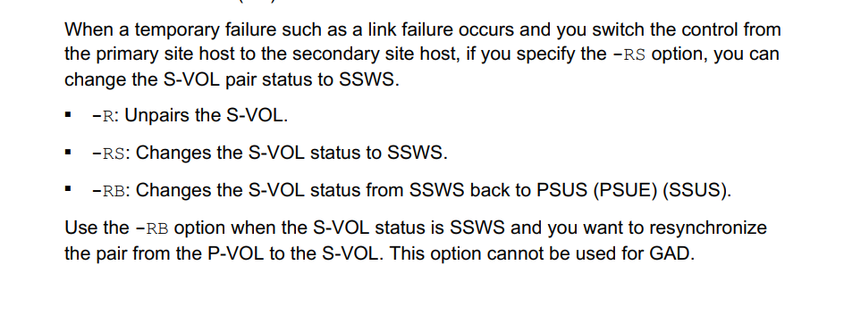

#### CCI to PROTECTOR
---
---


**Primary** 		-I1
**Secondary** 	-I2
**HUR** 			-I3
```clisp
	pairsplit -g GROUP -I1					→ PAUSE
	pairsplit -g GROUP -RS -I1				→ PAUSE with the option
	pairsplit -g GROUP -RB -I1				→ UNSUSPEND
	pairresync -g GROUP -I1					→ RESUME
	pairresync -g GROUP -swaps -I3			→ SWAPS
```
