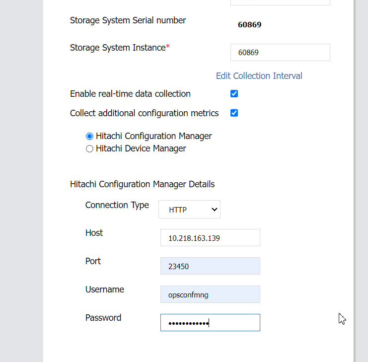

#### REST CONFMGR REGISTER
---
---


**Probe IP: 10.218.163.139**

##### **1. Get registered storages**
---
```bash
curl --insecure -v -H "Accept:application/json" -X GET http://10.218.163.139:23450/ConfigurationManager/v1/objects/storages
```

##### **2. Register storage if it is not already registered**
---

 → InputParameters.json  file
```json
{
	"svpIp": "10.206.206.10",
	"serialNumber": 60715,
	"model": "VSP 5600",
	"changeNotificationSetting": {
		"isNotifiable": true
	}
}
```
Delete following lines if InputParameters.json fails
```json
"changeNotificationSetting": {
	"isNotifiable": true
}
```
Run
```bash
curl --insecure -v -H "Accept:application/json" -H "Content-Type:application/json" -u opsconfmng:Opscenter123 -api  POST --data-binary @./InputParameters_60869.json http://10.218.163.139:23450/ConfigurationManager/v1/objects/storages
```
 It returns like:
 ```json
{
	"storageDeviceId": "836000123457",
	"restServerIp": "192.0.2.101",
	"restServerPort": 23451,
	"isMutualDiscovery": true
}
```

##### **3.  Get registered storages again**
---
```bash
curl --insecure -v -H "Accept:application/json" -X GET http://10.218.163.139:23450/ConfigurationManager/v1/objects/storages
```

##### **4. Change Communication Mode to FC Connection (fcCommunicationMode)**
---

###### a. Create session
```bash
curl -k -v -H "Accept:application/json" -H "Content-Type:application/json" -u opsconfmng:Opscenter123 -X POST http://10.218.163.139:23450/ConfigurationManager/v1/objects/storages/900000060869/sessions/ -d ""
```
###### b. Set fcCommunicationMode
```bash
curl -v -H "Accept:application/json" -H "Content-Type:application/json" -H "Authorization:Session 55599ec1-9178-4798-ab32-e7ed09ab787e" -H "Response-Job-Status: Completed" -d "{\""parameters\":{\"communicationModes\":[{\"communicationMode\":\"fcConnectionMode\""}]}}" -X PUT http://10.218.163.139:23450/ConfigurationManager/v1/900000060869/services/communication-mode/actions/change/invoke
```
###### c. Verify that the communicate mode now change to "fcConnectionMode"
```bash
curl -k -v -H "Accept:application/json" -u opsconfmng:Opscenter123 -X GET http://10.218.163.139:23450/ConfigurationManager/v1/objects/storages/900000060869

```

##### 5. Register through probe GUI
	


Host: Probe IP
Port: 23450 for http, 23451 for https
username/password: Create at storage for REST


Check:


