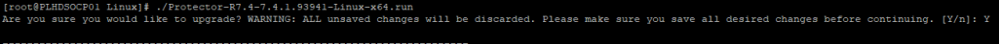

#### UPGRADE - SHORT LIST
---
---


Download these
https://support.hitachivantara.com/en/user/answers/downloads/downloads-detail.html?d=Ops%20Center%20Installation%20Media&pptype=Software%20Version

##### Comserv - HOC10-83-00_E02_COMSERV.iso
---

	OPS
	----------
	[root@hdsopstml COMSERV]# ./install.sh
	Hitachi Ops Center Common Service 10.8.3-00 [Upgrade]
	Caution: Quit all programs. If security, process, and virus monitoring programs are running, the installation can fail.


##### Administrator - HOC10-82-00_E02_ADMINISTRATOR.iso
---

	OPS	
	----------
	[root@hdsopstml dir]# ./install.sh
	Enter username for the service account credentials: sysadmin (service for standalone: Chang3Me!)
	Enter sysadmin's Password:
	Older version exists. Do you want to upgrade? [y/n]: y
	Do you wish to configure Ops Center Common Services [y/n]: y
	Enter URI to Ops Center Common Services portal: https://hdsopstml.turkcell.entp.tgc/portal
	Provide signing certificate for Ops Center Common Services. Press [Enter] if you do not have one []:
	Enter Ops Center Common Services admin account username: sysadmin
	Enter Ops Center Common Services admin account password:
	Enter Ops Center Administrator application name [Administrator]:
	Enter Ops Center Administrator application description value []:


##### Confmanager - HOC10-83-00_E02_CONFMANAGER.iso
---

If there is CCI error:
```bash
/opt/hitachi/hdid/bin/diagdata --stop
```
	OPS
	----------
	[root@hdsopstml Linux]# ./install.sh
	Configuration Manager REST API 10.8.3-00 [Upgrade]
	
	PROBE
	----------
	[root@HDSPROBETML Linux]# ./install.sh
	Configuration Manager REST API 10.8.3-00 [Upgrade]


##### Analyzer - HOC10-83-00_E02_ANALYZER.iso
---

if CPAN fails in Probe fix timezone:
```bash
timedatectl set-timezone Europe/Istanbul
```
	OPS
	----------
	[root@hdsopstml cd]# cp -pr ANALYTICS/ ../dir/
	[root@hdsopstml cd]# cd ../dir/ANALYTICS/
	analytics_install.sh  analytics_precheck.sh  analytics_uninstall.sh  DCA  IAA
	[root@hdsopstml ANALYTICS]# sh ./analytics_precheck.sh
	[root@hdsopstml ANALYTICS]# sh ./analytics_install.sh VUP
	
	PROBE
	----------
	[root@HDSPROBETML ~]# cd DCAPROBE
	[root@HDSPROBETML DCAPROBE]# sh ./dcaprobe_precheck.sh
	[root@HDSPROBETML DCAPROBE]# sh ./dcaprobe_install.sh VUP


##### Protector - HOC10-83-00_E02_PROTECTOR.iso
---

	OPS
	----------
	[root@hdsopstml Linux]# ./Protector-R7.4-7.4.1.93941-Linux-x64.run
	Are you sure you would like to upgrade? WARNING: ALL unsaved changes will be discarded. Please make sure you save all desired changes 	  before continuing. [Y/n]: Y
	
	PROBE
	----------



##### Automator - HOC10-83-00_E02_AUTOMATOR.iso
---

	OPS
	----------
	[root@hdsopstml Linux]# cd HAD_SERVER/
	[root@hdsopstml HAD_SERVER]# cd REDHAT/
	[root@hdsopstml REDHAT]# ./install.sh
	Hitachi Ops Center Automator 10.8.3-00 [Upgrade]
