### PROTECTOR OPERATIONS
---
---

#### Check Snapshots
---

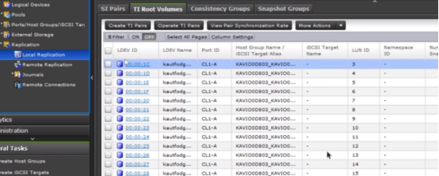

Pair Status must be PSUS
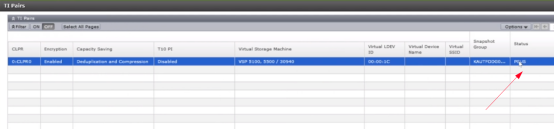

Snapshot Groups
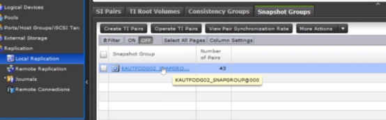

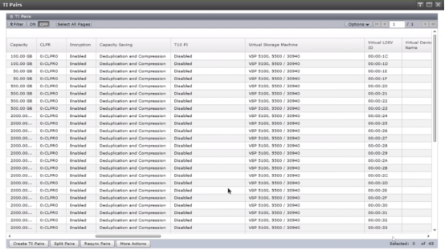

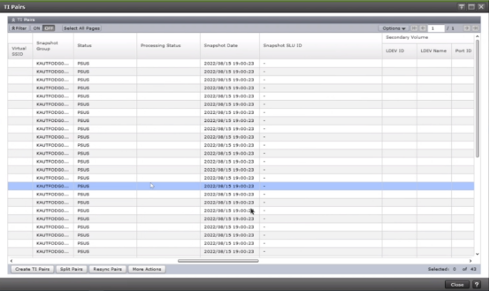

#### Mount Floating Snapshots
---

Assign secondary LDEV and mount

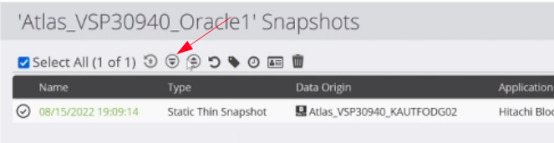

#### Revert Snapshot
---

Write snap to the disk

#### Set Retention Expiration Date
---

Extend
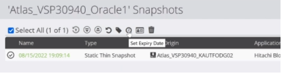

#### Transfer Role Based Access to Other Node
---

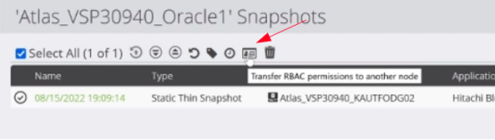

#### Unmount Snapshots
---

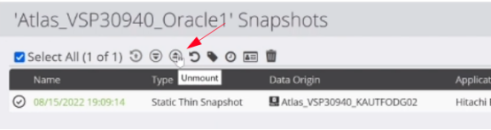

#### Delete Snapshots
---

Unmount snapshots first If they are mounted 
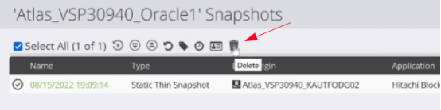

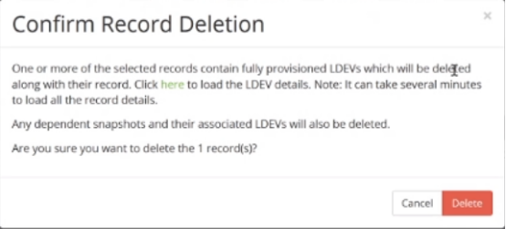

